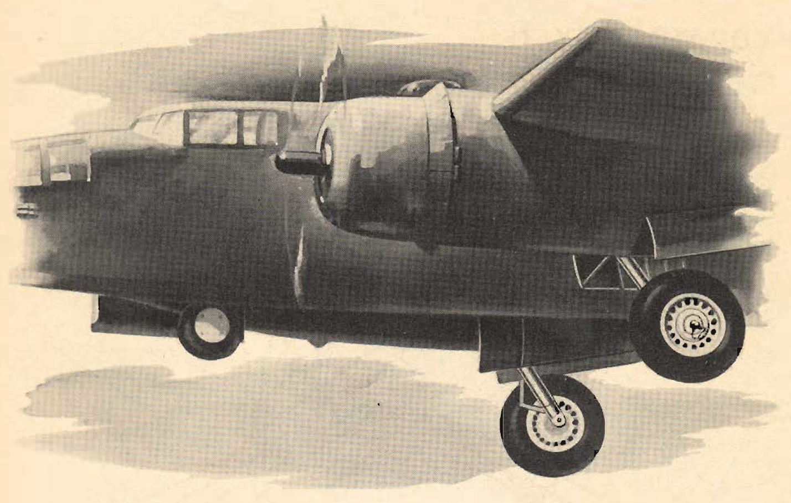
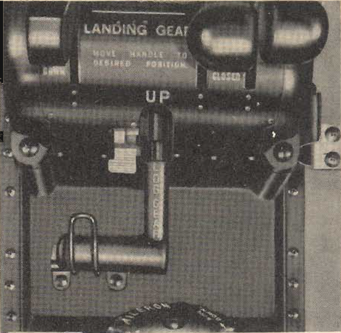
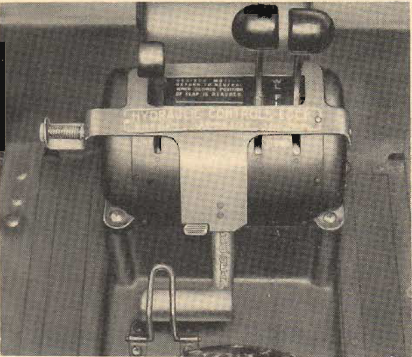

Landing gear
============

 {.body .conbody}
The [B-25]{.keyword} has retractable, tricycle landing gear,
hydraulically operated.

The landing gear retracts aft, the main gear into the engine nacelles,
the nose gear into the fuselage. Doors cover the gear openings in both
the retracted and extended positions.

\
{#LandingGear__image_ozw_2sr_jgb .image}\

The landing gear control handle is on the lower section of the pilot\'s
control pedestal. Three distinct safety devices prevent accidental
movement of the control handle:

1\. A latch on the pedestal that must be set in the correct position
before you can move the handle.

2\. A wire hook fastened to the pedestal which is placed over the control
handle whenever the handle is in the \'\'[DOWN]{.keyword .option}\'\'
position.

\
{#LandingGear__image_vvy_gsr_jgb
.image width="288"}\

3\. A locking plate that the pilot attaches to the pedestal whenever he
leaves the airplane.

\
{#LandingGear__image_u1q_ksr_jgb
.image width="288"}\

The swivel-type nose gear strut incorporates a centering device. It
functions when weight is removed from the nosewheel. There is a shimmy
damper on the nosewheel strut to absorb the vibrations created in
taxiing. The nosewheel may be released from the shimmy damper for towing
purposes. A static ground wire is attached to the nosewheel.

There is a position indicator for the landing gear on the instrument
panel. A warning horn, replaced on later models by a warning light,
indicates whether landing gear is down and locked when throttles are
retarded.

You can check the position of the main wheels visually from the cockpit.
Check the position of the nosewheel visually by use of the drift meter
or by removing the inspection plate from the floor in front of the
copilot.

The landing gear has smooth-contour wheels and tires. The nose wheel
tire has a dual-seal tube, but the main wheel tires use regular lube.

The main wheels have hydraulically operated, multiple-disc brakes.
Varying pressures on the toe pedals produce braking action.

Conventional parking brakes permit setting the brakes in a locked
position.

For emergency operation of landing gear and brakes, see Emergency
Section.

\
{#LandingGear__image_ecx_4sr_jgb
.image width="288"}\
\
{#LandingGear__image_qhb_rsr_jgb
.image width="288"}\
\
{#LandingGear__image_asl_5sr_jgb
.image width="288"}\
\
{#LandingGear__image_gsr_wsr_jgb
.image width="288"}\

**Parent topic:** [Equipment and
Instruments](../mdita/equipment_and_instruments.md "This section provides a survey of the key systems, equipment and instrumentation of the B-25 airplane.")

