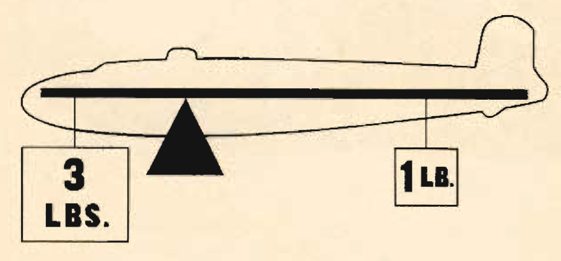

Weight and Balance
==================

 {.body .conbody}
The day when a pilot flew by guesswork is past. One by one the decisions
that were made by intuition, hunches, and guesswork have been taken over
by an orderly system based on knowledge and understanding. Invariably
this has resulted in greater safety and operating efficiency.

\
{#WeightAndBalance__image_akk_ddv_3gb
.image}\

In the loading of heavy bombers this is especially true. Ever-changing
tactical requirements, calling for more and more complex combinations of
cargo, fuel, crew, and armament, have made any but precise, accurate
methods too dangerous to consider. This need to get the utmost in
efficiency from every flight high- lights the need for precise control
of weight and balance.

Improper loading, at best, cuts down the efficiency of an airplane.
Maneuverability, rate of climb, speed, and ceiling suffer greatly.

At its worst, it may mean failure to complete a flight, and sometimes
failure even to start a flight, in most cases with a loss of life and
destruction of valuable equipment.

\
{#WeightAndBalance__image_gft_2dv_3gb .image
width="384"}\

 {#WeightAndBalance__sect_Overload .section .section}
Overload {#overload .title .sectiontitle}
--------

\
{#WeightAndBalance__image_gyz_gdv_3gb
.image width="288"}\

1.  Causes higher stalling speeds.
2.  Lowers structural safety Limits.
3.  Reduces maneuverability.
4.  Increases length of the takeoff run.
5.  Lowers the angle and rate of climb.
6.  Decreases ceiling.
7.  Increases fuel consumption for a given speed.
8.  Overloads the tires.

 {#WeightAndBalance__sect_NoseTooHeavy .section .section}
CG Too Far Forward {#cg-too-far-forward .title .sectiontitle}
------------------

\
{#WeightAndBalance__image_fjt_3dv_3gb
.image width="288"}\

1.  Increases dives beyond control.
2.  Causes unstable, nose-down tendencies when flaps are lowered.
3.  Increases difficulty in raising nose on landing.
4.  Overloads nosewheel and tire.
5.  Increases pilot strain in instrument flying.
6.  Dangerous if tail structure is damaged.

 {#WeightAndBalance__sect_CGTooFarAft .section .section}
CG Too Far Aft {#cg-too-far-aft .title .sectiontitle}
--------------

\
{#WeightAndBalance__image_t5d_4dv_3gb
.image width="288"}\

1.  Increases stall tendency.
2.  Limits low power operation.
3.  Decreases speed.
4.  Decreases range.
5.  Increases pilot strain in instrument flying.
6.  Dangerous if tail structure is damaged.

-   **[Principles of weight and
    balance](../mdita/PrinciplesOfWeightAndBalance.md)**\
    Understanding proper balance and the center of gravity of a
    [B-25]{.keyword}, and how to correctly determine the total weight
    and its distribution on board the aircraft.

 {.linklist .relinfo .relconcepts}
**Related concepts**\

[Fuel](../mdita/fuel.md "Information on the fuel required for the B-25, and how to determine the maximum flight range for the aircraft under different conditions.")

[Grade 91
Fuel](../mdita/grade_91_fuel.md "With our entry into World War II, and our operations on fighting fronts the length and breadth of the world, it became apparent that we could not produce high-octane fuels quickly enough to meet the demand.")

[Cold Weather
Operations](../mdita/cold_weather_operations.md "Cold weather operations bring visions of long arctic nights, glaciers, Eskimos, and stories you have heard of the Far North.")

[Anti-Icing](../mdita/anti_icing.md "Emergency provision is made to prevent ice formation on the propellers, and on the bombsight window by an alcohol anti-icing system.")

[Surface De-icer
System](../mdita/surface_de_icer_system.md "The location and scenarios for using the de-icing systems on you B-25.")

[Defrosting
Systems](../mdita/defrosting_systems.md "Where the desfrosting systems are located across the B-25.")

[Heating
System](../mdita/heating_system.md "The airplane has two independent heating systems; one for heating the navigator's, pilot's, and bombardier's compartments, the other for heating the radio operator's compartment and the interior of the fuselage aft of it.")

[Landing in Cold
Weather](../mdita/landing_in_cold_weather.md "Practical tips on what to know when landing your B-25 in cold weather flying conditions.")

[Oil Dilution After Landing in Cold
Weather](../mdita/oil_dilution_after_landing_in_cold_weather.md "To obtain sufficient dilution of the oil to facilitate starting, allow the engine to cool either by idling or stopping after flight, before dilution begins.")

[Some Typical
Missions](../mdita/some_typical_missions.md "The types of practice missions you can expect when learning the B-25.")

[Gunnery
Missions](../mdita/gunnery_missions.md "In this and all ensuing gunnery missions when both ground and water targets are used, extreme care must be exercised to see that the field of fire is clear of other planes.")

 {.linklist .relinfo .reltasks}
**Related tasks**\

[Starting Engines in Cold
Weather](../mdita/starting_engines_in_cold_weather.md "A checklist to ensure that your engines will start and work properly in cold weather conditions.")

[Takeoff in Cold
Weather](../mdita/takeoff_in_cold_weather.md "Short checklist on what to look for when attempting to take off during cold weather conditions.")

[Flight in Cold
Weather](../mdita/flight_in_cold_weather.md "Your anti-icing and de-icing equipment is primarily intended as a means of getting you out of icing levels.")

[Formation
Bombing](../mdita/formation_bombing.md "This is a day, 6-ship formation bombing mission.")

[Chemical spray
mission](../mdita/ChemicalSprayMission.md "Background and expectations on the chemical spray missions.")

[Day Navigation, Photo-Reconnaissance, and Instrument Let-Down
Mission](../mdita/day_navigation_photo_reconnaissance_and_instrument_let_down_mission.md "How this mission works and what's expected of every crew member.")

 {.linklist .relinfo .relref}
**Related reference**\

[Power Control Chart for Grade 91
Fuel](../mdita/power_control_chart_for_grade_91_fuel.md "What you can expect when flying the B-25 using Grade 91 fuel.")

[Maximum Range Chart For B-25 C, D, & G
Aircraft](../mdita/maximum_range_chart_for_b_25_c_d_and_g_aircraft.md "Information on the maximum range for the C, D, and G models of the B-25.")

[Maximum Range Chart for B-25 H & J
Aircraft](../mdita/maximum_range_chart_for_b_25_h_and_j_aircraft.md "Information on the maximum range for the H and J models of the B-25.")

