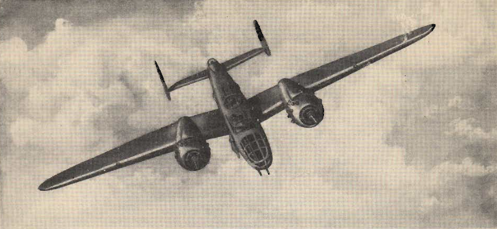

Advanced Air Work
=================

 {.body .conbody}
Many of the maneuvers described here are prohibited in this airplane.
However, knowing the reactions of the airplane to these maneuvers is
important.

Do not take these instructions as a license to abuse your airplane. It
is better to stay away from trouble than invite it.

\
{.image}\

-   **[Prohibited Maneuvers in the
    B-25](../mdita/prohibited_maneuvers_in_the_b_25.md)**\
    The following maneuvers are not prohibited because of the flying
    characteristics of the airplane, but because they impose severe
    structural stresses on it. The [B-25]{.keyword} is a bomber, not a
    pursuit plane.
-   **[Spins](../mdita/spins.md)**\
    No pilot should ever knowingly allow the airplane to get into a
    spin. If you accidentally get into a spin, however, the recovery is
    normal.
-   **[Dives](../mdita/dives.md)**\
    The diving characteristics of the [B-25]{.keyword}, like all its
    flight characteristics; are exceptionally good. The first thing for
    you to remember, as a new pilot in the [B-25]{.keyword}, is this:
    the plane is not a dive bomber.
-   **[Night Flying](../mdita/night_flying.md)**\
    The technique of night flying is closely akin to instrument flying.
-   **[Instrument Flying](../mdita/instrument_flying.md)**\
    Every pilot must have in his possession a copy of T. O. series
    30-100. You must know these Technical Orders for the mastery of
    instrument flight.
-   **[Formation](../mdita/formation.md)**\
    \"You just gotta stay in there.\" Thus returning combat pilots pass
    on to you the most important thing they learned in the battle zones.
-   **[Strange Field Landings](../mdita/strange_field_landings.md)**\
    Flying above your home base you instinctively use familiar features
    of landscape to orient yourself. Your judgment of distance,
    altitude, speedy and depth are sharpened.
-   **[Crosswind Takeoff](../mdita/crosswind_takeoff.md)**\
    Modern flying, with its heavy airplanes, demands a runway for safe
    operation. The days when you taxied out, lined up parallel to the
    wind tee, and took off are gone forever.
-   **[Crosswind Landing](../mdita/crosswind_landing.md)**\
    Crosswind landing in the [B-25]{.keyword} requires accurate flying,
    to save the plane from unnecessary structural stresses. You must
    land the airplane smoothly to prevent blowing a tire, collapsing a
    struts or exerting side loads on the gear.
-   **[Stalls](../mdita/stalls.md)**\
    The [B-25]{.keyword} stalls from the wing root to the wingtip. Thus
    there is no unstable tendency except a slight lateral rolling,
    easily corrected by coordinated control pressures.
-   **[Slow Flying](../mdita/slow_flying.md)**\
    Slow flying increases your confidence in the [B-25]{.keyword} as few
    other maneuvers will. It demonstrates more effectively than anything
    else the effect of applying power.
-   **[Short-Field Takeoff](../mdita/short_field_takeoff.md)**\
    The short-field takeoff is an important operational maneuver. You
    can easily understand its importance if you stop to consider that
    the first Tokyo raid could never have been made without its use.
-   **[Short-Field Landings](../mdita/short_field_landings.md)**\
    You have all heard a lot of discussion on the importance of accurate
    short-field landings. Combat requires that you be able to operate
    under conditions that are close to the absolute limit of the
    airplane\'s performance.
-   **[Single Engine
    Operation](../mdita/single_engine_operation.md)**\
    Single engine operation of the [B-25]{.keyword} follows a logical
    pattern of procedure. The plane flies efficiently on one engine at a
    reduced speed.
-   **[Single Engine Operation
    Procedure](../mdita/single_engine_operation_procedure.md)**\
    Critical single engine airspeed must be maintained at the sacrifice
    of all other considerations.
-   **[Single Engine Trouble
    Search](../mdita/single_engine_trouble_search.md)**\
    How to troubleshoot issues with a single engine.
-   **[Single Engine Practice](../mdita/single_engine_practice.md)**\
    Remember that you are trimmed for single engine flight at one
    airspeed only. If the airspeed or power setting is changed you must
    re-trim.
-   **[Engine Failure on
    Takeoff](../mdita/engine_failure_on_takeoff.md)**\
    This is a tricky proposition for any pilot to handle. When the
    engine fails before you gain CSE speed, retract the wheels and land
    straight ahead. There is far less danger in a belly landing than in
    attempting to go around with too low an airspeed.
-   **[Effect of Power and Airspeed on Single Engine
    Operation](../mdita/effect_of_power_and_airspeed_on_single_engine_operation.md)**\
    To fly safely on single engine you must know the effect of power on
    rudder control at various airspeeds. This is vital to your safety
    when practicing go-around procedures and other maneuvers that
    require quick changes in power settings.
-   **[Single Engine Landing](../mdita/single_engine_landing.md)**\
    Single engine landings should remove any lingering doubts you may
    have about the [B-25]{.keyword} and its ability as a single engine
    performer.
-   **[Single Engine
    Go-Around](../mdita/single_engine_go_around.md)**\
    Successful single engine go-around depends on an early decision that
    a go-around is necessary. You can start a go-around procedure at a
    low altitude and from a low airspeed on the approach, but it is
    difficult and dangerous.
-   **[Tips on Single Engine
    Operation](../mdita/tips_on_single_engine_operation.md)**\
    A list of handy tips on how to work with your engines in regular
    circumstances, and how to re-start a dead engine.
-   **[Auxiliary Hydraulic Pump and Emergency Hydraulic Selector
    Valve](../mdita/auxiliary_hydraulic_pump_and_emergency_hydraulic_selector_valve.md)**\
    The auxiliary hydraulic pump is a double-action hand pump for use as
    a source of pressure if the main hydraulic system fails.
-   **[Tactical Uses of the
    B-25](../mdita/tactical_uses_of_the_b_25.md)**\
    Preparing for a mission, and the roles of all of the crew in making
    that mission a success.

 {.linklist .relinfo .relconcepts}
**Related concepts**\

[Taxiing](../mdita/taxiing.md "Taxiing the B-25, with its tricycle landing gear, may seem strange after handling the conventional type.")

[Common Taxiing
Errors](../mdita/common_taxiing_errors.md "A short list of what not to do when taxiing.")

[Taxiing
Tips](../mdita/taxiing_tips.md "A short list of useful tips to know when taxiing.")

[Takeoff](../mdita/takeoff.md "Takeoff in the B-25 with its tricycle gear, varies from that with conventional gear only during the initial part of the roll. You will find it much easier.")

[Notes on
Takeoff](../mdita/notes_on_takeoff.md "Do not dive the airplane after lifting it at the end of the takeoff run. When you level out to pick up CSE speed after takeoff release the stick pressure as the speed picks up.")

[Common Takeoff
Errors](../mdita/common_takeoff_errors.md "A list of common errors that are made during takeoff.")

[Power
Changes](../mdita/power_changes.md "What to know about expected engine performance when throttling up.")

[Climb](../mdita/climb.md "Making your B-25 climb properly without straining your arms or your airplane.")

[Let-down](../mdita/let_down.md "A let-down is a simple procedure either in instrument or contact flight.")

[Landing](../mdita/landing.md ""The easiest plane to land I have ever flown."")

[Power-On
Landings](../mdita/power_on_landings.md "Before turning onto the base leg, one landing is much like another. The variations in procedure start as you leave the downwind leg.")

[Power-Off
Landing](../mdita/power_off_landing.md "The B-25 is too large and heavy to practice the prescribed forced-landing procedures used in lighter planes.")

[Tips On
Landing](../mdita/tips_on_landing.md "A list of things to know that will make your landings easier on you and on the B-25.")

[Making a
Go-Around](../mdita/making_a_go_around.md "There is a common reluctance among pilots to go around. They feel it implies a lack of ability to meet an unusual situation.")

[Common landing errors](../mdita/common_landing_errors.md)

 {.linklist .relinfo .reltasks}
**Related tasks**\

[Run-up](../mdita/run_up.md "The process for doing a run-up prior to takeoff.")

[Trimming](../mdita/trimming.md "When properly trimmed the B-25 flies with an ease that belies its weight and size.")

[Landing
Checklist](../mdita/landing_checklist.md "On any landing, enter traffic as instructed by field regulations or as instructed by the control tower.")

[Post-Landing
Checklist](../mdita/post_landing_checklist.md "On the runway, move the prop control to "INC. RPM."")

[No-Flap
Landing](../mdita/no_flap_landing.md "Occasionally both in combat and normal operations your plane may be damaged to the extent that flaps cannot be lowered for landing.")

[Go-Around
Procedure](../mdita/go_around_procedure.md "Don't hesitate to go around. Any doubt that the plane is under perfect control is sufficient cause to go around. If you have made a poor approach and know that the landing will be too long, or too rough— go around.")

[Parking](../mdita/parking.md "When you park your plane after a flight, just remember that the Colonel may make the next flight in that particular airplane.")

 {.linklist .relinfo .relref}
**Related reference**\

[Before Takeoff - C.I.G. F.T.P.R.-Friction
Brake](../mdita/before_takeoff_c.i.g.f.t.p.r._friction_brake.md "Checklist to ensure that your Controls move freely, Instruments function, proper Gas settings, then to check Flaps, Trim, Props are set for take-off, and then Run up the engine before removing the friction brake.")

