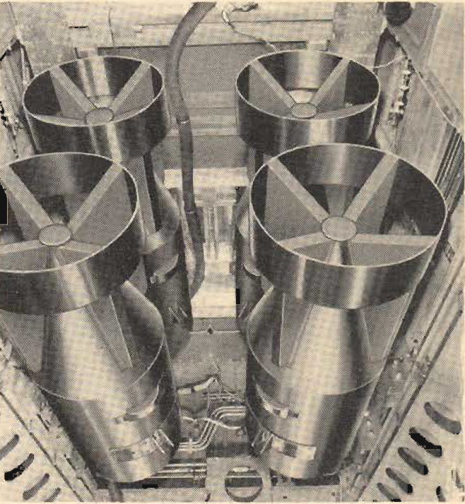

Armament
========

 {.body .conbody}
The armament of the [B-25]{.keyword} follows basically the same pattern
found in any AAF bombardment airplane. The detailed installation varies
greatly according to the tactical uses intended.

{#armament__image_ukc_wkm_cgb .image}

Safe handling and operation require thorough knowledge arid practice on
this equipment, under the supervision of a competent instructor.

 {#armament__sect_Bombing .section .section}
Bombing {#bombing .title .sectiontitle}
-------

The bomb bay, between the navigator s and the radio operator\'s
compartments, has fixed ladder bomb racks which accommodate 100-lb. to
1600-lb. bombs. A special rack may he installed to carry one 2000-lb.
bomb. The control system is electric and most of the system is dual
wired as a precaution against damage by gunfire. Wing racks may be
installed on the outer wing panels to carry 8 bombs of from 100 lb. to
300 lb., or 6 325-lb. depth charges.

Controls for operating the bomb bay doors and bomb releases are in the
bombardier\'s compartment.

On the [B-25]{.keyword} G and H, the bomb bay and bombing controls are
in the pilot\'s compartment.

\
{#armament__image_swf_klm_cgb .image
width="288"}\

On the [B-25]{.keyword} J, the bombardment controls are in both the
bombardier\'s and pilot\'s compartments.

Controls in the pilot\'s compartment will salvo both bomb load and bomb
bay tanks. (See Emergency Procedures.)

Provision is made for carrying a torpedo as an alternate bomb load. Use
of the torpedo precludes bomb loads in the bomb bay, but does not limit
the use of external wing racks.

Chemical spray tanks may be carried in the bomb bay and on the wing
racks when necessary.

 {#armament__sect_Gunnery .section .section}
Gunnery {#gunnery .title .sectiontitle}
-------

Gunnery equipment varies greatly in different series airplanes. They are
as follows: [B-25]{.keyword} C and D,

\
{#armament__image_vt2_plm_cgb
.image width="288"}\

One fixed .50-cal. nose gun is mounted on the right side of the
bombardier\'s compartment. The pilot fires this gun and the bombardier
charges it. There is a type N-3B optical gunsight on the upper left side
of the instrument panel.

One flexible .5fl-cal. nose gun, in a ball-and-socket mount, is directly
above the bombsight window. The bombardier fires this gun, which has a
ring-and-post sight.

There is an electrically powered Bendix upper turret in the radio
gunner\'s compartment. This turret carries two .50-cal. guns fired by
either the radio operator or the gunner, and has a type N-6A optical
gunsight.

 {#armament__sect_B-25G .section .section}
[B-25]{.keyword} G {#b-25-g .title .sectiontitle}
------------------

One 75-mm. cannon (type M-4) is in the tunnel beneath the left side of
the pilot\'s compartment and fires through the nose. The pilot fires the
cannon and the cannoneer loads it. There is a type N-3B optical gunsight
on the left side of the pilot\'s instrument panel for the forward-firing
guns.

Two forward-firing, .50-cal. fixed guns are in the nose. The pilot
charges and fires these guns.

There is a Bendix upper turret in the radio gunner\'s compartment. It
carries two .50-cal. guns, fired by either the radio operator or the
gunner, and has a type N-6A optical gunsight.

A few modified G\'s carry flexible .50-cal. waist guns J blister guns,
and one flexible .50-cal. tail gun.

\
{#armament__image_ibl_rlm_cgb
.image width="288"}\

 {#armament__sect_B-25H .section .section}
[B-25]{.keyword} H {#b-25-h .title .sectiontitle}
------------------

One 75-mm, cannon (type T-13) is in the tunnel beneath the left side of
the pilot\'s compartment and fires through the nose. The pilot fires the
cannon and the cannoneer loads it. A type N-3B optical gunsight for the
forward-firing guns is on the left side of the pilot\'s instrument
panel.

Four forward-firing, .50-cai. fixed guns are in the nose section. The
pilot fires these guns, which are charged in the navigator-cannoneer\'s
compartment.

Two or four fixed .50-cal. guns are mounted in blisters on each side of
the plane. The cannoneer charges these guns and the pilot fires them.

A Bendix upper turret, in the aft portion of the cannoneer\'s
compartment, carries two .50-cal. guns, fired by the engineer, and has
an N-6A gunsight.

Two flexible .50-cal. guns in Plexiglas windows, one at each side of the
fuselage aft of the bomb bay, are fired by the radio operator. They have
ring-and-post sights.

A Bell model M-7 electric-hydraulic turret with two .50-cal. guns and a
type N-8 gunsight is in the tail. A tail gunner operates this turret.

\
{#armament__image_rms_tlm_cgb
.image width="480"}\

 {#armament__sect_B-25J .section .section}
[B-25]{.keyword} J {#b-25-j .title .sectiontitle}
------------------

There is one or two forward-fixing, fixed .50-cal. nose gun. The
bombardier charges this gun and the pilot fires it. The bombardier fires
one flexible .50-cal. gun in the nose.

Four fixed .50-cal. guns are installed in blisters, two on each side of
the fuselage. The cannoneer charges these guns and the pilot fires them.

A type N-3B optical gunsight governs the forward-firing guns.

A Bendix upper turret, in the aft portion of the cannoneer\'s
compartment, carries two .50-cal. guns, fired by the engineer, and has
an N-6A gunsight.

Two flexible .50-cal. guns in Plexiglas windows, one at each side of the
fuselage aft of the bomb bay, are fired by the radio operator. They have
ring-and-bead or optical sights.

A Bell model M-7 electric-hydraulic turret with two .50-cal. guns and a
type N-8 gunsight is in the tail and is operated by a tail gunner.

\
{#armament__image_ddp_vlm_cgb
.image width="576"}\

**Parent topic:** [Equipment and
Instruments](../mdita/equipment_and_instruments.md "This section provides a survey of the key systems, equipment and instrumentation of the B-25 airplane.")

