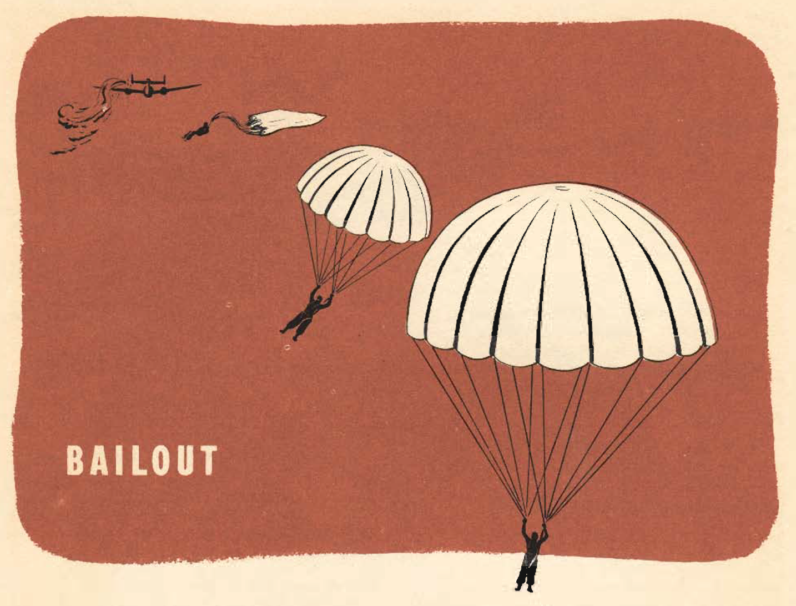
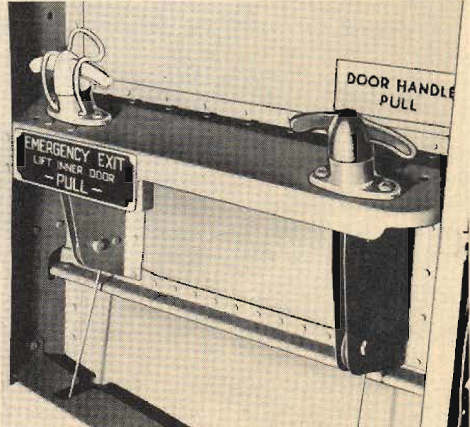

Bailout
=======

 {.body .conbody}
Take good care of your parachute, Keep it clean and free of grease and
moisture.

\
{.image}\

 {.note .important .note_important}
[Important:]{.note__title} Preflight your chute before every flight.

See that there are no loose threads, rips or tears in the case. Check
that the seal is intact, the release pins straight, and that the chute
has been recently inspected and checked.

Instruct your crew in the use of their parachutes and on the necessity
for instant obedience to the bailout order. A few seconds\' delay at the
escape hatch can easily prove fatal not only to the man who hesitates
but to the rest of the crew.

**You are the last man out. Have your crew well drilled and
instructed.**

**Check with the ground crew on the condition and operation of the
escape hatches.** Spot checks show that these hatches are often
overlooked on the periodic inspections.

\
{.image
width="288"}\

-   **[Bailout Procedure](../mdita/bailout_procedure.md)**\
-   **[How to Jump](../mdita/how_to_jump.md)**\
-   **[Procedure for Reclosing Bomb Bay
    Doors](../mdita/procedure_for_reclosing_bomb_bay_doors.md)**\
    If you have had a hydraulic failure, be sure that the bomb bay doors
    are not partially open when you jump.

**Parent topic:** [Emergency
Situations](../mdita/emergency_situations.md "This section covers what to do in specific emergency situations, including fire aboard the B-25 while in flight, bailing out, forced landings and ditching the airplane.")

