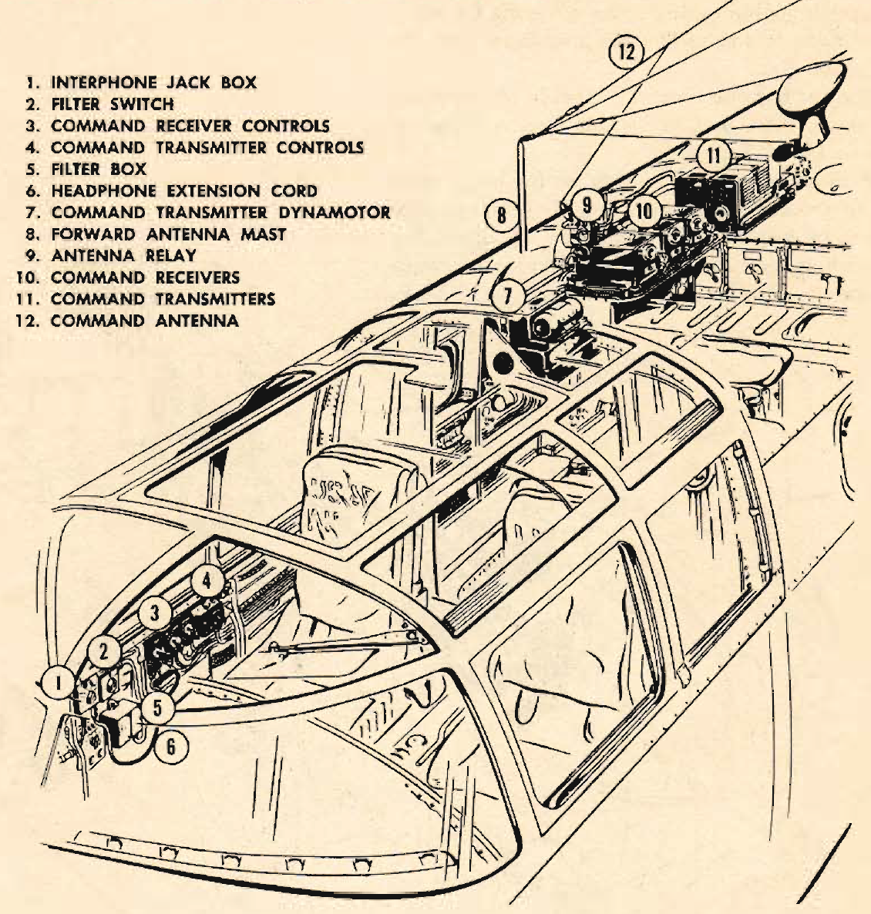

Communication Equipment
=======================

 {.body .conbody}
Location and types of communication equipment located throughout the
[B-25]{.keyword}.

{#communication_equipment__image_rbd_kkm_cgb
.image}

The communication equipment on the [B-25]{.keyword} is basically the
same as that on all Army bombardment airplanes.

The following radio sets are installed:

-   Command set
-   Liaison set
-   Radio compass receiver
-   Marker beacon receiver
-   Interphone system

On some models the tactical use of the airplane requires the
installation of VHF and IFF equipment. Special training in this
equipment will be given when missions require its use.

 {#communication_equipment__sect_CommandSet .section .section}
Command Set {#command-set .title .sectiontitle}
-----------

The command set has 2 transmitters with a range of 4 to 5.3 Mc on one
transmitter and a range of 7 to 9.1 Mc on the other.

Three receivers cover ranges of 190 to 550 Kc, 3 to 6 Mc, and 6 to 9.1
Mc. Selective use of these ranges is made by switching one or all of the
receivers \"ON.\"

The command set allows transmission and reception by voice and code for
air-to-air and air-to-ground stations over short ranges.

 {#communication_equipment__sect_LiaisonSet .section .section}
Liaison Set {#liaison-set .title .sectiontitle}
-----------

The liaison set has one transmitter with 7 interchangeable tuning units,
covering frequency ranges of 150 to 600 Kc and from 1500 Kc to 12,500
Kc.

The set has one receiver capable of reception of voice, tone, or CW
signals over a range of 150 to 18,000 Kc.

A radio operator uses this set for long-range air-to-ground
communication. In emergencies the pilot, copilot, and navigator, by
using the interphone circuits, can transmit voice messages to the
ground.

{#communication_equipment__image_o5t_nkm_cgb
.image}

 {#communication_equipment__sect_RadioCompassReceiver .section .section}
Radio Compass Receiver {#radio-compass-receiver .title .sectiontitle}
----------------------

{#communication_equipment__image_tww_qkm_cgb
.image}

The radio compass receiver has 2 control stations, one in the pilot\'s
compartment and one in the navigator\'s compartment.

Operating on either a fixed antenna or a rotating loop antenna, it
indicates direction of incoming signals. It covers a range of 200 to
1750 Kc.

For detailed instructions in the use of this equipment see T.O. 30-100
series.

 {#communication_equipment__sect_MarkerBeaconReceiver .section .section}
Marker Beacon Receiver {#marker-beacon-receiver .title .sectiontitle}
----------------------

The marker beacon receiver is a specialist. It performs only one job.
Operating on a frequency of 75 Mc, it detects signals transmitted by fan
marker beacons, and by Z marker beacons operating in the cones of
silence. A blinking light on the instrument panel is connected to the
receiver, blinking on when the airplane passes a 75 Mc transmitter.

 {#communication_equipment__sect_Interphone .section .section}
Interphone {#interphone .title .sectiontitle}
----------

The interphone system of the [B-25]{.keyword} is a standard
installation. It operates whenever the battery-disconnect switches are
\"[ON]{.keyword .option}.\" It is used by every crew member to
communicate with all other crew members.

The interphone plays a vital part in crew coordination. Used effectively
in combat, it serves as the eyes of the entire crew.

\
{#communication_equipment__image_c4z_skm_cgb
.image width="288"}\

**Parent topic:** [Equipment and
Instruments](../mdita/equipment_and_instruments.md "This section provides a survey of the key systems, equipment and instrumentation of the B-25 airplane.")

