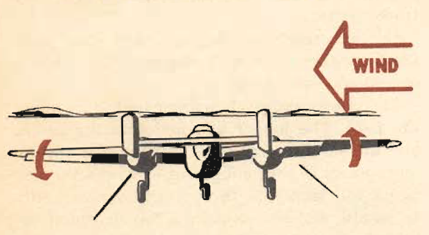
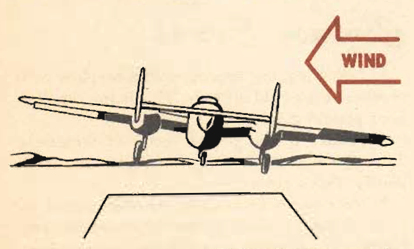

Crosswind Takeoff
=================

 {.body .taskbody}
Modern flying, with its heavy airplanes, demands a runway for safe
operation. The days when you taxied out, lined up parallel to the wind
tee, and took off are gone forever.

 {.section .section .context}
Instead of 360 degrees of airfield available for takeoff, the modem
airfield has three runways, usually set to take advantage of the six
cardinal points of the prevailing winds. Using these runways, you
encounter cross winds of varying degrees and intensities.

The aids to a crosswind takeoff are the rudders, the throttles, the
aileron, and, as a last resort, the brakes.

The technique is:

1.  [Make the usual takeoff checks.]{.ph .cmd}
2.  [Advance the throttles, leading with the upwind throttle. The
    strength of the wind will determine the amount of lead.]{.ph .cmd}
     {.itemgroup .info}
    \
    {.image width="288"}\
    

3.  [As the speed increases and the rudders become effective, equalize
    the throttles.]{.ph .cmd}
4.  [Leave the ground with the throttles evenly set and use just enough
    rudder and aileron to make a coordinated turn into the wind, thus
    counteracting any drift.]{.ph .cmd}
     {.itemgroup .info}
    \
    {.image width="288"}\
     {.note .note .note_note}
    [Note:]{.note__title} The plane may skip as the speed increases
    toward the end of the takeoff roll. This is an indication that it is
    ready to fly. Help it along to prevent skipping and to keep the
    consequent side thrust from injuring the landing gear.
    

    \
    {.image
    width="288"}\
    

 {.section .section .tasktroubleshooting}
**Common Errors**

-   Failure to recognize the drift.
-   Trying to correct the drift by skidding instead of turning into the
    wind. This increases the stalling speed and if violent enough it
    will put the plane back on the ground. The bounce will be made with
    the drift applying a side thrust to the gear.
-   Juggling the throttles, giving uneven control. Lead the upwind
    throttle, constantly reducing the lead. As the speed increases the
    rudder control is great enough to take off cleanly.

**Parent topic:** [Advanced Air
Work](../mdita/advanced_air_work.md "Many of the maneuvers described here are prohibited in this airplane. However, knowing the reactions of the airplane to these maneuvers is important.")

 {.linklist .relinfo .relconcepts}
**Related concepts**\

[Taxiing](../mdita/taxiing.md "Taxiing the B-25, with its tricycle landing gear, may seem strange after handling the conventional type.")

[Common Taxiing
Errors](../mdita/common_taxiing_errors.md "A short list of what not to do when taxiing.")

[Taxiing
Tips](../mdita/taxiing_tips.md "A short list of useful tips to know when taxiing.")

[Takeoff](../mdita/takeoff.md "Takeoff in the B-25 with its tricycle gear, varies from that with conventional gear only during the initial part of the roll. You will find it much easier.")

[Notes on
Takeoff](../mdita/notes_on_takeoff.md "Do not dive the airplane after lifting it at the end of the takeoff run. When you level out to pick up CSE speed after takeoff release the stick pressure as the speed picks up.")

[Common Takeoff
Errors](../mdita/common_takeoff_errors.md "A list of common errors that are made during takeoff.")

[Power
Changes](../mdita/power_changes.md "What to know about expected engine performance when throttling up.")

[Climb](../mdita/climb.md "Making your B-25 climb properly without straining your arms or your airplane.")

[Let-down](../mdita/let_down.md "A let-down is a simple procedure either in instrument or contact flight.")

[Landing](../mdita/landing.md ""The easiest plane to land I have ever flown."")

[Power-On
Landings](../mdita/power_on_landings.md "Before turning onto the base leg, one landing is much like another. The variations in procedure start as you leave the downwind leg.")

[Power-Off
Landing](../mdita/power_off_landing.md "The B-25 is too large and heavy to practice the prescribed forced-landing procedures used in lighter planes.")

[Tips On
Landing](../mdita/tips_on_landing.md "A list of things to know that will make your landings easier on you and on the B-25.")

[Making a
Go-Around](../mdita/making_a_go_around.md "There is a common reluctance among pilots to go around. They feel it implies a lack of ability to meet an unusual situation.")

[Common landing errors](../mdita/common_landing_errors.md)

 {.linklist .relinfo .reltasks}
**Related tasks**\

[Run-up](../mdita/run_up.md "The process for doing a run-up prior to takeoff.")

[Trimming](../mdita/trimming.md "When properly trimmed the B-25 flies with an ease that belies its weight and size.")

[Landing
Checklist](../mdita/landing_checklist.md "On any landing, enter traffic as instructed by field regulations or as instructed by the control tower.")

[Post-Landing
Checklist](../mdita/post_landing_checklist.md "On the runway, move the prop control to "INC. RPM."")

[No-Flap
Landing](../mdita/no_flap_landing.md "Occasionally both in combat and normal operations your plane may be damaged to the extent that flaps cannot be lowered for landing.")

[Go-Around
Procedure](../mdita/go_around_procedure.md "Don't hesitate to go around. Any doubt that the plane is under perfect control is sufficient cause to go around. If you have made a poor approach and know that the landing will be too long, or too rough— go around.")

[Parking](../mdita/parking.md "When you park your plane after a flight, just remember that the Colonel may make the next flight in that particular airplane.")

 {.linklist .relinfo .relref}
**Related reference**\

[Before Takeoff - C.I.G. F.T.P.R.-Friction
Brake](../mdita/before_takeoff_c.i.g.f.t.p.r._friction_brake.md "Checklist to ensure that your Controls move freely, Instruments function, proper Gas settings, then to check Flaps, Trim, Props are set for take-off, and then Run up the engine before removing the friction brake.")

