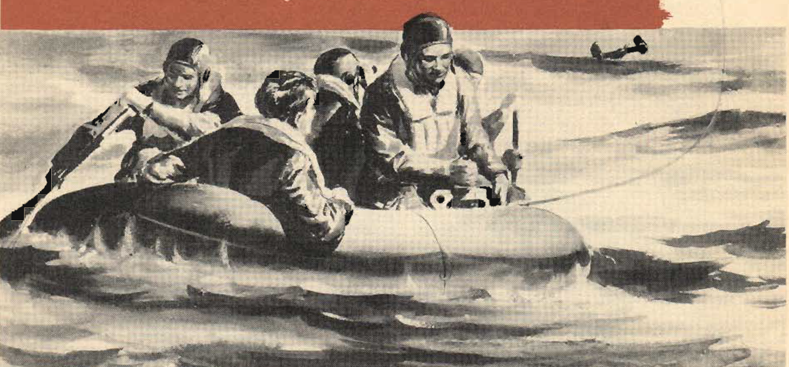
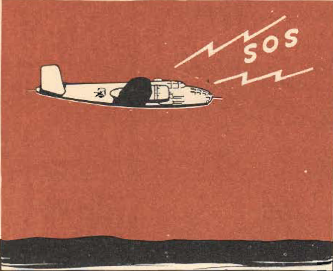
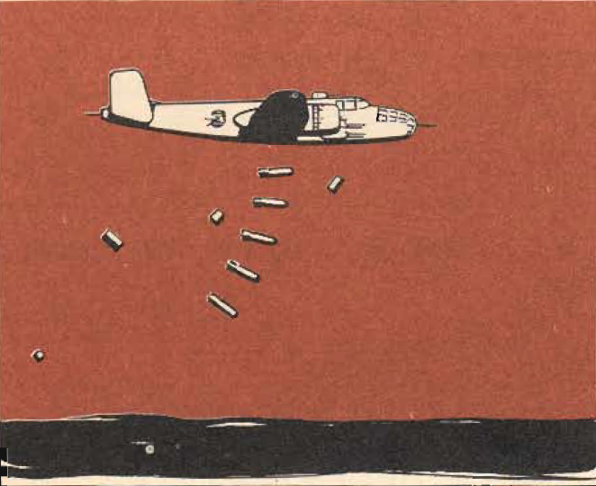
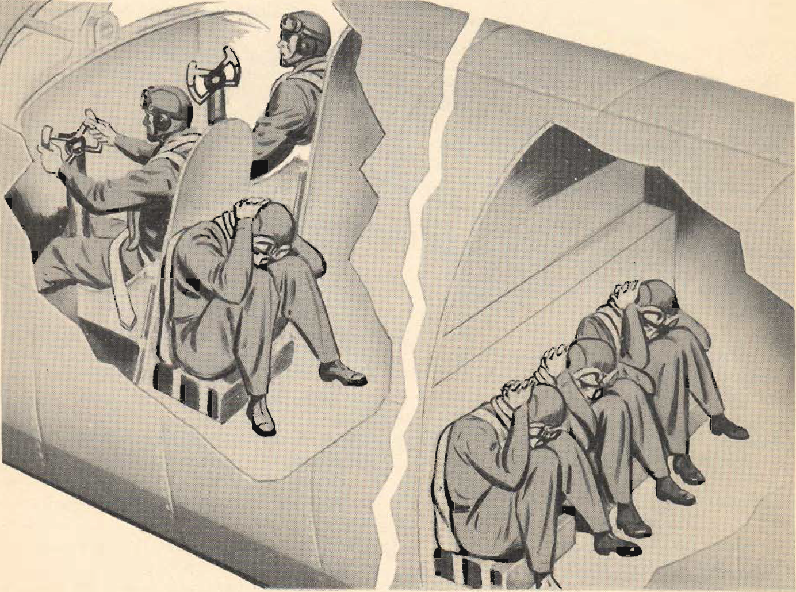

Ditching
========

 {.body .conbody}
With the tactical needs of World War II calling for the operation of
land planes over vast stretches of water, airmen faced a new hazard:
ditching---the forced landing of land planes at sea.

\
{.image}\

From the analysis of actual ditching reports, plus the results of tests
made with scale models, there has come a body of information so
comprehensive that today ditching is a matter of tried and proven
procedure.

Like any procedure, it must be practiced to be effective. Safeguard
yourself and your crew by consistent practice.

**Successful ditching depends on the speed and efficiency with which
each crew member carries out his duties, and on the coordination of all
efforts.**

The two major factors which may necessitate ditching your airplane are
lack of fuel and mechanical failure. It is well to bear in mind,
however, that many ditchings have been avoided by thorough knowledge of
the airplane and its characteristics under all conditions.

 {#ditching__sect_WhenToDitch .section .section}
When to Ditch {#when-to-ditch .title .sectiontitle}
-------------

**Start preparation for ditching as soon as you feel the slightest doubt
that your mission will be completed successfully.**

You are responsible for the welfare of your crew. It is your duty to see
that they are prepared well in advance of the actual ditching.

Do not delay your decision too long. Your crew must have as much time as
possible to prepare. Once your decision i.s made, notify the crew by
interphone and the alarm bell \"Prepare to ditch!\"

 {#ditching__sect_RadioProcedure .section .section}
Radio Procedure {#radio-procedure .title .sectiontitle}
---------------

**Start emergency radio procedure immediately.** Your best chance for
rescue lies in correct and speedy radio procedure before ditching. Radio
operator and pilot must fully understand the specific radio procedure in
their particular theater of operations.

If you transmit distress signals that you are ditching, but are lucky
enough to make land, be sure to notify the Air-Sea Rescue Unit as soon
as possible to avoid danger and loss of time (or other crews who may be
out searching for you.

\
{.image width="288"}\

 {#ditching__sect_PreparePlane .section .section}
Prepare the Plane {#prepare-the-plane .title .sectiontitle}
-----------------

When ditched, the [B-25]{.keyword} loses its forward speed after the
second impact in slightly more than its own length. This sudden
deceleration makes deadly missiles of all loose objects in the airplane.
**Jettison loose equipment.** Also jettison all objects likely to be
torn loose by the impact. Lightening the plane reduces the landing speed
and lessens the impact. Get rid of oxygen walk-around bottles, kitbags,
extra sidcarms, cargo. Strip turrets of ammunition, dismantle and
jettison guns and radio sets mounted over the bomb bay. Save at least
one parachute for each raft. The silk and shroud lines will prove handy
in the raft for sail, cover, and extra line.

Salvo bombs and the fuselage tank if it is more than half full. If
fuselage tank is less than half full, keep it in the plane for added
buoyancy.

\
{.image width="288"}\

Once the plane is in the water, only the emergency kits and signaling
devices are valuable to you. Collect Very cartridges, pistol, smoke
flares, all signaling devices and keep them on your person. Don\'t
hesitate to throw out everything else that is loose or can be pried
loose. Often the decreased weight will enable you to remain in the air
much longer and bring you closer to land.

Drop all equipment through the lower and side hatches. Be careful to
avoid damage to tail surfaces.

Before the landing, close all bottom hatches. Leave the right side hatch
open to prevent jamming on impact. **If there is not enough time to
salvo bombs and fuselage tank (30 seconds), keep the bomb bay doors
closed.** Open the pilot\'s escape hatch only when below 1000 feet. Open
hatches create drag.

 {#ditching__sect_PrepareCrew .section .section}
Prepare the Crew {#prepare-the-crew .title .sectiontitle}
----------------

Remove all entangling cords and lines, parachute harness, radio cords,
oxygen masks when below 12,000 feet, and throat microphones- Remove
flying boots. Wear all other clothing, regardless of temperature. Loosen
the clothing about your neck, particularly ties. Wear hfe vests at all
times on over-water flights, but do not inflate them inside the plane.
The escape hatches are small and may damage the vests in the exit.

Accomplish your prearranged duties and go to your ditching station at
once. Remain there until the landing is completed. Moving around
unnecessarily will change the trim of the plane and make the pilot\'s
job more difficult.

**Fasten all safety belts and harness before the landing.** Use your
headsets and mike at your ditching station but do not fasten them to
your body.

**Above all, remain in your ditching station until the plane has stopped
moving.** More men are injured during the deceleration than at any other
time. Terrific forces are generated then; the human body cannot absorb
these forces if it is not protected.

 {#ditching__sect_PersonnelPosition .section .section}
Position of Personnel {#position-of-personnel .title .sectiontitle}
---------------------

Pilot--- in his seat, seat full forward and locked, cushion protecting
chest.

Copilot - in his seat, seat full back and locked to provide easy access
to the escape hatch. If his seat is forward it may block the exit of the
entire crew. On late-series planes with low-backed copilot\'s seat, it
can be full forward. Copilot braces with his hands on the rubber crash
ring on the instrument panel. **Keep elbows flexed.**

Engineer---behind the pilot\'s seat, facing the rear of the plane,
braced and cushioned.

Navigator--- on the floor of the navigator\'s compartment, facing aft,
braced and cushioned.

Radio operator---on his seat, back against the bomb bay wall, safety
belt fastened.

Gunner--- beside the radio operator on the floor. If the airplane has a
footwell for the radio operator, up-end a radio coil in this space and
sit on that to avoid a cramped position.

If the head protrudes above the support at the back, hold it firmly in
position with the hands across the base of the skull, pulling down
firmly against the neck muscles. It has been found that the body in this
position will absorb shocks far greater than those encountered in
ditching.

\
{.image}\

-   **[Ditching: Pilot\'s
    Duties](../mdita/tk_DitchingPilotSDuties.md)**\
    Make the decision to ditch.
-   **[Ditching: Copilot\'s
    Duties](../mdita/DitchingCopilotSDuties.md)**\
-   **[Ditching: Radio Operator\'s
    Duties](../mdita/DitchingRadioOperatorSDuties.md)**\
-   **[Ditching: Engineer\'s
    Duties](../mdita/DitchingEngineerSDuties.md)**\
-   **[Ditching: Gunner\'s
    Duties](../mdita/DitchingGunnerSDuties.md)**\
-   **[Critical periods in
    ditching](../mdita/CriticalPeriodsInDitching.md)**\
    There are two critical periods in ditching:
-   **[Ditching: Landing
    procedure](../mdita/DitchingLandingProcedure.md)**\
-   **[Escape procedure: Front
    Cockpit](../mdita/DitchingEscapeProcedure.md)**\

**Parent topic:** [Emergency
Situations](../mdita/emergency_situations.md "This section covers what to do in specific emergency situations, including fire aboard the B-25 while in flight, bailing out, forced landings and ditching the airplane.")

