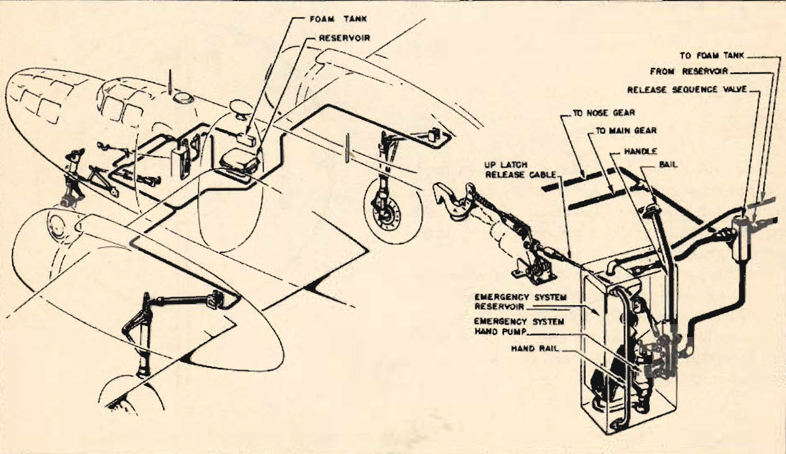
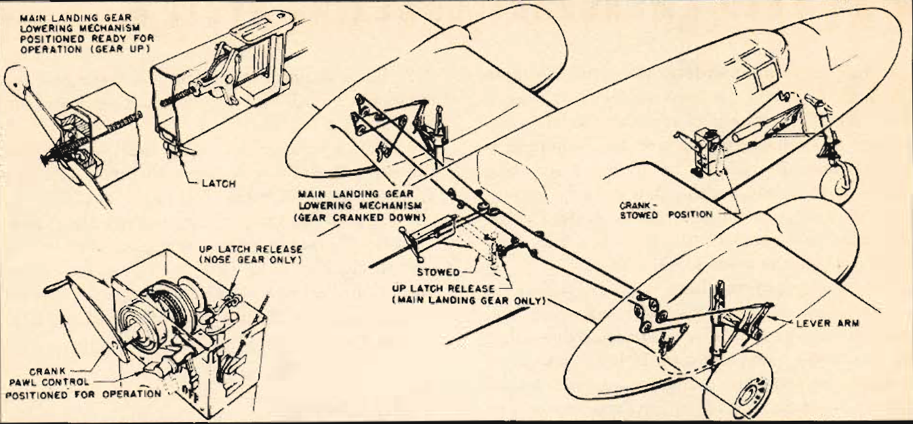

Emergency Hydraulic Wheel Lowering System
=========================================

 {.body .taskbody}
The [B-25]{.keyword} has an emergency hydraulic wheel lowering system to
provide power if the main hydraulic wheel lowering system fails. The
system provides for simultaneous lowering of main landing gear and nose
gear.

 {.section .section .context}
The system consists of an emergency hand pump and a hydraulic fluid
reservoir, both in the navigator\'s compartment. The complete system
incorporates automatic valves to regulate normal and emergency flow of
fluid to the operating struts, a nosegear up-lock release cable
connecting the hand pump handle and the up-lock latch, and fluid
transmission lines.

The emergency reservoir fills automatically when the main reservoir is
filled, and the fluid is available for the emergency lowering of the
landing gear even if the main hydraulic system fluid is completely lost.

\
{.image}\

**Operation**

If the hydraulic system fails completely, take the following steps:

1.  [Return to the home base if possible. Report your trouble briefly to
    the tower.]{.ph .cmd}
2.  [Climb to an altitude of at least 5000 feet above the surrounding
    terrain.]{.ph .cmd}
3.  [Reduce your airspeed below 150 mph.]{.ph .cmd}
4.  [Place landing gear control handle in pilot\'s compartment
    \"DOWN.\"]{.ph .cmd}
5.  [Operate emergency hand pump one full stroke to release nose gear
    up-lock. Check landing gear indicator to see whether nose gear is
    partially extended. If not, give the pump handle another full
    stroke.]{.ph .cmd}
6.  [Operate the hand pump until gear is down and locked. Employ your
    normal checks to in- sure that gear is actually down and
    locked.]{.ph .cmd}
7.  [Return pump handle to forward position and safety it.]{.ph .cmd}
     {.itemgroup .info}
    Some earlier models of the [B-25]{.keyword} have mechanical
    emergency wheel lowering controls. In these models, you lower the
    main landing gear and the nose gear separately. The controls consist
    of screw jacks and a series of cables which operate directly on the
    wheels.

    \
    {.image}\
    

**Parent topic:** [Emergency
Systems](../mdita/emergency_systems.md "This section covers all of the emergency systems, including the emergency hydraulic wheel lowering system, wing flap system, hydraulic and air brakes, what to do in the event of a complete failure of the hydraulic systems, and miscellaneous emergency equipment.")

