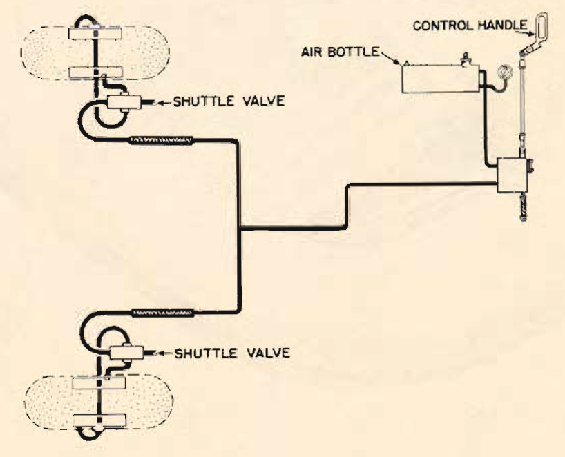

Emergency Operation-Air Brakes
==============================

 {.body .taskbody}
Use this Air Brake System only in extreme emergencies.

 {.section .section .context}
**Use it when normal hydraulic system has failed and you cannot develop
sufficient pressure with your auxiliary hydraulic hand pump.**

When you are sure you must use the air brake system, choose the field
with the largest runways within range of your airplane. The runway
should be at least one mile long for a safe landing. Make a short-field
landing.

Dissipate all the speed you can safely lose before using your air brake,
but don\'t wait until you are out of runway!

You cannot use these brakes selectively. Be ready to counteract any
uneven braking action with the throttles.

**Operation:**

1.  [Pull up sharply on the air brake handle to break the safety
    wire.]{.ph .cmd}
2.  [Lower the handle immediately. Lower it by hand, as the handle is
    spring-loaded and will be pulled back past neutral if it is allowed
    to snap down.]{.ph .cmd}
     {.itemgroup .info}
    The air pressure is applied to the brakes at the extreme top of the
    brake handle\'s travel, and released at the extreme bottom of the
    travel. In neutral, the air pressure is locked in the brakes and air
    bottle.
    

3.  [Apply braking action in a series of quick, sharp applications. If
    you apply the brakes continuously for two to three seconds most of
    the pressure will be transferred to the brake drums and the brakes
    may lock.]{.ph .cmd}
4.  [To release the brakes, move the brake handle all the way down. It
    will release pressure in the brakes only at the end of its
    travel,]{.ph .cmd}
5.  [After you accomplish one complete braking action and the plane
    stops, there should be a small residue of air still in the emergency
    air brake bottle. You can use brakes a second time only at a greatly
    reduced power.]{.ph .cmd}
6.  [You must depend only on the original braking actions and should, on
    coming to a stop, call the tower and have the plane towed in. Any
    attempt to taxi with the limited braking action available is
    extremely dangerous.]{.ph .cmd}
     {.itemgroup .info}
     {.note .warning .note_warning}
    [Warning:]{.note__title} Placing handle in neutral position must be
    done by hand; the spring load on the handle will snap it into
    release position and exhaust the air pressure.
    Chock wheels before brakes are released.

    Bleed hydraulic brake system after using the air brake system.
    

    \
    {.image}\
    

**Parent topic:** [Emergency
Systems](../mdita/emergency_systems.md "This section covers all of the emergency systems, including the emergency hydraulic wheel lowering system, wing flap system, hydraulic and air brakes, what to do in the event of a complete failure of the hydraulic systems, and miscellaneous emergency equipment.")

