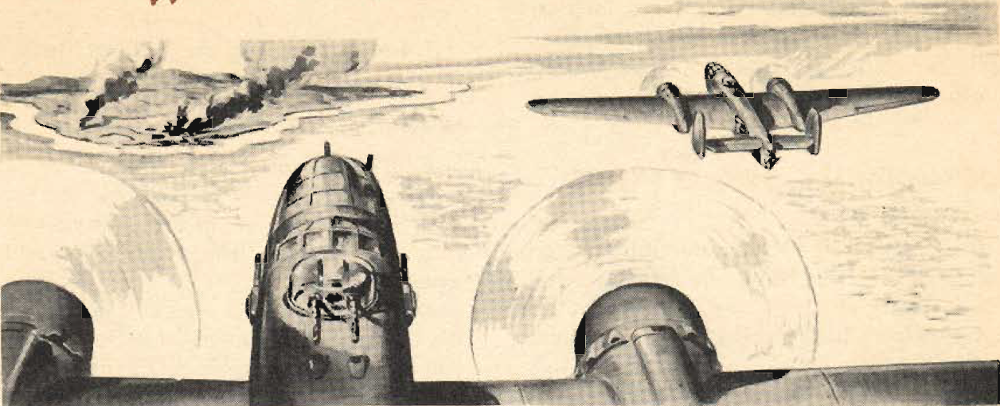

Formation Bombing
=================

 {.body .taskbody}
This is a day, 6-ship formation bombing mission.

 {.section .section .context}
\
{.image}\

1.  [A Norden sight will be used in the lead ship on each element and
    D-8 sights will be used in wing ships. Bombardiers in lead ships
    will sight for both range and deflection. Bombardiers in wing ships
    will drop bombs on lead ship.]{.ph .cmd}
2.  [Flight leader will take off at a predetermined time; other ships
    will take off at 30 second intervals and join formation.]{.ph .cmd}
3.  [After formation has been satisfactorily joined, one circle will be
    made of the field. During this circle, formation will climb at 170
    mph.]{.ph .cmd}
4.  [Flight leader should have an approximate power setting of 32\" MP
    at 2200 rpm. Climb will continue on course until an altitude of
    10,000 feet is obtained. High blower will not be used and all ships
    will keep mixture controls in \"FULL RICH\" position.]{.ph .cmd}
5.  [Upon reaching the desired altitude, the leader will assume that
    anti-aircraft fire has been encountered, and evasive action will be
    used.]{.ph .cmd}
6.  [Upon approaching the target, a gentle left turn, diving at 1000
    feet per minute onto the target, will be executed. This final turn
    requires judgment and precision timing on the part of the lead ship.
    After diving to the correct bombing altitude (8000 feet), and onto
    the target, the lead ship should be in a position to allow
    approximately a 20 second bomb run, straight and level. Immediately
    upon the closing of the bomb bay doors, the leader will again make a
    left turn, diving at 1000 feet per minute with a bank not to exceed
    15 degrees. This dive will be held until 7000 feet altitude is
    reached. The following data should be strictly observed:]{.ph .cmd}
    a.  [The lead ship should climb at 170 MPH, with approximate power
        settings of 32\" MP and 2200 RPM. The wing ships should use 2400
        RPM.]{.ph .cmd}
    b.  [After altitude is reached, power settings of lead ship should
        not exceed 1900 RPM and 27\" at any time. The wing ships should
        use at least 2000 RPM,]{.ph .cmd}
    c.  [Copilots must be sure that RPM is increased if the MP dictates
        it.]{.ph .cmd}
    d.  [The bombing run should be made at an indicated airspeed of 230
        MPH, and upon leaving the target, should not exceed 250
        MPH.]{.ph .cmd}
    e.  [Wing ships will open bomb bay doors immediately upon seeing
        doors of lead ship open, and bombs will be dropped on the lead
        ship, **The Bombardier-Navigator must be quick in releasing
        bombs after he sees the first bomb Ieave the lead ship.**]{.ph
        .cmd}
    f.  [Caution must be used by the lead ship at all times. Turns and
        maneuvers must be gone into gently and slowly.]{.ph .cmd}
    g.  [After bombing is completed, flight will return to home base and
        break up into three-ship elements for landing.]{.ph .cmd}

**Parent topic:** [Some Typical
Missions](../mdita/some_typical_missions.md "The types of practice missions you can expect when learning the B-25.")

 {.linklist .relinfo .relconcepts}
**Related concepts**\

[Weight and
Balance](../mdita/WeightAndBalance.md "The day when a pilot flew by guesswork is past. One by one the decisions that were made by intuition, hunches, and guesswork have been taken over by an orderly system based on knowledge and understanding. Invariably this has resulted in greater safety and operating efficiency.")

[Principles of weight and
balance](../mdita/PrinciplesOfWeightAndBalance.md "Understanding proper balance and the center of gravity of a B-25, and how to correctly determine the total weight and its distribution on board the aircraft.")

[Fuel](../mdita/fuel.md "Information on the fuel required for the B-25, and how to determine the maximum flight range for the aircraft under different conditions.")

[Grade 91
Fuel](../mdita/grade_91_fuel.md "With our entry into World War II, and our operations on fighting fronts the length and breadth of the world, it became apparent that we could not produce high-octane fuels quickly enough to meet the demand.")

[Cold Weather
Operations](../mdita/cold_weather_operations.md "Cold weather operations bring visions of long arctic nights, glaciers, Eskimos, and stories you have heard of the Far North.")

[Anti-Icing](../mdita/anti_icing.md "Emergency provision is made to prevent ice formation on the propellers, and on the bombsight window by an alcohol anti-icing system.")

[Surface De-icer
System](../mdita/surface_de_icer_system.md "The location and scenarios for using the de-icing systems on you B-25.")

[Defrosting
Systems](../mdita/defrosting_systems.md "Where the desfrosting systems are located across the B-25.")

[Heating
System](../mdita/heating_system.md "The airplane has two independent heating systems; one for heating the navigator's, pilot's, and bombardier's compartments, the other for heating the radio operator's compartment and the interior of the fuselage aft of it.")

[Landing in Cold
Weather](../mdita/landing_in_cold_weather.md "Practical tips on what to know when landing your B-25 in cold weather flying conditions.")

[Oil Dilution After Landing in Cold
Weather](../mdita/oil_dilution_after_landing_in_cold_weather.md "To obtain sufficient dilution of the oil to facilitate starting, allow the engine to cool either by idling or stopping after flight, before dilution begins.")

 {.linklist .relinfo .reltasks}
**Related tasks**\

[Starting Engines in Cold
Weather](../mdita/starting_engines_in_cold_weather.md "A checklist to ensure that your engines will start and work properly in cold weather conditions.")

[Takeoff in Cold
Weather](../mdita/takeoff_in_cold_weather.md "Short checklist on what to look for when attempting to take off during cold weather conditions.")

[Flight in Cold
Weather](../mdita/flight_in_cold_weather.md "Your anti-icing and de-icing equipment is primarily intended as a means of getting you out of icing levels.")

 {.linklist .relinfo .relref}
**Related reference**\

[Power Control Chart for Grade 91
Fuel](../mdita/power_control_chart_for_grade_91_fuel.md "What you can expect when flying the B-25 using Grade 91 fuel.")

[Maximum Range Chart For B-25 C, D, & G
Aircraft](../mdita/maximum_range_chart_for_b_25_c_d_and_g_aircraft.md "Information on the maximum range for the C, D, and G models of the B-25.")

[Maximum Range Chart for B-25 H & J
Aircraft](../mdita/maximum_range_chart_for_b_25_h_and_j_aircraft.md "Information on the maximum range for the H and J models of the B-25.")

