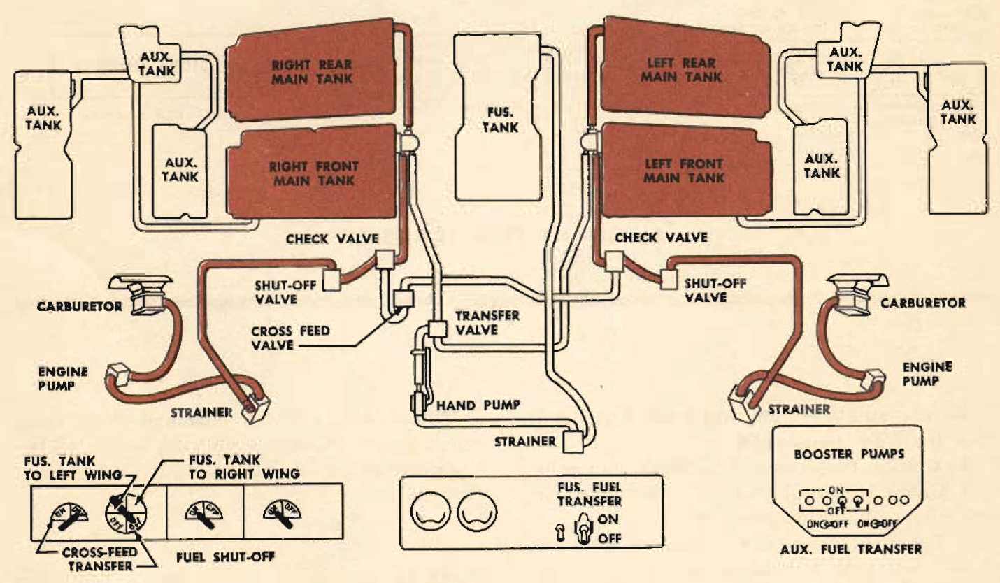
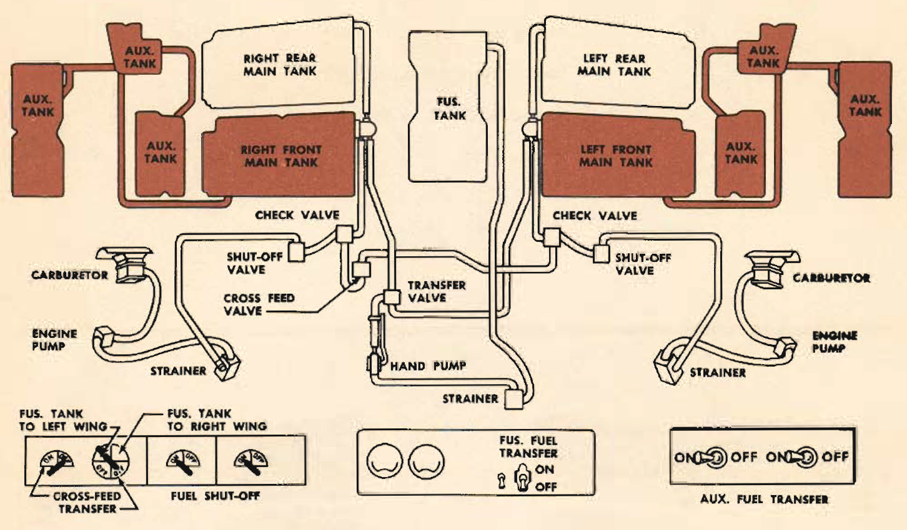

Fuel System Operation
=====================

 {.body .taskbody}
Every man on your crew must know the fuel system so thoroughly that a
mistake in its operation is impossible.

 {.section .section .context}
\
{.image}\
\
{.image}\

To use auxiliary fuel you must first get it into the front main cells.

To transfer fuel from the auxiliary wing cells:

1.  [Check fuel levels in front cells to see that space is available for
    transfer.]{.ph .cmd}
2.  [Turn auxiliary fuel transfer switches \"ON.\" (On pilot\'s
    pedestal.)]{.ph .cmd}
3.  [Turn liquidometer to the front cell receiving fuel.]{.ph .cmd}
4.  [After front cell is full, turn transfer switch \"OFF.\"]{.ph .cmd}
5.  [Repeat on opposite side.]{.ph .cmd}

**Parent topic:** [Equipment and
Instruments](../mdita/equipment_and_instruments.md "This section provides a survey of the key systems, equipment and instrumentation of the B-25 airplane.")

