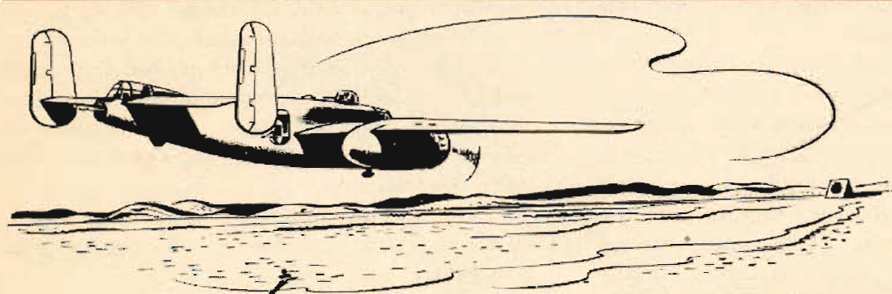

Gunnery Missions
================

 {.body .conbody}
In this and all ensuing gunnery missions when both ground and water
targets are used, extreme care must be exercised to see that the field
of fire is clear of other planes.

+-----------------+-----------------+-----------------+-----------------+
| X Base          | To              | 33°38\'N;       | 39 Miles        |
|                 |                 | 80°32\'W        |                 |
|                 |                 |                 |                 |
|                 |                 | (Bridge over X  |                 |
|                 |                 | River)          |                 |
+-----------------+-----------------+-----------------+-----------------+
| 33°38\'N;       | To              | 34°04\'N;       | 46 Miles        |
| 80°32\'W        |                 | 79°56\'W        |                 |
|                 |                 |                 |                 |
|                 |                 | (Fork in H      |                 |
|                 |                 | River)          |                 |
+-----------------+-----------------+-----------------+-----------------+
| 34°04\'N;       | To              | 34°08\'N;       | 42 Miles        |
| 79°56\'W        |                 | 79°13\'W        |                 |
|                 |                 |                 |                 |
|                 |                 | (H River, 6     |                 |
|                 |                 | Miles after     |                 |
|                 |                 | crossing        |                 |
|                 |                 | railroad line)  |                 |
+-----------------+-----------------+-----------------+-----------------+
| 34°08\'N;       | To              | I.P. 33°39½\'N; | 33 Miles        |
| 79°13\'W        |                 | 79°09½\'W       |                 |
+-----------------+-----------------+-----------------+-----------------+
| Initial Point   | To              | Gunnery Control | 12 Miles        |
+-----------------+-----------------+-----------------+-----------------+
| Total           |                 |                 | 172 Miles       |
+-----------------+-----------------+-----------------+-----------------+

\
{#gunnery_missions__image_gxl_21w_3gb
.image}\

-   **[Instructions for Firing-Ground
    Targets](../mdita/instructions_for_firing_ground_targets.md)**\
    The expectations and ammunition load out for destroying ground-based
    targets.
-   **[Instructions for Firing-Water
    Targets](../mdita/instructions_for_firing_water_targets.md)**\
    The expectations and ammunition load out for destroying water-based
    targets.

**Parent topic:** [Some Typical
Missions](../mdita/some_typical_missions.md "The types of practice missions you can expect when learning the B-25.")

 {.linklist .relinfo .relconcepts}
**Related concepts**\

[Weight and
Balance](../mdita/WeightAndBalance.md "The day when a pilot flew by guesswork is past. One by one the decisions that were made by intuition, hunches, and guesswork have been taken over by an orderly system based on knowledge and understanding. Invariably this has resulted in greater safety and operating efficiency.")

[Principles of weight and
balance](../mdita/PrinciplesOfWeightAndBalance.md "Understanding proper balance and the center of gravity of a B-25, and how to correctly determine the total weight and its distribution on board the aircraft.")

[Fuel](../mdita/fuel.md "Information on the fuel required for the B-25, and how to determine the maximum flight range for the aircraft under different conditions.")

[Grade 91
Fuel](../mdita/grade_91_fuel.md "With our entry into World War II, and our operations on fighting fronts the length and breadth of the world, it became apparent that we could not produce high-octane fuels quickly enough to meet the demand.")

[Cold Weather
Operations](../mdita/cold_weather_operations.md "Cold weather operations bring visions of long arctic nights, glaciers, Eskimos, and stories you have heard of the Far North.")

[Anti-Icing](../mdita/anti_icing.md "Emergency provision is made to prevent ice formation on the propellers, and on the bombsight window by an alcohol anti-icing system.")

[Surface De-icer
System](../mdita/surface_de_icer_system.md "The location and scenarios for using the de-icing systems on you B-25.")

[Defrosting
Systems](../mdita/defrosting_systems.md "Where the desfrosting systems are located across the B-25.")

[Heating
System](../mdita/heating_system.md "The airplane has two independent heating systems; one for heating the navigator's, pilot's, and bombardier's compartments, the other for heating the radio operator's compartment and the interior of the fuselage aft of it.")

[Landing in Cold
Weather](../mdita/landing_in_cold_weather.md "Practical tips on what to know when landing your B-25 in cold weather flying conditions.")

[Oil Dilution After Landing in Cold
Weather](../mdita/oil_dilution_after_landing_in_cold_weather.md "To obtain sufficient dilution of the oil to facilitate starting, allow the engine to cool either by idling or stopping after flight, before dilution begins.")

 {.linklist .relinfo .reltasks}
**Related tasks**\

[Starting Engines in Cold
Weather](../mdita/starting_engines_in_cold_weather.md "A checklist to ensure that your engines will start and work properly in cold weather conditions.")

[Takeoff in Cold
Weather](../mdita/takeoff_in_cold_weather.md "Short checklist on what to look for when attempting to take off during cold weather conditions.")

[Flight in Cold
Weather](../mdita/flight_in_cold_weather.md "Your anti-icing and de-icing equipment is primarily intended as a means of getting you out of icing levels.")

 {.linklist .relinfo .relref}
**Related reference**\

[Power Control Chart for Grade 91
Fuel](../mdita/power_control_chart_for_grade_91_fuel.md "What you can expect when flying the B-25 using Grade 91 fuel.")

[Maximum Range Chart For B-25 C, D, & G
Aircraft](../mdita/maximum_range_chart_for_b_25_c_d_and_g_aircraft.md "Information on the maximum range for the C, D, and G models of the B-25.")

[Maximum Range Chart for B-25 H & J
Aircraft](../mdita/maximum_range_chart_for_b_25_h_and_j_aircraft.md "Information on the maximum range for the H and J models of the B-25.")

