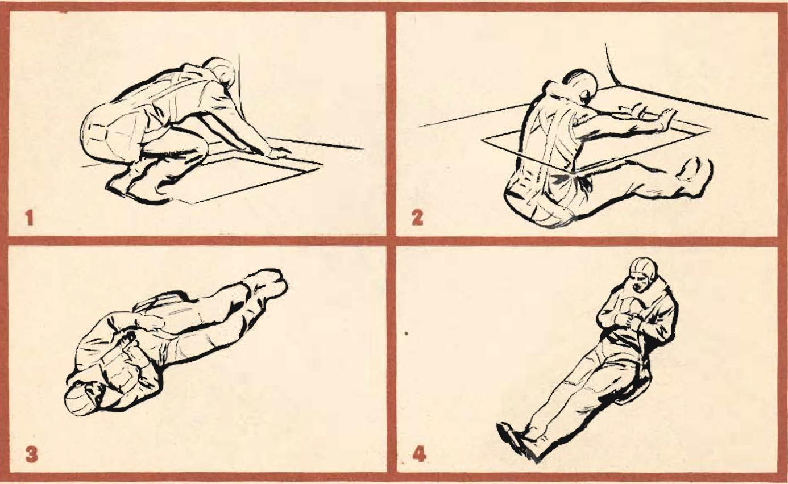

How to Jump
===========

 {.body .taskbody}
 {.section .section .context}
\
{.image}\

1.  [Face rear of ship and place hands on structure above rear of
    hatch.]{.ph .cmd}
2.  [Lower legs through opening. The slip- stream will carry your legs
    up against the underpart of the fuselage. Twist your shoulder to the
    left to prevent injury to the head on the way out. Push away from
    the plane with your hands.]{.ph .cmd}
3.  [When you are sure that you are clear of the plane, look directly at
    the ripcord release and take hold of the handle.]{.ph .cmd}
4.  [Straighten your legs, keeping your feet together, and pull the
    release. In a low-altitude jump, pull the release as soon as
    possible.]{.ph .cmd}
     {.itemgroup .info}
    For further information on bailout technique, consult your Pilot\'s
    Information File.
    

**Parent topic:**
[Bailout](../mdita/bailout.md "Take good care of your parachute, Keep it clean and free of grease and moisture.")

