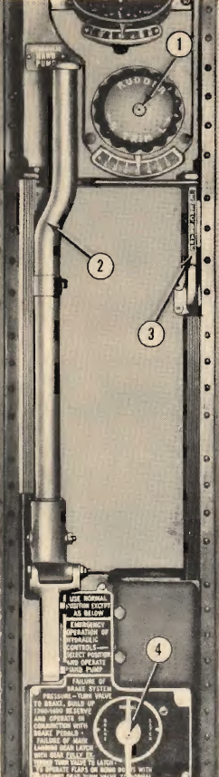

Hydraulic Hand Pump and Emergency Air Brake Control
===================================================

Key features of the hydraulic hand pump and the emergency air brake
control.

 {.section .section}
{#hydraulic_hand_pump_and_emergency_air_brake_control__image_ndm_rgm_cgb
.image height="576"}

**Parent topic:** [Location of Controls B-25 C and
D](../mdita/location_of_controls_b_25_c_and_d.md "An overview of the airplane's key controls and their locations.")

