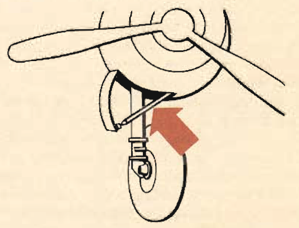

Landing Checklist
=================

 {.body .taskbody}
On any landing, enter traffic as instructed by field regulations or as
instructed by the control tower.

 {.section .section .context}
Adjust the power settings to bring the speed below 170 mph but not below
150 mph. Prior to landing, make this landing check:

 {.note .important .note_important}
[Important:]{.note__title} Do not allow the speed to drop below 150 mph
until you are on the approach.

1.  [Trailing antenna \"RETRACTED\".]{.ph .cmd}
2.  [Wing deicers \"OFF\".]{.ph .cmd}
3.  [Heaters \"OFF\".]{.ph .cmd}
4.  [Autopilot \"OFF\".]{.ph .cmd}
5.  [Fuel pressure.]{.ph .cmd}
6.  [Fuel levels.]{.ph .cmd}
7.  [Booster pumps \"ON\".]{.ph .cmd}
8.  [Transfer pumps \"OFF\".]{.ph .cmd}
9.  [Mixture \"FULL RICH\".]{.ph .cmd}
10. [Carburetor heat \"NORMAL\" except in severe icing conditions.]{.ph
    .cmd}
11. [Propellers 2400 rpm--- This permits the use of maximum climbing
    power in the event of a go-around. (See power control charts.)]{.ph
    .cmd}
12. [Landing gear \"DOWN\"---locked and safetied, visually and orally
    checked.]{.ph .cmd}
     {.itemgroup .info}
    \
    {#landing_checklist__image_us2_djh_2gb
    .image width="288"}\
    You can check the main gear visually and the nose gear on the selsyn
    indicator, and, if the prop hub is polished, you can check it by its
    reflection in the hub. There is a warning horn in some aircraft and
    a warning light in later models. This warning system operates when
    the throttles are retarded.
    

13. [Brake and hydraulic pressure.]{.ph .cmd}
14. **Optional:** [Optional with local regulations, you may use 15° of
    flaps on the downwind leg to improve visibility and to improve
    handling characteristics at low speeds.]{.ph .cmd}

 {#landing_checklist__postreq_g4d_hjh_2gb .section .section .postreq}
 {.p}
Final
[GUMPS](../gl_GUMPS.md "GUMPS stands for: G – Gas (Fuel on the proper tank, fuel pump on as required, positive fuel pressure) U – Undercarriage (landing gear down) M – Mixture (fuel mixture set) P – Propeller (prop set) S – Seat belts and Switches (lights, pitot heat, and so on)")check
before landing:

G
:   Gas

U
:   Undercarriage and Pressures

M
:   Mixture

P
:   Props

**Parent topic:** [Typical Air
Work](../mdita/typical_air_work.md "Common functions and process relating to flying the B-25.")

 {.linklist .relinfo .relconcepts}
**Related concepts**\

[Advanced Air
Work](../mdita/advanced_air_work.md "Many of the maneuvers described here are prohibited in this airplane. However, knowing the reactions of the airplane to these maneuvers is important.")

[Prohibited Maneuvers in the
B-25](../mdita/prohibited_maneuvers_in_the_b_25.md "The following maneuvers are not prohibited because of the flying characteristics of the airplane, but because they impose severe structural stresses on it. The B-25 is a bomber, not a pursuit plane.")

[Spins](../mdita/spins.md "No pilot should ever knowingly allow the airplane to get into a spin. If you accidentally get into a spin, however, the recovery is normal.")

[Dives](../mdita/dives.md "The diving characteristics of the B-25, like all its flight characteristics; are exceptionally good. The first thing for you to remember, as a new pilot in the B-25, is this: the plane is not a dive bomber.")

[Instrument
Flying](../mdita/instrument_flying.md "Every pilot must have in his possession a copy of T. O. series 30-100. You must know these Technical Orders for the mastery of instrument flight.")

[Formation](../mdita/formation.md ""You just gotta stay in there." Thus returning combat pilots pass on to you the most important thing they learned in the battle zones.")

[Strange Field
Landings](../mdita/strange_field_landings.md "Flying above your home base you instinctively use familiar features of landscape to orient yourself. Your judgment of distance, altitude, speedy and depth are sharpened.")

[Crosswind
Landing](../mdita/crosswind_landing.md "Crosswind landing in the B-25 requires accurate flying, to save the plane from unnecessary structural stresses. You must land the airplane smoothly to prevent blowing a tire, collapsing a struts or exerting side loads on the gear.")

[Stalls](../mdita/stalls.md "The B-25 stalls from the wing root to the wingtip. Thus there is no unstable tendency except a slight lateral rolling, easily corrected by coordinated control pressures.")

[Slow
Flying](../mdita/slow_flying.md "Slow flying increases your confidence in the B-25 as few other maneuvers will. It demonstrates more effectively than anything else the effect of applying power.")

[Short-Field
Takeoff](../mdita/short_field_takeoff.md "The short-field takeoff is an important operational maneuver. You can easily understand its importance if you stop to consider that the first Tokyo raid could never have been made without its use.")

[Short-Field
Landings](../mdita/short_field_landings.md "You have all heard a lot of discussion on the importance of accurate short-field landings. Combat requires that you be able to operate under conditions that are close to the absolute limit of the airplane's performance.")

[Single Engine
Operation](../mdita/single_engine_operation.md "Single engine operation of the B-25 follows a logical pattern of procedure. The plane flies efficiently on one engine at a reduced speed.")

[Single Engine
Practice](../mdita/single_engine_practice.md "Remember that you are trimmed for single engine flight at one airspeed only. If the airspeed or power setting is changed you must re-trim.")

[Effect of Power and Airspeed on Single Engine
Operation](../mdita/effect_of_power_and_airspeed_on_single_engine_operation.md "To fly safely on single engine you must know the effect of power on rudder control at various airspeeds. This is vital to your safety when practicing go-around procedures and other maneuvers that require quick changes in power settings.")

[Single Engine
Landing](../mdita/single_engine_landing.md "Single engine landings should remove any lingering doubts you may have about the B-25 and its ability as a single engine performer.")

[Tips on Single Engine
Operation](../mdita/tips_on_single_engine_operation.md "A list of handy tips on how to work with your engines in regular circumstances, and how to re-start a dead engine.")

[Auxiliary Hydraulic Pump and Emergency Hydraulic Selector
Valve](../mdita/auxiliary_hydraulic_pump_and_emergency_hydraulic_selector_valve.md "The auxiliary hydraulic pump is a double-action hand pump for use as a source of pressure if the main hydraulic system fails.")

[Tactical Uses of the
B-25](../mdita/tactical_uses_of_the_b_25.md "Preparing for a mission, and the roles of all of the crew in making that mission a success.")

 {.linklist .relinfo .reltasks}
**Related tasks**\

[Night
Flying](../mdita/night_flying.md "The technique of night flying is closely akin to instrument flying.")

[Crosswind
Takeoff](../mdita/crosswind_takeoff.md "Modern flying, with its heavy airplanes, demands a runway for safe operation. The days when you taxied out, lined up parallel to the wind tee, and took off are gone forever.")

[Single Engine Operation
Procedure](../mdita/single_engine_operation_procedure.md "Critical single engine airspeed must be maintained at the sacrifice of all other considerations.")

[Single Engine Trouble
Search](../mdita/single_engine_trouble_search.md "How to troubleshoot issues with a single engine.")

[Engine Failure on
Takeoff](../mdita/engine_failure_on_takeoff.md "This is a tricky proposition for any pilot to handle. When the engine fails before you gain CSE speed, retract the wheels and land straight ahead. There is far less danger in a belly landing than in attempting to go around with too low an airspeed.")

[Single Engine
Go-Around](../mdita/single_engine_go_around.md "Successful single engine go-around depends on an early decision that a go-around is necessary. You can start a go-around procedure at a low altitude and from a low airspeed on the approach, but it is difficult and dangerous.")

