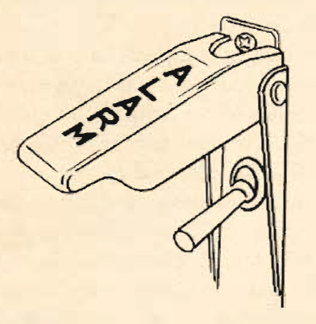
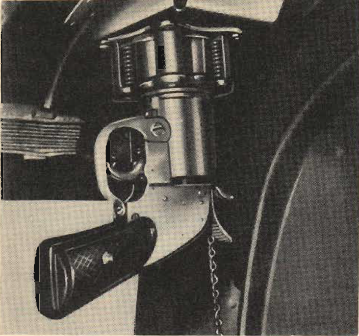
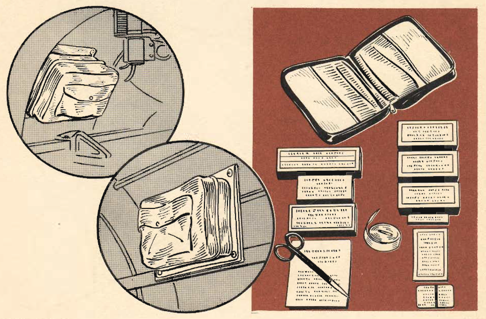
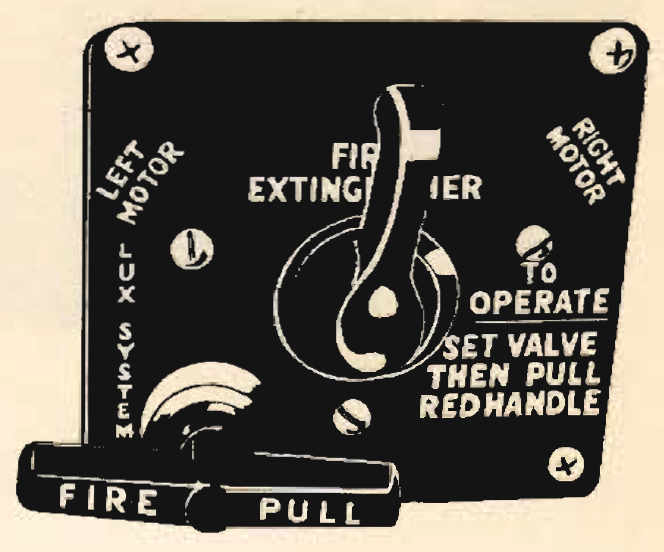
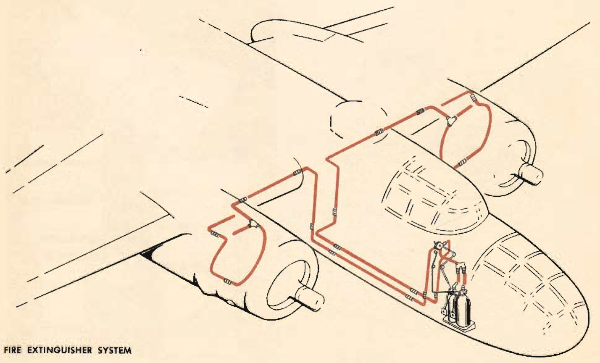

Miscellaneous Emergency Equipment
=================================

Information on all of the remaining emergency equipment, including the
alarm bells, life raft and life preservers, emergency fuel pump,
pyrotechnic signal pistol the radio demolition switch, hand ax,
first-aid kits and fire extinguishers.

 {#miscellaneous_emergency_equipment__sect_AlarmBells .section .section}
Alarm Bells {#alarm-bells .title .sectiontitle}
-----------

The alarm bells are located at all crew stations. A switch on the lower
left section of the pilot\'s switch panel controls them.

\
{#miscellaneous_emergency_equipment__image_o1n_13p_3gb
.image width="288"}\

 {#miscellaneous_emergency_equipment__sect_LifeRaft .section .section}
Life Raft {#life-raft .title .sectiontitle}
---------

A life raft equipped with a CO~2~ cylinder for instantaneous inflation
is stowed in the upper forward left corner of the radio compartment. For
proper use, see ditching.

\
{#miscellaneous_emergency_equipment__image_mzl_b3p_3gb
.image width="480"}\

 {#miscellaneous_emergency_equipment__sect_LifePreservers .section .section}
Life Preservers {#life-preservers .title .sectiontitle}
---------------

The back cushions on the pilot\'s and copilot\'s seats are filled with
kapok and will serve as life preservers.

 {#miscellaneous_emergency_equipment__sect_EmerFuelPump .section .section}
Emergency Fuel Pump {#emergency-fuel-pump .title .sectiontitle}
-------------------

In late-series airplanes there is an emergency fuel transfer hand pump
on the floor of the navigator\'s compartment. If the electric fuel
system fails, you can transfer fuel from the bomb bay tanks to the wing
tanks with this pump.

 {#miscellaneous_emergency_equipment__sect_PyroSignalPistol .section .section}
Pyrotechnic Signal Pistol {#pyrotechnic-signal-pistol .title .sectiontitle}
-------------------------

On later planes, an M-8 type pyrotechnic pistol is stowed in a canvas
holster in the navigator\'s compartment as loose equipment.

 {.note .warning .note_warning}
[Warning:]{.note__title} Don\'t load this pistol except when it has been
placed in the mount provided in the upper left corner of the
navigator\'s compartment.

\
{#miscellaneous_emergency_equipment__image_tcd_d3p_3gb
.image width="288"}\

 {#miscellaneous_emergency_equipment__sect_RadioDemoSwitch .section .section}
Radio Demolition Switch {#radio-demolition-switch .title .sectiontitle}
-----------------------

On later airplanes, a switch controlling the charge for demolishing the
identification radio in an emergency is on the right instrument sub-
panel. Depress both buttons simultaneously to set off the charge.

 {#miscellaneous_emergency_equipment__sect_HandAx .section .section}
Hand Ax {#hand-ax .title .sectiontitle}
-------

There is a hand ax on the right side of the fuselage in the radio
operator\'s compartment.

 {#miscellaneous_emergency_equipment__sect_FirstAidKits .section .section}
First-Aid Kits {#first-aid-kits .title .sectiontitle}
--------------

Two first-aid kits are provided, one on the left side of the
navigator\'s compartment, the other on the right side of the radio
compartment. The number of kits is often increased when the ship engages
in tactical operation.

\
{#miscellaneous_emergency_equipment__image_xbs_23p_3gb
.image width="576"}\

 {#miscellaneous_emergency_equipment__sect_FireExtinguishers .section .section}
Fire Extinguishers {#fire-extinguishers .title .sectiontitle}
------------------

Carbon dioxide fire extinguishers are at the right side of the
navigator\'s compartment and at the right side of the radio operator\'s
compartment.

There is an engine fire extinguisher system for both engines. It is
controllable from the copilot\'s station. A safety fuse for indicating a
premature discharge is on the right side of the fuselage above the
nosewheel.

\
{#miscellaneous_emergency_equipment__image_vqs_33p_3gb
.image width="288"}\
\
{#miscellaneous_emergency_equipment__image_y3p_h3p_3gb
.image width="288"}\
\
{#miscellaneous_emergency_equipment__image_vpm_g3p_3gb
.image width="576"}\

**Parent topic:** [Emergency
Systems](../mdita/emergency_systems.md "This section covers all of the emergency systems, including the emergency hydraulic wheel lowering system, wing flap system, hydraulic and air brakes, what to do in the event of a complete failure of the hydraulic systems, and miscellaneous emergency equipment.")

