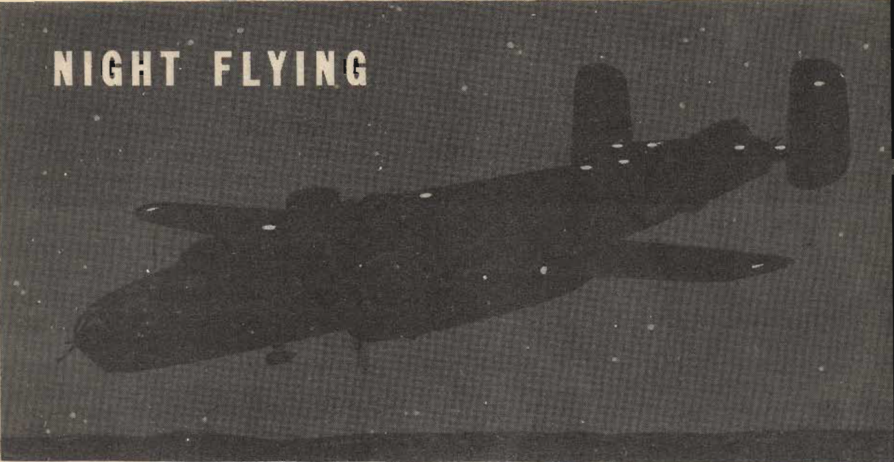

Night Flying
============

 {.body .taskbody}
The technique of night flying is closely akin to instrument flying.

 {.section .section .context}
\
{#night_flying__image_ljg_ss4_ggb
.image}\

A few tips on night flying:

 {.note .important .note_important}
[Important:]{.note__title} In night flying, a turn may suddenly change
contact flight to instrument flight. Be ready to fly instruments at any
moment.

1.  [Know the location of your controls.]{.ph .cmd}
2.  [Always carry a flashlight.]{.ph .cmd}
3.  [Use extra care in taxiing.]{.ph .cmd}
4.  [Use landing lights **alternately** for taxiing, except in very
    congested areas.]{.ph .cmd}
5.  [Use the extension Ught rather than the dome light for reading maps
    and charts.]{.ph .cmd}
6.  [Check all lighting equipment and fluorescent lighting of instrument
    panel before leaving the ground.]{.ph .cmd}
7.  [Make an accurate check of your flight instruments.]{.ph .cmd}
8.  [Switch on the dome light if your eyes feel strained during
    prolonged instrument flight at night. This creates the illusion of
    flying under a hood and relieves strain.]{.ph .cmd}

**Parent topic:** [Advanced Air
Work](../mdita/advanced_air_work.md "Many of the maneuvers described here are prohibited in this airplane. However, knowing the reactions of the airplane to these maneuvers is important.")

 {.linklist .relinfo .relconcepts}
**Related concepts**\

[Taxiing](../mdita/taxiing.md "Taxiing the B-25, with its tricycle landing gear, may seem strange after handling the conventional type.")

[Common Taxiing
Errors](../mdita/common_taxiing_errors.md "A short list of what not to do when taxiing.")

[Taxiing
Tips](../mdita/taxiing_tips.md "A short list of useful tips to know when taxiing.")

[Takeoff](../mdita/takeoff.md "Takeoff in the B-25 with its tricycle gear, varies from that with conventional gear only during the initial part of the roll. You will find it much easier.")

[Notes on
Takeoff](../mdita/notes_on_takeoff.md "Do not dive the airplane after lifting it at the end of the takeoff run. When you level out to pick up CSE speed after takeoff release the stick pressure as the speed picks up.")

[Common Takeoff
Errors](../mdita/common_takeoff_errors.md "A list of common errors that are made during takeoff.")

[Power
Changes](../mdita/power_changes.md "What to know about expected engine performance when throttling up.")

[Climb](../mdita/climb.md "Making your B-25 climb properly without straining your arms or your airplane.")

[Let-down](../mdita/let_down.md "A let-down is a simple procedure either in instrument or contact flight.")

[Landing](../mdita/landing.md ""The easiest plane to land I have ever flown."")

[Power-On
Landings](../mdita/power_on_landings.md "Before turning onto the base leg, one landing is much like another. The variations in procedure start as you leave the downwind leg.")

[Power-Off
Landing](../mdita/power_off_landing.md "The B-25 is too large and heavy to practice the prescribed forced-landing procedures used in lighter planes.")

[Tips On
Landing](../mdita/tips_on_landing.md "A list of things to know that will make your landings easier on you and on the B-25.")

[Making a
Go-Around](../mdita/making_a_go_around.md "There is a common reluctance among pilots to go around. They feel it implies a lack of ability to meet an unusual situation.")

[Common landing errors](../mdita/common_landing_errors.md)

 {.linklist .relinfo .reltasks}
**Related tasks**\

[Run-up](../mdita/run_up.md "The process for doing a run-up prior to takeoff.")

[Trimming](../mdita/trimming.md "When properly trimmed the B-25 flies with an ease that belies its weight and size.")

[Landing
Checklist](../mdita/landing_checklist.md "On any landing, enter traffic as instructed by field regulations or as instructed by the control tower.")

[Post-Landing
Checklist](../mdita/post_landing_checklist.md "On the runway, move the prop control to "INC. RPM."")

[No-Flap
Landing](../mdita/no_flap_landing.md "Occasionally both in combat and normal operations your plane may be damaged to the extent that flaps cannot be lowered for landing.")

[Go-Around
Procedure](../mdita/go_around_procedure.md "Don't hesitate to go around. Any doubt that the plane is under perfect control is sufficient cause to go around. If you have made a poor approach and know that the landing will be too long, or too rough— go around.")

[Parking](../mdita/parking.md "When you park your plane after a flight, just remember that the Colonel may make the next flight in that particular airplane.")

 {.linklist .relinfo .relref}
**Related reference**\

[Before Takeoff - C.I.G. F.T.P.R.-Friction
Brake](../mdita/before_takeoff_c.i.g.f.t.p.r._friction_brake.md "Checklist to ensure that your Controls move freely, Instruments function, proper Gas settings, then to check Flaps, Trim, Props are set for take-off, and then Run up the engine before removing the friction brake.")

