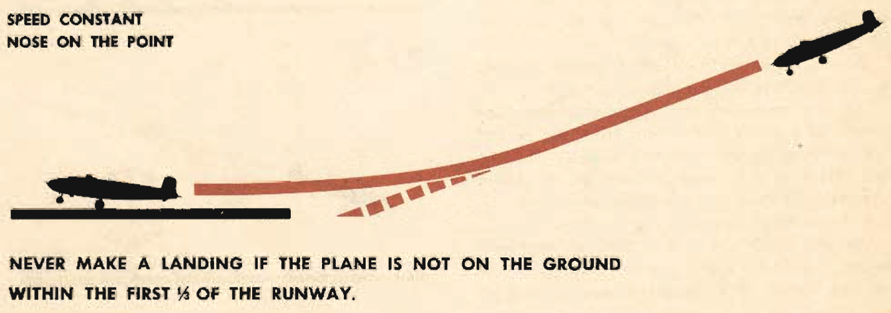
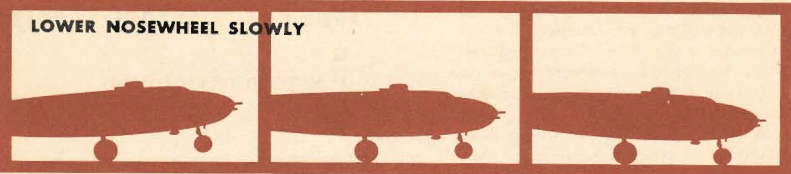
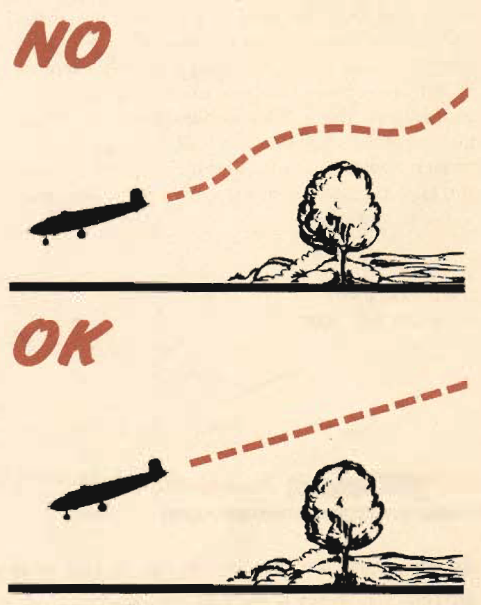
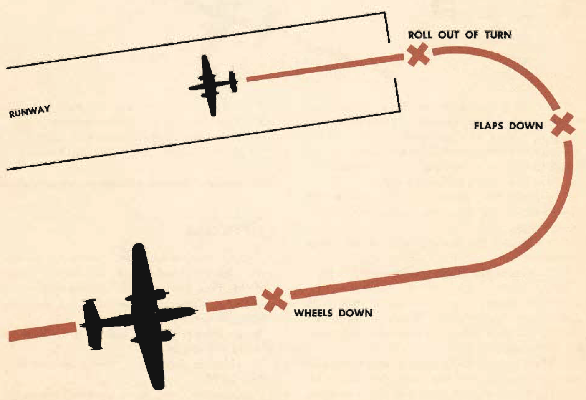

Power-On Landings
=================

 {.body .conbody}
Before turning onto the base leg, one landing is much like another. The
variations in procedure start as you leave the downwind leg.

Before turning onto the base leg, one landing is much like another. The
variations in procedure start as you leave the downwind leg.

 {#power_on_landings__sect_NormalLanding .section .section}
Normal landing procedure {#normal-landing-procedure .title .sectiontitle}
------------------------

The first of the techniques discussed is a normal landing procedure.

Turn onto the base leg and make your final radio check unless the tower
has given other instructions. Play the turn into the runway from the
base leg to allow a straight approach.

When you are lined up, lower the flaps full down and di\*op the nose to
a point short of the runway, Adjust the power and glide angle to keep
the nose traveling along a line that would, if not corrected, put the
nose of your plane squarely on the point you have selected. Maintain a
predetermined speed all through the approach and to the point at which
your roundout starts. This gliding speed varies with the load, but on
most planes it is from 120 to 130 mph.

Adjust the trim tabs to ease the load on the controls. Keep the speed
constant and the nose on the point, thus setting up a constant glide
path. As you approach the runway, flare off and reduce the power and
speed. When over the runway, hold the throttles completely closed to
prevent them from creeping open and stretching the glide.

{.image}

Land in a tail-low attitude. Make contact with the main wheels touching
down at the same time. The landing gear is designed to absorb great
loads if they are applied straight ahead. Tremendous thrust is generated
in landing, and if it is applied in a side thrust it can easily collapse
the gear.

The landing speed depends on your skill and on weight conditions.

{.image}

Hold the nosewheel in the air with the elevators, thus reducing the
length of the landing roll. The increased angle of attack of the wings,
plus the 45\" of flaps, acts as an air brake.

**Lower the nosewheel slowly with elevator control as you lose airspeed
on the landing roll.** Do not allow the nosewheel to drop heavily onto
the runway. It was not designed to absorb this type of load.

**Never use the brakes when the nosewheel is off the ground.** This
throws the nosewheel to the ground suddenly and will collapse it,
seriously damaging the airplane. Keep your heels on the floor to avoid
unintentional braking.

 {#power_on_landings__sect_NightLanding .section .section}
Power-On landing procedure {#power-on-landing-procedure .title .sectiontitle}
--------------------------

The second technique for power-on landing is a procedure for use at
night, under strong wind conditions, or whenever you want more positive
control. In this you fly the airplane all the way to the ground.

Set the approach in exactly the same manner as for the first technique.

As you approach the runway, reduce the power at a point farther out from
the end of the runway. Reduce power gradually, slowing the pUne as you
come in. The use of power lowers your stall speed and the speed must be
low to prevent overshooting the runway.

As you reach the end of the runways your speed should be slightly above
the power-off stalling speed, with the plane in a landing attitude. Now
reduce power slowly until the plane settles onto the ground. Close the
throttles completely only when the plane is on the ground.

**Don\'t make a dragging approach in this type of landing.**

This is not a short-field landing--- there is no place in it for slow
flying. The plane is never below power-off stall speed until it is over
the runway. The maneuver is designed to give you maximum control of the
airplane. You lose this advantage if you do not execute it properly.

The remainder of the ground roll and landing check are identical with
the first procedure.

\
{.image width="288"}\

 {#power_on_landings__sect_CombatLanding .section .section}
Combat landing procedure {#combat-landing-procedure .title .sectiontitle}
------------------------

The third technique is commonly called a combat landing. It is the
product of combat theatres, where the difference between life and death
is often the amount of time it takes you to get out of the traffic
pattern and onto the ground.

A slow-flying bomber with wheels and flaps down is a setup for any
fighter which spots it.

This is a precision maneuver requiring a lot of skill and judgment.

Fly the downwind leg in the same way as the two other power-on landing
techniques. The rest of the procedure is entirely different.

When you are opposite the end of the runway on your downwind leg, start
a turn into the field.

Play your speed and altitude in a constantly descending turn. Lower your
flaps in the turn so that they will be full down as you roll out above
the runway.

Properly executed, you can complete this roll-out just above the end of
the runway at a speed that permits the minimum amount of float above the
runway before touching down.

If you visualize a chandelle and then reverse it so that you picture a
diving turn through 180°, you have an accurate picture of this landing.

{.image}

 {.note .caution .note_caution}
[CAUTION:]{.note__title} This maneuver requires the touch and skill of
an experienced pilot. Have an instructor pilot demonstrate it to you and
practice it when he is present. The rest of the landing procedure is
identical with the others.

**Parent topic:** [Typical Air
Work](../mdita/typical_air_work.md "Common functions and process relating to flying the B-25.")

 {.linklist .relinfo .relconcepts}
**Related concepts**\

[Advanced Air
Work](../mdita/advanced_air_work.md "Many of the maneuvers described here are prohibited in this airplane. However, knowing the reactions of the airplane to these maneuvers is important.")

[Prohibited Maneuvers in the
B-25](../mdita/prohibited_maneuvers_in_the_b_25.md "The following maneuvers are not prohibited because of the flying characteristics of the airplane, but because they impose severe structural stresses on it. The B-25 is a bomber, not a pursuit plane.")

[Spins](../mdita/spins.md "No pilot should ever knowingly allow the airplane to get into a spin. If you accidentally get into a spin, however, the recovery is normal.")

[Dives](../mdita/dives.md "The diving characteristics of the B-25, like all its flight characteristics; are exceptionally good. The first thing for you to remember, as a new pilot in the B-25, is this: the plane is not a dive bomber.")

[Instrument
Flying](../mdita/instrument_flying.md "Every pilot must have in his possession a copy of T. O. series 30-100. You must know these Technical Orders for the mastery of instrument flight.")

[Formation](../mdita/formation.md ""You just gotta stay in there." Thus returning combat pilots pass on to you the most important thing they learned in the battle zones.")

[Strange Field
Landings](../mdita/strange_field_landings.md "Flying above your home base you instinctively use familiar features of landscape to orient yourself. Your judgment of distance, altitude, speedy and depth are sharpened.")

[Crosswind
Landing](../mdita/crosswind_landing.md "Crosswind landing in the B-25 requires accurate flying, to save the plane from unnecessary structural stresses. You must land the airplane smoothly to prevent blowing a tire, collapsing a struts or exerting side loads on the gear.")

[Stalls](../mdita/stalls.md "The B-25 stalls from the wing root to the wingtip. Thus there is no unstable tendency except a slight lateral rolling, easily corrected by coordinated control pressures.")

[Slow
Flying](../mdita/slow_flying.md "Slow flying increases your confidence in the B-25 as few other maneuvers will. It demonstrates more effectively than anything else the effect of applying power.")

[Short-Field
Takeoff](../mdita/short_field_takeoff.md "The short-field takeoff is an important operational maneuver. You can easily understand its importance if you stop to consider that the first Tokyo raid could never have been made without its use.")

[Short-Field
Landings](../mdita/short_field_landings.md "You have all heard a lot of discussion on the importance of accurate short-field landings. Combat requires that you be able to operate under conditions that are close to the absolute limit of the airplane's performance.")

[Single Engine
Operation](../mdita/single_engine_operation.md "Single engine operation of the B-25 follows a logical pattern of procedure. The plane flies efficiently on one engine at a reduced speed.")

[Single Engine
Practice](../mdita/single_engine_practice.md "Remember that you are trimmed for single engine flight at one airspeed only. If the airspeed or power setting is changed you must re-trim.")

[Effect of Power and Airspeed on Single Engine
Operation](../mdita/effect_of_power_and_airspeed_on_single_engine_operation.md "To fly safely on single engine you must know the effect of power on rudder control at various airspeeds. This is vital to your safety when practicing go-around procedures and other maneuvers that require quick changes in power settings.")

[Single Engine
Landing](../mdita/single_engine_landing.md "Single engine landings should remove any lingering doubts you may have about the B-25 and its ability as a single engine performer.")

[Tips on Single Engine
Operation](../mdita/tips_on_single_engine_operation.md "A list of handy tips on how to work with your engines in regular circumstances, and how to re-start a dead engine.")

[Auxiliary Hydraulic Pump and Emergency Hydraulic Selector
Valve](../mdita/auxiliary_hydraulic_pump_and_emergency_hydraulic_selector_valve.md "The auxiliary hydraulic pump is a double-action hand pump for use as a source of pressure if the main hydraulic system fails.")

[Tactical Uses of the
B-25](../mdita/tactical_uses_of_the_b_25.md "Preparing for a mission, and the roles of all of the crew in making that mission a success.")

 {.linklist .relinfo .reltasks}
**Related tasks**\

[Night
Flying](../mdita/night_flying.md "The technique of night flying is closely akin to instrument flying.")

[Crosswind
Takeoff](../mdita/crosswind_takeoff.md "Modern flying, with its heavy airplanes, demands a runway for safe operation. The days when you taxied out, lined up parallel to the wind tee, and took off are gone forever.")

[Single Engine Operation
Procedure](../mdita/single_engine_operation_procedure.md "Critical single engine airspeed must be maintained at the sacrifice of all other considerations.")

[Single Engine Trouble
Search](../mdita/single_engine_trouble_search.md "How to troubleshoot issues with a single engine.")

[Engine Failure on
Takeoff](../mdita/engine_failure_on_takeoff.md "This is a tricky proposition for any pilot to handle. When the engine fails before you gain CSE speed, retract the wheels and land straight ahead. There is far less danger in a belly landing than in attempting to go around with too low an airspeed.")

[Single Engine
Go-Around](../mdita/single_engine_go_around.md "Successful single engine go-around depends on an early decision that a go-around is necessary. You can start a go-around procedure at a low altitude and from a low airspeed on the approach, but it is difficult and dangerous.")

