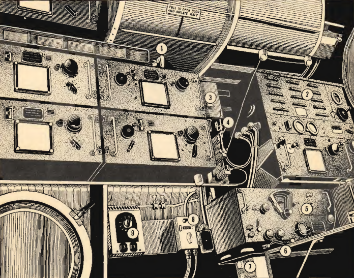

Radio Operator\'s Compartment-Left Side
=======================================

Switches and controls located in the Radio Operator\'s compartment
facing left.

 {.section .section}
{#radio_operators_compartment_left_side__image_lzl_2hm_cgb
.image}

**Parent topic:** [Location of Controls B-25 C and
D](../mdita/location_of_controls_b_25_c_and_d.md "An overview of the airplane's key controls and their locations.")

