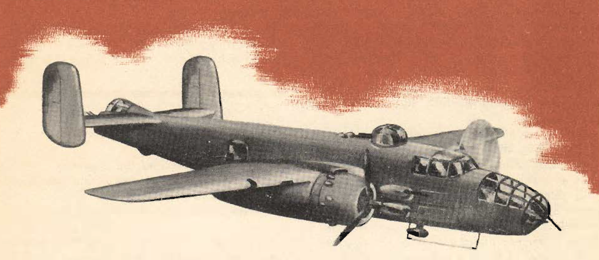

Single Engine Operation
=======================

 {.body .conbody}
Single engine operation of the [B-25]{.keyword} follows a logical
pattern of procedure. The plane flies efficiently on one engine at a
reduced speed.

\
{.image}\

Beyond a weight of 32,000 lbs. you will experience some difficulty in
maintaining altitude. This should never be a serious handicap, since you
can always correct it by ridding the plane of excess weight.

Competent ground and air instruction must precede any single engine
practice or operation. On the ground your training should include a
detailed account of the technique of single engine flying and cockpit
drill in the sequence of operation.

You can\'t get too much cockpit time.

Accidents never just happen. They are the culmination of a chain of
events. Don\'t be cocksure; this breeds a lack of respect for your
plane, and this is the first stop toward trouble.

In the air you must know what to expect from aerodynamic forces: the
difference in handling at different speeds, the effect of open and
closed bomb bay doors, the dropping of excess weight, and the futility
of using flaps except in landing.

Each airplane has a critical single engine speed. In the
[B-25]{.keyword} it is 140 mph for normal load weights.

Critical single engine speed is the slowest speed at which the rudder
has a sale margin of control over the unbalanced thrust of the one live
engine, at maximum power.

Maximum power settings for single engine flight depend on the particular
conditions. You can apply power in direct relation to the air- speed. At
high speeds it is possible to use take- off power settings for a short
time.

For all normal single engine operation, keep your power settings at
maximum climb or below. The airplane becomes difficult to control beyond
this power setting unless you have excess airspeed. If you have excess
speed, you don\'t need excessive power.

**Parent topic:** [Advanced Air
Work](../mdita/advanced_air_work.md "Many of the maneuvers described here are prohibited in this airplane. However, knowing the reactions of the airplane to these maneuvers is important.")

 {.linklist .relinfo .relconcepts}
**Related concepts**\

[Taxiing](../mdita/taxiing.md "Taxiing the B-25, with its tricycle landing gear, may seem strange after handling the conventional type.")

[Common Taxiing
Errors](../mdita/common_taxiing_errors.md "A short list of what not to do when taxiing.")

[Taxiing
Tips](../mdita/taxiing_tips.md "A short list of useful tips to know when taxiing.")

[Takeoff](../mdita/takeoff.md "Takeoff in the B-25 with its tricycle gear, varies from that with conventional gear only during the initial part of the roll. You will find it much easier.")

[Notes on
Takeoff](../mdita/notes_on_takeoff.md "Do not dive the airplane after lifting it at the end of the takeoff run. When you level out to pick up CSE speed after takeoff release the stick pressure as the speed picks up.")

[Common Takeoff
Errors](../mdita/common_takeoff_errors.md "A list of common errors that are made during takeoff.")

[Power
Changes](../mdita/power_changes.md "What to know about expected engine performance when throttling up.")

[Climb](../mdita/climb.md "Making your B-25 climb properly without straining your arms or your airplane.")

[Let-down](../mdita/let_down.md "A let-down is a simple procedure either in instrument or contact flight.")

[Landing](../mdita/landing.md ""The easiest plane to land I have ever flown."")

[Power-On
Landings](../mdita/power_on_landings.md "Before turning onto the base leg, one landing is much like another. The variations in procedure start as you leave the downwind leg.")

[Power-Off
Landing](../mdita/power_off_landing.md "The B-25 is too large and heavy to practice the prescribed forced-landing procedures used in lighter planes.")

[Tips On
Landing](../mdita/tips_on_landing.md "A list of things to know that will make your landings easier on you and on the B-25.")

[Making a
Go-Around](../mdita/making_a_go_around.md "There is a common reluctance among pilots to go around. They feel it implies a lack of ability to meet an unusual situation.")

[Common landing errors](../mdita/common_landing_errors.md)

 {.linklist .relinfo .reltasks}
**Related tasks**\

[Run-up](../mdita/run_up.md "The process for doing a run-up prior to takeoff.")

[Trimming](../mdita/trimming.md "When properly trimmed the B-25 flies with an ease that belies its weight and size.")

[Landing
Checklist](../mdita/landing_checklist.md "On any landing, enter traffic as instructed by field regulations or as instructed by the control tower.")

[Post-Landing
Checklist](../mdita/post_landing_checklist.md "On the runway, move the prop control to "INC. RPM."")

[No-Flap
Landing](../mdita/no_flap_landing.md "Occasionally both in combat and normal operations your plane may be damaged to the extent that flaps cannot be lowered for landing.")

[Go-Around
Procedure](../mdita/go_around_procedure.md "Don't hesitate to go around. Any doubt that the plane is under perfect control is sufficient cause to go around. If you have made a poor approach and know that the landing will be too long, or too rough— go around.")

[Parking](../mdita/parking.md "When you park your plane after a flight, just remember that the Colonel may make the next flight in that particular airplane.")

 {.linklist .relinfo .relref}
**Related reference**\

[Before Takeoff - C.I.G. F.T.P.R.-Friction
Brake](../mdita/before_takeoff_c.i.g.f.t.p.r._friction_brake.md "Checklist to ensure that your Controls move freely, Instruments function, proper Gas settings, then to check Flaps, Trim, Props are set for take-off, and then Run up the engine before removing the friction brake.")

