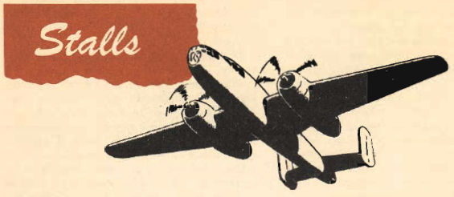

Stalls
======

 {.body .conbody}
The [B-25]{.keyword} stalls from the wing root to the wingtip. Thus
there is no unstable tendency except a slight lateral rolling, easily
corrected by coordinated control pressures.

\
{.image}\

The plane breaks cleanly through the stall, with no tendency to drop a
wing, and makes a relatively rapid recovery.

When stalling with power on, the tail surfaces give a warning of the
approaching stall by a pronounced buffeting. When stalling with power
off there is no warning except the sluggish feel of the plane as it
loses lift and control.

Stalls in the [B-25]{.keyword} must be practiced because:

-   You must determine for yourself the stalling characteristics of the
    plane.
-   You must know the speeds at which the plane stalls to set up
    properly the speeds for slow flying, short field work and normal
    landing.

    The stalling characteristics are not altered by changes in gross
    weight, amount of power used, raising or lowering the flaps, opening
    and closing the cowl flaps, or operating the de-icer boots, The
    stalling speed, however, is changed by these variables.

    Operation of the de-icer boots raises the indicated stalling speed 4
    mph. With the wing flaps full down, the stalling speed drops
    approximately 20 mph at normal gross weight. The application of
    power lowers the stalling speed still further, depending on the
    amount of power used.

    **Changes of the CG position in the plane greatly affect the stall
    characteristics. Do not stall the plane when the center of gravity
    approaches its fore-and-aft limits.**

    **The stall speeds of the [B-25]{.keyword} are approximately:**

      ----------------------------------- -----------------------------------
      Level Flight                        101 MPH

      30° Bank                            134 MPH

      60° Bank                            154 MPH
      ----------------------------------- -----------------------------------

-   You must know the best recovery for the plane you fly.

There are many more reasons, chief among them the confidence you derive
from flying your plane through its low speed limits.

Furthermore, you will trust your plane completely and fly it more
accurately in the precision maneuvers that come later in your training.

High-speed stalls and those brought on by rough and uncoordinated
movement of the controls are dangerous in the [B-25]{.keyword}, If you
try this type of stall, execute it at reduced power, and avoid it after
the characteristics have been determined.

Practice at various flap settings, with wheels up and down, straight and
level, and in turns.

When practicing power-on stalls, keep the power at a maximum of 20\" Hg.
If you exceed this power limit, the stalling attitude of the plane
restricts visibility and tends to make the stall more vicious. This
teaches you nothing and only adds unnecessary strain to the airplane.

Stalls and stalling speeds are directly related to maximum performance
and to a wide variety of maneuvers you will meet later in training.
Understand this relationship thoroughly.

It gives you a basis for setting up proper gliding attitudes, gliding
speeds, approaches and landings. It determines the type and method of
corrections to he made in changing gliding speeds.

A good method of determining correct gliding speed is to add 20% or 25%
to the wheels-down, flaps-down, (45\") power-off stalling speed and use
that as a gliding speed to remain within safe flight limits.

Perform all stalls at an altitude to permit recovery 8000 feet above the
terrain. Practice with the propeller set at the maximum climbing rpm and
power settings varying as necessary.

Perform power-on stalls in this manner: from level flight, reduce the
manifold pressure to a maximum of 20\"; then bring the nose of the
airplane slowly and smoothly to approximately a tail-low landing
attitude, maintaining a constant back -pressure until the stall is
reached. Do not pull up too rapidly, as this gives a false indicated
stalling speed, caused by the momentum built up in flight. Hold the
plane in a stalling attitude and allow it to fly into the stall.

Do not use excessive power, as this makes the reaction of the airplane
violent.

As already mentioned, the [B-25]{.keyword} stalls from the wing root to
the tip; the stall is straight ahead and is not violent. You have
aileron and rudder control all the way to the stall. When you reach the
stall, recover by nosing down.

Counteract any rolling or yawing tendency by use of the rudders. Apply
only enough aileron to keep the controls coordinated. Increase power
slowly when control is regained.

**Do not attempt to make a straight power recovery.** The
[B-25]{.keyword} is too heavy to recover safely in this manner. You will
get a series of secondary stalls and possibly an unintentional spin.

Don\'t hurry your recovery. Make it smooth and sure, with coordinated
control pressures to prevent a secondary stall. Reach a safe air- speed
before attempting to level out.

**Use a power-off, nose-down recovery to recover from violent stalls in
which the airplane starts to roll or spin out of control.** You will
lose a great deal of altitude in this type of recovery. Make the pullout
gradually to keep a safe wingloading.

Practice glide stalls in the [B-25]{.keyword} to familiarize yourself
with the feel of the airplane under landing conditions.

Perform them by establishing a power-off glide at normal gliding speeds
and then flaring od exactly as you would to make a landing. Hold The
plane at a constant altitude in a landing attitude until it stalls. The
stalling characteristics are the same as in a power-on stall except that
the elevators and stabilizer will not buffet as they do in a power-on
stall.

Again, the recovery is a combination of nose-down and increased power.
This stall simulates landing conditions exactly when practised with the
wheels and flaps full down. The recovery should be made above 8000 feet
to give ample room for emergencies.

\
{#stalls__image_j5c_vz4_3gb
.image}\

**Parent topic:** [Advanced Air
Work](../mdita/advanced_air_work.md "Many of the maneuvers described here are prohibited in this airplane. However, knowing the reactions of the airplane to these maneuvers is important.")

 {.linklist .relinfo .relconcepts}
**Related concepts**\

[Taxiing](../mdita/taxiing.md "Taxiing the B-25, with its tricycle landing gear, may seem strange after handling the conventional type.")

[Common Taxiing
Errors](../mdita/common_taxiing_errors.md "A short list of what not to do when taxiing.")

[Taxiing
Tips](../mdita/taxiing_tips.md "A short list of useful tips to know when taxiing.")

[Takeoff](../mdita/takeoff.md "Takeoff in the B-25 with its tricycle gear, varies from that with conventional gear only during the initial part of the roll. You will find it much easier.")

[Notes on
Takeoff](../mdita/notes_on_takeoff.md "Do not dive the airplane after lifting it at the end of the takeoff run. When you level out to pick up CSE speed after takeoff release the stick pressure as the speed picks up.")

[Common Takeoff
Errors](../mdita/common_takeoff_errors.md "A list of common errors that are made during takeoff.")

[Power
Changes](../mdita/power_changes.md "What to know about expected engine performance when throttling up.")

[Climb](../mdita/climb.md "Making your B-25 climb properly without straining your arms or your airplane.")

[Let-down](../mdita/let_down.md "A let-down is a simple procedure either in instrument or contact flight.")

[Landing](../mdita/landing.md ""The easiest plane to land I have ever flown."")

[Power-On
Landings](../mdita/power_on_landings.md "Before turning onto the base leg, one landing is much like another. The variations in procedure start as you leave the downwind leg.")

[Power-Off
Landing](../mdita/power_off_landing.md "The B-25 is too large and heavy to practice the prescribed forced-landing procedures used in lighter planes.")

[Tips On
Landing](../mdita/tips_on_landing.md "A list of things to know that will make your landings easier on you and on the B-25.")

[Making a
Go-Around](../mdita/making_a_go_around.md "There is a common reluctance among pilots to go around. They feel it implies a lack of ability to meet an unusual situation.")

[Common landing errors](../mdita/common_landing_errors.md)

 {.linklist .relinfo .reltasks}
**Related tasks**\

[Run-up](../mdita/run_up.md "The process for doing a run-up prior to takeoff.")

[Trimming](../mdita/trimming.md "When properly trimmed the B-25 flies with an ease that belies its weight and size.")

[Landing
Checklist](../mdita/landing_checklist.md "On any landing, enter traffic as instructed by field regulations or as instructed by the control tower.")

[Post-Landing
Checklist](../mdita/post_landing_checklist.md "On the runway, move the prop control to "INC. RPM."")

[No-Flap
Landing](../mdita/no_flap_landing.md "Occasionally both in combat and normal operations your plane may be damaged to the extent that flaps cannot be lowered for landing.")

[Go-Around
Procedure](../mdita/go_around_procedure.md "Don't hesitate to go around. Any doubt that the plane is under perfect control is sufficient cause to go around. If you have made a poor approach and know that the landing will be too long, or too rough— go around.")

[Parking](../mdita/parking.md "When you park your plane after a flight, just remember that the Colonel may make the next flight in that particular airplane.")

 {.linklist .relinfo .relref}
**Related reference**\

[Before Takeoff - C.I.G. F.T.P.R.-Friction
Brake](../mdita/before_takeoff_c.i.g.f.t.p.r._friction_brake.md "Checklist to ensure that your Controls move freely, Instruments function, proper Gas settings, then to check Flaps, Trim, Props are set for take-off, and then Run up the engine before removing the friction brake.")

