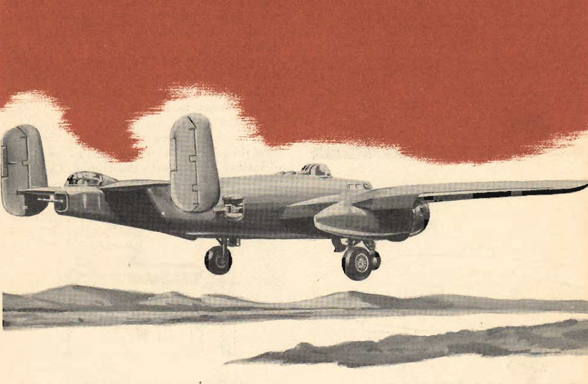

Takeoff
=======

 {.body .conbody}
Takeoff in the [B-25]{.keyword} with its tricycle gear, varies from that
with conventional gear only during the initial part of the roll. You
will find it much easier.

{#takeoff__image_ow1_jqm_cgb .image}

The principal difference is in attaining the proper angle of attack of
the wing. On the conventional type you start from a stall attitude and
reduce the angle to permit flight. In the [B-25]{.keyword} you start
from a negative angle of attack and increase the angle of attack by
raising the nosewheel.

Several factors affect the takeoff technique. Chief of these are gross
weight, wind velocity, type of runway, and the height and distance of
the nearest obstacles. Plan your takeoff according to these variables.
The following takeoff is normal.

When you get permission to take off, taxi out and line up properly.
Advance the throttles slowly, using them to obtain directional control.
As soon as the plane is rolling straight, equalize the throttles and
advance them smoothly to takeoff power. Check the engine instruments for
maximum power indications and for irregular operation--- if in doubt cut
off the power. Don\'t load up the engines with a sudden blast of power.
You are operating powerful engines; treat them with care and respect.

Be prepared to make power adjustments during the takeoff. If an engine
fails before you gain critical single engine speed, you must reduce
power quickly to prevent loss of control.

After you start the takeoff run, use the brakes only in an emergency.
Maintain directional control with the throttles and rudders.

\
{#takeoff__image_wp5_bds_cgb
.image width="288"}\
\
{#takeoff__image_jhr_dds_cgb
.image width="288"}\
\
{#takeoff__image_e2z_gds_cgb
.image width="288"}\

Raise the nose wheel off the ground slightly as soon as you have good
control. The angle of attack and the weight of the [B-25]{.keyword} tend
to keep the plane on the ground during the takeoff roll. The takeoff
becomes conventional when a positive angle of attack, with resulting
lift, is developed.

The [B-25]{.keyword} flies itself off the ground. Allow it to do so, for
smoother, easily controlled takeoffs. If the plane attempts to skip and
bounce in slight cross winds, help it lift off the runway, thus
smoothing out the takeoff.

When the airplane is definitely airborne, raise the wheels. **Be sure
there is no possibility of further contact with the ground.** Good
airplanes have been lost through carelessness.

\
{#takeoff__image_tgn_cfs_cgb
.image width="288"}\

1.  Lift the safety lock holding the control handle \"DOWN\" and locked.
2.  Move the mechanical lock up.
3.  Move the landing gear handle to \"UP.\"

\
{#takeoff__image_u1s_mfs_cgb
.image width="288"}\

 {.p}
 {.embed-responsive .embed-responsive-16by9}

[Figure[ 1]{.fig--title-label-number}: ]{.figtitleprefix
.fig--title-label}Example of a [B-25]{.keyword} taking off

Level off and allow the plane to gain CSE flying speed (140 mph).

Reduce power to maximum climbing power settings. (See chart of Grade 91
and Grade 100 power settings). Don\'t base this power reduction on
distance from the field. The particular situation, load, speed, terrain
features, and altitude determine the proper place for this reduction.

Reduce power as soon as possible, however, to relieve the strain on the
engines. Let the plane climb slowly, gaining speed as it climbs, Reduce
the power to normal climb settings as soon as you establish a constant
climb. Load conditions cause the climb settings to vary slightly.

Maintain a climbing speed between 160 and 170 mph for these reasons:

\
{#takeoff__image_ktr_zfs_cgb
.image width="288"}\

1.  Speed is developed quickly and maintained to allow single engine
    operation if necessary.
2.  Excessively slow climbs prevent proper cooling of the engines at
    high power settings.
3.  You obtain good forward visibility by keeping the nose relatively
    low.

Raise the wing flaps when you have sufficient altitude. This will
normally be about 300 feet above the terrain and between 150 mph and 170
mph. Apply back pressure to the control column as the flaps come up,
increasing the angle of attack of the wings. This defeats any tendency
to settle and lose altitude.

Close cowl flaps as soon as possible after takeoff, but leave them open
if the cylinder-head temperature approaches 200°C.

**Parent topic:** [Typical Air
Work](../mdita/typical_air_work.md "Common functions and process relating to flying the B-25.")

 {.linklist .relinfo .relconcepts}
**Related concepts**\

[Advanced Air
Work](../mdita/advanced_air_work.md "Many of the maneuvers described here are prohibited in this airplane. However, knowing the reactions of the airplane to these maneuvers is important.")

[Prohibited Maneuvers in the
B-25](../mdita/prohibited_maneuvers_in_the_b_25.md "The following maneuvers are not prohibited because of the flying characteristics of the airplane, but because they impose severe structural stresses on it. The B-25 is a bomber, not a pursuit plane.")

[Spins](../mdita/spins.md "No pilot should ever knowingly allow the airplane to get into a spin. If you accidentally get into a spin, however, the recovery is normal.")

[Dives](../mdita/dives.md "The diving characteristics of the B-25, like all its flight characteristics; are exceptionally good. The first thing for you to remember, as a new pilot in the B-25, is this: the plane is not a dive bomber.")

[Instrument
Flying](../mdita/instrument_flying.md "Every pilot must have in his possession a copy of T. O. series 30-100. You must know these Technical Orders for the mastery of instrument flight.")

[Formation](../mdita/formation.md ""You just gotta stay in there." Thus returning combat pilots pass on to you the most important thing they learned in the battle zones.")

[Strange Field
Landings](../mdita/strange_field_landings.md "Flying above your home base you instinctively use familiar features of landscape to orient yourself. Your judgment of distance, altitude, speedy and depth are sharpened.")

[Crosswind
Landing](../mdita/crosswind_landing.md "Crosswind landing in the B-25 requires accurate flying, to save the plane from unnecessary structural stresses. You must land the airplane smoothly to prevent blowing a tire, collapsing a struts or exerting side loads on the gear.")

[Stalls](../mdita/stalls.md "The B-25 stalls from the wing root to the wingtip. Thus there is no unstable tendency except a slight lateral rolling, easily corrected by coordinated control pressures.")

[Slow
Flying](../mdita/slow_flying.md "Slow flying increases your confidence in the B-25 as few other maneuvers will. It demonstrates more effectively than anything else the effect of applying power.")

[Short-Field
Takeoff](../mdita/short_field_takeoff.md "The short-field takeoff is an important operational maneuver. You can easily understand its importance if you stop to consider that the first Tokyo raid could never have been made without its use.")

[Short-Field
Landings](../mdita/short_field_landings.md "You have all heard a lot of discussion on the importance of accurate short-field landings. Combat requires that you be able to operate under conditions that are close to the absolute limit of the airplane's performance.")

[Single Engine
Operation](../mdita/single_engine_operation.md "Single engine operation of the B-25 follows a logical pattern of procedure. The plane flies efficiently on one engine at a reduced speed.")

[Single Engine
Practice](../mdita/single_engine_practice.md "Remember that you are trimmed for single engine flight at one airspeed only. If the airspeed or power setting is changed you must re-trim.")

[Effect of Power and Airspeed on Single Engine
Operation](../mdita/effect_of_power_and_airspeed_on_single_engine_operation.md "To fly safely on single engine you must know the effect of power on rudder control at various airspeeds. This is vital to your safety when practicing go-around procedures and other maneuvers that require quick changes in power settings.")

[Single Engine
Landing](../mdita/single_engine_landing.md "Single engine landings should remove any lingering doubts you may have about the B-25 and its ability as a single engine performer.")

[Tips on Single Engine
Operation](../mdita/tips_on_single_engine_operation.md "A list of handy tips on how to work with your engines in regular circumstances, and how to re-start a dead engine.")

[Auxiliary Hydraulic Pump and Emergency Hydraulic Selector
Valve](../mdita/auxiliary_hydraulic_pump_and_emergency_hydraulic_selector_valve.md "The auxiliary hydraulic pump is a double-action hand pump for use as a source of pressure if the main hydraulic system fails.")

[Tactical Uses of the
B-25](../mdita/tactical_uses_of_the_b_25.md "Preparing for a mission, and the roles of all of the crew in making that mission a success.")

 {.linklist .relinfo .reltasks}
**Related tasks**\

[Night
Flying](../mdita/night_flying.md "The technique of night flying is closely akin to instrument flying.")

[Crosswind
Takeoff](../mdita/crosswind_takeoff.md "Modern flying, with its heavy airplanes, demands a runway for safe operation. The days when you taxied out, lined up parallel to the wind tee, and took off are gone forever.")

[Single Engine Operation
Procedure](../mdita/single_engine_operation_procedure.md "Critical single engine airspeed must be maintained at the sacrifice of all other considerations.")

[Single Engine Trouble
Search](../mdita/single_engine_trouble_search.md "How to troubleshoot issues with a single engine.")

[Engine Failure on
Takeoff](../mdita/engine_failure_on_takeoff.md "This is a tricky proposition for any pilot to handle. When the engine fails before you gain CSE speed, retract the wheels and land straight ahead. There is far less danger in a belly landing than in attempting to go around with too low an airspeed.")

[Single Engine
Go-Around](../mdita/single_engine_go_around.md "Successful single engine go-around depends on an early decision that a go-around is necessary. You can start a go-around procedure at a low altitude and from a low airspeed on the approach, but it is difficult and dangerous.")

