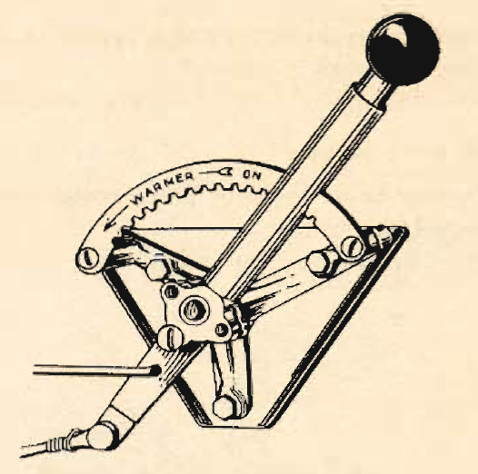

Takeoff in Cold Weather
=======================

 {.body .taskbody}
Short checklist on what to look for when attempting to take off during
cold weather conditions.

 {.section .section .context}
 {.note .warning .note_warning}
[Warning:]{.note__title} Your cabin heaters must be \"OFF\" before
takeoff.\
{.image width="288"}\

1.  [Never take off if there is any snow, ice, or frost on the wings.
    Even the thinnest layer of frost may cause loss of lift and
    treacherous stalling characteristics. In extreme conditions it may
    be necessary to taxi out to the takeoff position before removing the
    protective covers from the flight surfaces.]{.ph .cmd}
2.  [In ordinary operation, carburetor air controls should be in
    \"NORMAL\" for takeoff. In extremely cold weather, however, it is
    often advisable to place carburetor air control in \"ICING\" during
    takeoff to insure proper fuel vaporization.]{.ph .cmd}
     {.itemgroup .info}
     {.note .note .note_note}
    [Note:]{.note__title} (You will seldom find these extreme conditions
    in the continental United States. In arctic zones, consult
    experienced pilots before employing this procedure.)
    
    

**Parent topic:** [Cold Weather
Operations](../mdita/cold_weather_operations.md "Cold weather operations bring visions of long arctic nights, glaciers, Eskimos, and stories you have heard of the Far North.")

 {.linklist .relinfo .relconcepts}
**Related concepts**\

[Weight and
Balance](../mdita/WeightAndBalance.md "The day when a pilot flew by guesswork is past. One by one the decisions that were made by intuition, hunches, and guesswork have been taken over by an orderly system based on knowledge and understanding. Invariably this has resulted in greater safety and operating efficiency.")

[Principles of weight and
balance](../mdita/PrinciplesOfWeightAndBalance.md "Understanding proper balance and the center of gravity of a B-25, and how to correctly determine the total weight and its distribution on board the aircraft.")

[Fuel](../mdita/fuel.md "Information on the fuel required for the B-25, and how to determine the maximum flight range for the aircraft under different conditions.")

[Grade 91
Fuel](../mdita/grade_91_fuel.md "With our entry into World War II, and our operations on fighting fronts the length and breadth of the world, it became apparent that we could not produce high-octane fuels quickly enough to meet the demand.")

[Some Typical
Missions](../mdita/some_typical_missions.md "The types of practice missions you can expect when learning the B-25.")

[Gunnery
Missions](../mdita/gunnery_missions.md "In this and all ensuing gunnery missions when both ground and water targets are used, extreme care must be exercised to see that the field of fire is clear of other planes.")

 {.linklist .relinfo .reltasks}
**Related tasks**\

[Formation
Bombing](../mdita/formation_bombing.md "This is a day, 6-ship formation bombing mission.")

[Chemical spray
mission](../mdita/ChemicalSprayMission.md "Background and expectations on the chemical spray missions.")

[Day Navigation, Photo-Reconnaissance, and Instrument Let-Down
Mission](../mdita/day_navigation_photo_reconnaissance_and_instrument_let_down_mission.md "How this mission works and what's expected of every crew member.")

 {.linklist .relinfo .relref}
**Related reference**\

[Power Control Chart for Grade 91
Fuel](../mdita/power_control_chart_for_grade_91_fuel.md "What you can expect when flying the B-25 using Grade 91 fuel.")

[Maximum Range Chart For B-25 C, D, & G
Aircraft](../mdita/maximum_range_chart_for_b_25_c_d_and_g_aircraft.md "Information on the maximum range for the C, D, and G models of the B-25.")

[Maximum Range Chart for B-25 H & J
Aircraft](../mdita/maximum_range_chart_for_b_25_h_and_j_aircraft.md "Information on the maximum range for the H and J models of the B-25.")

