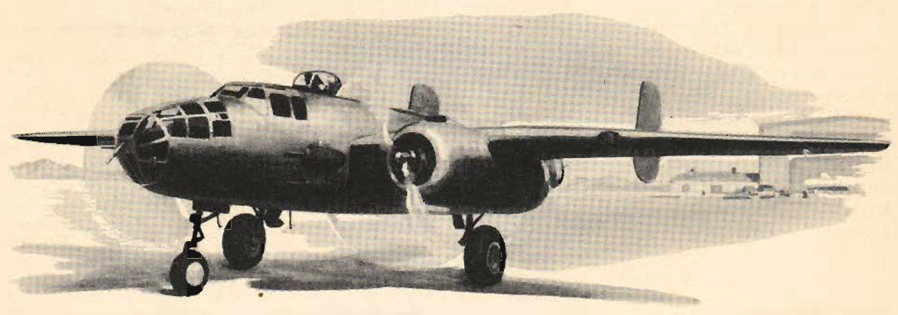
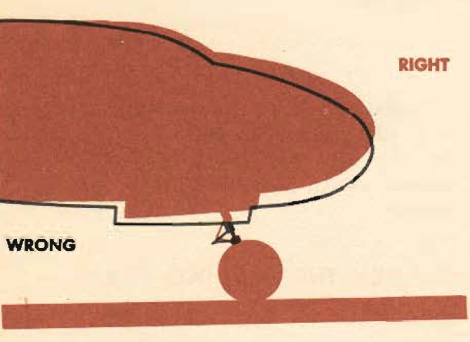
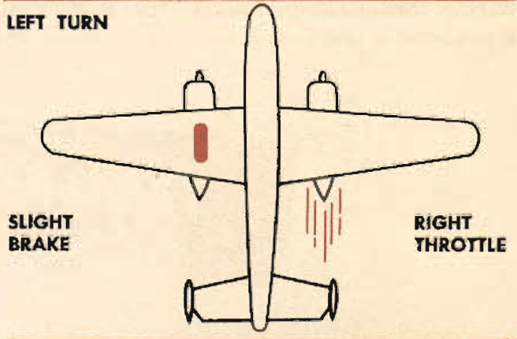
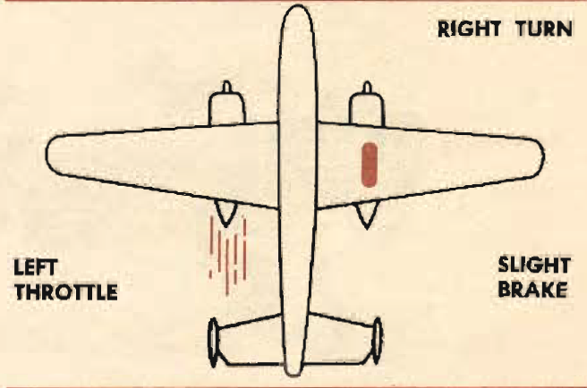
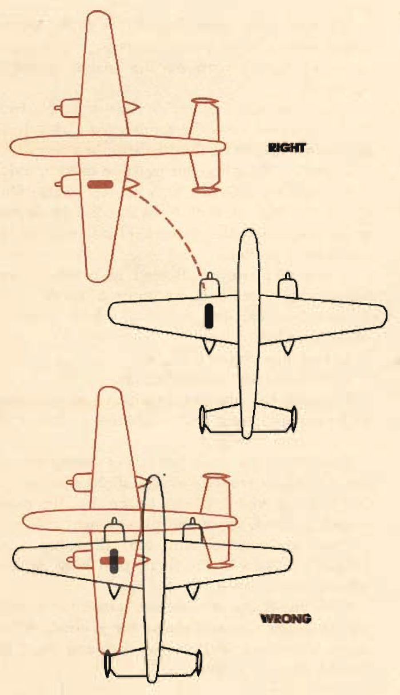

Taxiing
=======

 {.body .conbody}
Taxiing the [B-25]{.keyword}, with its tricycle landing gear, may seem
strange after handling the conventional type.

{#taxiing__image_dc1_w4m_cgb .image}

The primary controls for taxiing are the throttles, rudders, and the
brakes when necessary. A secondary aid is the aileron.

Taxiing the [B-25]{.keyword}, with its tricycle landing gear, may seem
strange after handling the conventional type.

The primary controls for taxiing are the throttles, rudders, and the
brakes when necessary. A secondary aid is the aileron.

Proper coordination of these controls gives you effortless taxiing.

Carburetors should he adjusted to idle at 650 rpm. The scavenger pumps
lose their prime and the plugs foul at a lower rpm.

Operate the throttles as smoothly as possible, and when you stop the
plane for any reason set the rpm at 1000. This prevents fouling and
creates enough propeller blast to help cool the engines.

 {#taxiing__sect_DirectionOfRoll .section .section}
Direction of Roll {#direction-of-roll .title .sectiontitle}
-----------------

\
{#taxiing__image_fbl_1pm_cgb .image
width="288"}\

Don\'t try to guide the plane for the first few feet of its roll. If you
do a great side load is exerted on the nosewheel strut if the nosewheel
is not pointing in the direction you are trying to guide the plane.
Never use force; you will shear or snap the nosewheel strut under the
pressures applied by the brakes and engines.

This airplane has conventional-type toe brakes on the rudder pedal.
After the airplane is moving, apply the brakes evenly and firmly to
check for adequate braking action. Never allow the taxi speed to build
up without making a brake check.

When the direction of roll is established, make corrections by
coordinating the rudder and the throttle and using the brakes only when
necessary. Use the brakes lightly, working to achieve accurate control
with minimum pressure.

\
{#taxiing__image_ndg_dpm_cgb
.image width="288"}\

You will never need hard, rough braking action if you use the brakes
properly.

Use the throttles to aid in taxiing, always keeping in mind that you
must anticipate the reaction of the thrust. Lead the turn. Lead the
corrective action needed to stop the turn.

Do not use excessive power. When one throttle is advanced, retard the
opposite throttle. Don\'t let power accumulate by jockeying first one
throttle and then the other.

\
{#taxiing__image_fmp_hpm_cgb .image
width="288"}\
\
{#taxiing__image_qvs_3pm_cgb
.image width="288"}\
\
{#taxiing__image_g1d_npm_cgb .image
width="288"}\

On straight-away taxiing let the plane roll free and maintain
directional control with the rudders. The twin tail assembly of the
[B-25]{.keyword} gives ample rudder control even at relatively low
taxiing speeds, although even when full rudder is applied there is a
slight delayed-action effect.

Never ride the brakes; this causes them to heat up rapidly.

Apply the brakes by feel, not by the position of the pedals.

Never allow the inside wheel to stop during a turn. To turn sharply,
slow the airplane to a low speed and coordinate the brake and throttle
to keep the inside wheel turning on an approximate 10-foot circle.

\
{#taxiing__image_lqk_ppm_cgb
.image width="288"}\

Any attempt to twist the plane on the inside wheel damages the wheel,
tire, and strut. Turning in this manner on soft ground, sand, or thin
paved runways causes the wheel to dig into the runway, sometimes
rapturing the runway surface.

This turning action may twist the wheel and strut off the airplane. What
is worse, the damage may not be apparent but the gear may be damaged so
badly that it will fold up under the strain of a landing.

Park a safe distance off the end of the runway you intend to use for the
takeoff. Turn into the wind to provide maximum cooling for the engine
run-up. The engine installations cool efficiently only when the airplane
is in flight. Sufficient air for cooling is never available during
ground operation. Take advantage of every opportunity to aid the engines
in cooling.

 {#taxiing__sect_NosewheelPositionInd .section .section}
Nosewheel Position Indicator {#nosewheel-position-indicator .title .sectiontitle}
----------------------------

\
{#taxiing__image_bdb_spm_cgb
.image width="288"}\

A nosewheel position indicator is on the lower center section of the
pilot\'s instrument panel. It warns you of the position of the nose-
wheel by flashing on one of two lights when the nosewheel turns past 15°
in either direction.

You can adjust the brilliancy of these lights by turning the jeweled cap
to \"DAY\" or \"NIGHT\" Check this indicator constantly when taxiing
under abnormal conditions and when recovering from sharp turns.

 {#taxiing__sect_CrosswindTaxi .section .section}
Crosswind Taxiing {#crosswind-taxiing .title .sectiontitle}
-----------------

The windvane effect so noticeable in lighter airplanes will still be
with you in the [B-25]{.keyword}, but not to the same extent. The
airplane tends to turn into the wind.

To prevent this streamlining, use the engines, rudder and downwind
brake. Advance the up- wind throttle and use strong rudder pressures.
This gives ample control in all but the most violent winds. Use a small
amount of downwind brake when necessary. Don\'t let this become a habit,
however, as in all ordinary conditions the throttles and rudders provide
good directional control.

\
{#taxiing__image_pnn_5pm_cgb
.image width="288"}\

 {.section .section}
Taxiing In Mud or Sand {#taxiing-in-mud-or-sand .title .sectiontitle}
----------------------

The only new element added to taxiing by the presence of mud or sand on
an airfield is the greater resistance to the passage of the nosewheel.
This resistance tries to force the nosewheel from its normal trailing
action to a reversed position.

Because of this new factor observe these additional precautions:

1.  Once the airplane is moving, keep it moving.
2.  Avoid sharp turns unless absolutely necessary.
3.  Avoid using the brakes unless absolutely necessary.

The following procedure is best in mud or sand:

While taxiing, control the turns with throttle, using brakes only when
necessary. The minimum radius of turn on the inside wheel is 10 feet.

When the airplane straightens out of a turn the nosewheel loses the
tendency to trail properly as the depth of the tire sink increases.

When abnormal power must be used to move the airplane, the tire sink is
too great. One of the crew must walk ahead of the plane and warn you
when the nosewheel attempts to reverse its direction.

If the airplane is allowed to pivot on one wheel the nosewheel assumes a
short angle toward the rear and the pivot wheel mires itself. To correct
this:

1.  Cut the engines
2.  Remove the towing lockpin
3.  Insert the tow bar or a piece of iron pipe and manually turn the
    nosewheel in line with the airplane fuselage.

If either of the main wheels is deeply mired, dig a shallow trench, with
a slight upslope, in front of the wheel. Check to see that the nose-
wheel is lined up in the direction of roll.

Start the engines and run them up with brakes set. Lower the flaps, pull
back on the wheel, and release the brakes.

 {.note .caution .note_caution}
[CAUTION:]{.note__title} If the wheels are mired too deeply the
propeller tips will strike the ground. When there is danger of this, the
airplane must be moved by a tractor.

\
{#taxiing__image_lds_ypm_cgb
.image width="288"}\

Don\'t try to move the airplane over soft ground with the nosewheel
towbar alone. This will break the nosewheel strut and pull it from under
the nose of the plane. Attach chains to the main wheel struts for
towing. Guide the nosewheel with the tow bar.

To take off from mud, sand, or a rough field, raise the nosewheel
quickly to relieve the weight during the run.

Land normally on mud or sand. Make every effort to hold the airplane
straight without using the brakes. This prevents skidding on a slick
surface. Great side loads are applied to the gear in skids of this type
and must be avoided.

**Parent topic:** [Typical Air
Work](../mdita/typical_air_work.md "Common functions and process relating to flying the B-25.")

 {.linklist .relinfo .relconcepts}
**Related concepts**\

[Advanced Air
Work](../mdita/advanced_air_work.md "Many of the maneuvers described here are prohibited in this airplane. However, knowing the reactions of the airplane to these maneuvers is important.")

[Prohibited Maneuvers in the
B-25](../mdita/prohibited_maneuvers_in_the_b_25.md "The following maneuvers are not prohibited because of the flying characteristics of the airplane, but because they impose severe structural stresses on it. The B-25 is a bomber, not a pursuit plane.")

[Spins](../mdita/spins.md "No pilot should ever knowingly allow the airplane to get into a spin. If you accidentally get into a spin, however, the recovery is normal.")

[Dives](../mdita/dives.md "The diving characteristics of the B-25, like all its flight characteristics; are exceptionally good. The first thing for you to remember, as a new pilot in the B-25, is this: the plane is not a dive bomber.")

[Instrument
Flying](../mdita/instrument_flying.md "Every pilot must have in his possession a copy of T. O. series 30-100. You must know these Technical Orders for the mastery of instrument flight.")

[Formation](../mdita/formation.md ""You just gotta stay in there." Thus returning combat pilots pass on to you the most important thing they learned in the battle zones.")

[Strange Field
Landings](../mdita/strange_field_landings.md "Flying above your home base you instinctively use familiar features of landscape to orient yourself. Your judgment of distance, altitude, speedy and depth are sharpened.")

[Crosswind
Landing](../mdita/crosswind_landing.md "Crosswind landing in the B-25 requires accurate flying, to save the plane from unnecessary structural stresses. You must land the airplane smoothly to prevent blowing a tire, collapsing a struts or exerting side loads on the gear.")

[Stalls](../mdita/stalls.md "The B-25 stalls from the wing root to the wingtip. Thus there is no unstable tendency except a slight lateral rolling, easily corrected by coordinated control pressures.")

[Slow
Flying](../mdita/slow_flying.md "Slow flying increases your confidence in the B-25 as few other maneuvers will. It demonstrates more effectively than anything else the effect of applying power.")

[Short-Field
Takeoff](../mdita/short_field_takeoff.md "The short-field takeoff is an important operational maneuver. You can easily understand its importance if you stop to consider that the first Tokyo raid could never have been made without its use.")

[Short-Field
Landings](../mdita/short_field_landings.md "You have all heard a lot of discussion on the importance of accurate short-field landings. Combat requires that you be able to operate under conditions that are close to the absolute limit of the airplane's performance.")

[Single Engine
Operation](../mdita/single_engine_operation.md "Single engine operation of the B-25 follows a logical pattern of procedure. The plane flies efficiently on one engine at a reduced speed.")

[Single Engine
Practice](../mdita/single_engine_practice.md "Remember that you are trimmed for single engine flight at one airspeed only. If the airspeed or power setting is changed you must re-trim.")

[Effect of Power and Airspeed on Single Engine
Operation](../mdita/effect_of_power_and_airspeed_on_single_engine_operation.md "To fly safely on single engine you must know the effect of power on rudder control at various airspeeds. This is vital to your safety when practicing go-around procedures and other maneuvers that require quick changes in power settings.")

[Single Engine
Landing](../mdita/single_engine_landing.md "Single engine landings should remove any lingering doubts you may have about the B-25 and its ability as a single engine performer.")

[Tips on Single Engine
Operation](../mdita/tips_on_single_engine_operation.md "A list of handy tips on how to work with your engines in regular circumstances, and how to re-start a dead engine.")

[Auxiliary Hydraulic Pump and Emergency Hydraulic Selector
Valve](../mdita/auxiliary_hydraulic_pump_and_emergency_hydraulic_selector_valve.md "The auxiliary hydraulic pump is a double-action hand pump for use as a source of pressure if the main hydraulic system fails.")

[Tactical Uses of the
B-25](../mdita/tactical_uses_of_the_b_25.md "Preparing for a mission, and the roles of all of the crew in making that mission a success.")

 {.linklist .relinfo .reltasks}
**Related tasks**\

[Night
Flying](../mdita/night_flying.md "The technique of night flying is closely akin to instrument flying.")

[Crosswind
Takeoff](../mdita/crosswind_takeoff.md "Modern flying, with its heavy airplanes, demands a runway for safe operation. The days when you taxied out, lined up parallel to the wind tee, and took off are gone forever.")

[Single Engine Operation
Procedure](../mdita/single_engine_operation_procedure.md "Critical single engine airspeed must be maintained at the sacrifice of all other considerations.")

[Single Engine Trouble
Search](../mdita/single_engine_trouble_search.md "How to troubleshoot issues with a single engine.")

[Engine Failure on
Takeoff](../mdita/engine_failure_on_takeoff.md "This is a tricky proposition for any pilot to handle. When the engine fails before you gain CSE speed, retract the wheels and land straight ahead. There is far less danger in a belly landing than in attempting to go around with too low an airspeed.")

[Single Engine
Go-Around](../mdita/single_engine_go_around.md "Successful single engine go-around depends on an early decision that a go-around is necessary. You can start a go-around procedure at a low altitude and from a low airspeed on the approach, but it is difficult and dangerous.")

