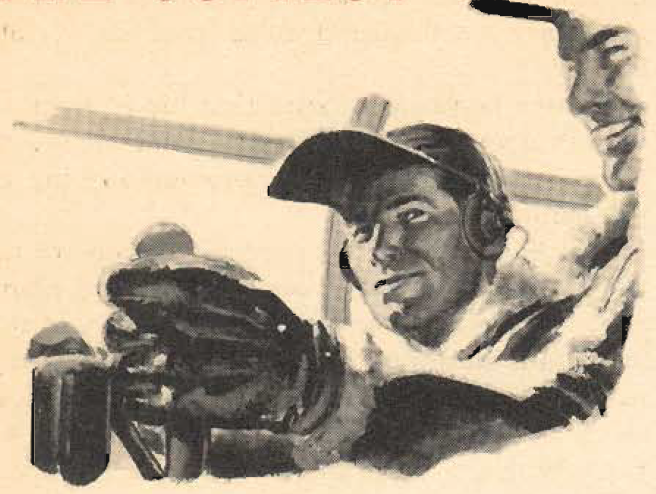

The Copilot
===========

 {.body .conbody}
Understanding the role of the copilot as the assistant and backup to the
pilot.

\
{#the_copilot__image_alt_zzl_cgb
.image width="288"}\

The copilot is the executive officer--- your chief assistant,
understudy, and strong right arm.

He must be familiar enough with every one of your duties---both as pilot
and as airplane commander---to take over and act in your place at any
time.

He must be able to fly the airplane under all conditions as well as you
would fly it yourself.

He must be proficient in engine operation and know instinctively what to
do to keep the airplane flying smoothly, even though he is not handling
the controls.

He must have a thorough knowledge of cruising control data and know how
to apply his knowledge at the proper time.

He is also the engineering officer aboard the airplane, and maintains a
complete log of performance data.

He must be able to fly good formation in any assigned position, day or
night.

He must be qualified to navigate by day or at night by pilotage, dead
reckoning, and by use of radio aids.

He must be proficient in the operation of all radio equipment in the
pilot\'s compartment.

In formation flying, he must be able to make engine adjustments almost
automatically.

He must be prepared to assist on instruments when the formation is
climbing through an overcast, so you can watch the rest of the
formation.

Remember that the more proficient your co-pilot is as a pilot, the
better able he is to perform the duties of the vital post he holds as
your second in command.

Be sure that he is always allowed to do his share of the flying, in the
copilot\'s seat, on take- offs, landings, and on instruments.

Bear in mind that the pilot in the right-hand seat of your airplane is
preparing himself for an airplane commander\'s post too. Allow him every
chance to develop his ability and to profit by your experience.

**Parent topic:** [Introduction to the Pilot Training Manual for The
Mitchell Bomber,
B-25](../mdita/introduction_to_the_pilot_training_manual.md "This manual is the text for your training as a B-25 pilot and airplane commander.")

