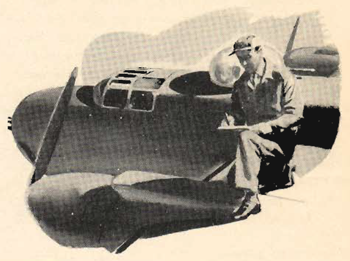

The Engineer
============

 {.body .conbody}
Understanding what your engineer needs to know to effective in his role.

\
{.image width="288"}\

Size up the man who is to be your engineer.

This man should know more about the airplane you are to fly than any
other member of the crew. If there are deficiencies in his training you
may be able to fill them in.

Size up the man who is to be your engineer. This man should know more
about the airplane you are to fly than any other member of the crew. If
there are deficiencies in his training you may be able to fill them in.

Think back on your own training. In many courses of instruction, you had
a lot of things thrown at you from right and left. You had to
concentrate on how to fly; where your equipment was concerned, you
learned to rely more and more on the enlisted men, particularly the crew
chief and the engineer, for advice.

Pilot and engineer must work closely together to supplement and fill in
the blank spaces in each other\'s education.

To be a qualified combat engineer, a man must know his airplane, his
engines, and his armament equipment thoroughly.

He must work closely with the copilot, checking engine operation, fuel
consumption, and the operation of all equipment.

He must be able to work with the bombardier, and know how to cock, lock,
and load the bomb racks. It is up to you to see that he is familiar with
these duties and, if he is hazy concerning them, to have the bombardier
give him special help and instruction.

He should have a general knowledge of radio equipment, and be able to
assist in tuning transmitters and receivers.

While the flexible gunners do not require the same delicate touch as the
turret gunner, they must have a fine sense of timing.

All gunners should be familiar with the coverage area of all gun
positions, and be prepared to bring the proper gun to bear on the
target.

They must be experts in aircraft identification.

They must be thoroughly familiar with the machine guns. They should know
how to maintain the guns, how to clear jams and stoppages, and how to
harmonize the sights with the guns.

During training flights, the gunners should be in their turrets,
tracking with the guns even when actual firing is not practicable. Other
aircraft flying in the vicinity offer excellent tracking targets, as do
automobiles, houses, and other ground objects during low-altitude
flights.

Keep your gunners\' interest alive at all times. Any form of competition
among the gunners themselves should stimulate their interest.

Finally, each gunner should fire the guns at each station to familiarize
himself with the other positions.

Your engineer should be your chief source of information about the
airplane. He should know more about the equipment than any other member
of the crew--- yourself included.

You, in turn, are his source of information about flying. Bear this in
mind in all your discussions with the engineer. The more complete you
can make his knowledge of the reasons behind every function of the
equipment, the more valuable he will be as a member of the crew. Someday
his extra knowledge may save the day in an emergency.

Generally, in emergencies, the engineer is the man to whom you turn
first. Build up his pride, his confidence, his knowledge. Know him
personally; check on the extent of his knowledge. Make him a man upon
whom you can rely.

**Parent topic:** [Introduction to the Pilot Training Manual for The
Mitchell Bomber,
B-25](../mdita/introduction_to_the_pilot_training_manual.md "This manual is the text for your training as a B-25 pilot and airplane commander.")

