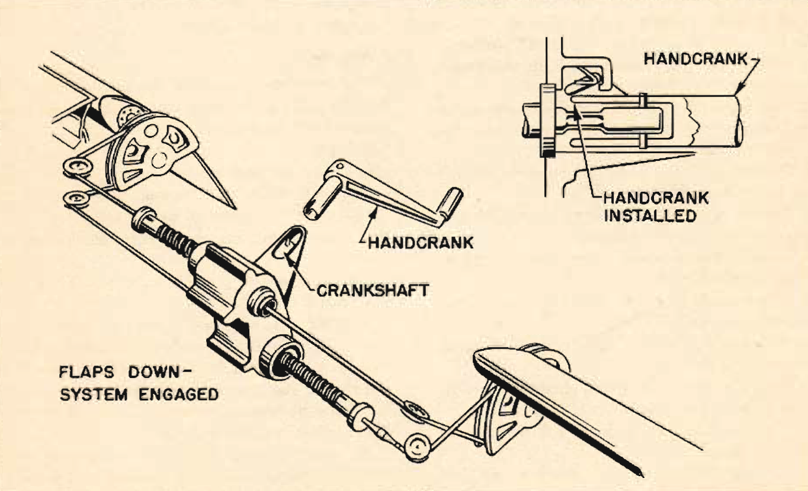

Wing Flap Emergency Lowering System
===================================

 {.body .taskbody}
In the event of **complete** failure of the main hydraulic system, an
emergency mechanical flap lowering mechanism is available.

 {.section .section .context}
It is important to remember to use the emergency mechanism only when the
hydraulic system failure is **complete**, as the two systems oppose each
other. Use of the emergency system while hydraulic pressure is still
available will seriously damage the mechanical system.

The emergency mechanism is in the radio compartment. Be sure the
interphone communication between the crew member operating the mechanism
and the pilot is 100% effective.

Before entering the traffic pattern it is advisable to lower partial
flaps. This enables you to get desired amount of flaps earlier on the
final approach.

**Operation**

1.  [Reduce airspeed below 150 mph.]{.ph .cmd}
2.  [Move pilot\'s flap control \"DOWN.\"]{.ph .cmd}
3.  [Remove hand crank from stowage position on forward wall of radio
    compartment and engage it with the shaft.]{.ph .cmd}
4.  [Rotate crank clockwise until you obtain the desired amount of flaps
    -14 turns will give you half flaps; 27 turns, full flaps.]{.ph .cmd}
5.  [To lock flaps in position, remove the crank.]{.ph .cmd}
     {.itemgroup .info}
     {.note .note .note_note}
    [Note:]{.note__title} If go-around is necessary, turn crank
    counterclockwise to full stop position. (This operation does not
    raise the flaps, but releases the pressure on them and the force of
    the slipstream raises them.)
    

     {.note .warning .note_warning}
    [Warning:]{.note__title} Before operating the flaps hydraulically
    again, be sure that your mechanical system is fully disengaged. To
    disengage, rotate crank counter-clockwise until checked. Remove
    crank and return to its stowage position.
    

    \
    {.image}\
    

**Parent topic:** [Emergency
Systems](../mdita/emergency_systems.md "This section covers all of the emergency systems, including the emergency hydraulic wheel lowering system, wing flap system, hydraulic and air brakes, what to do in the event of a complete failure of the hydraulic systems, and miscellaneous emergency equipment.")

