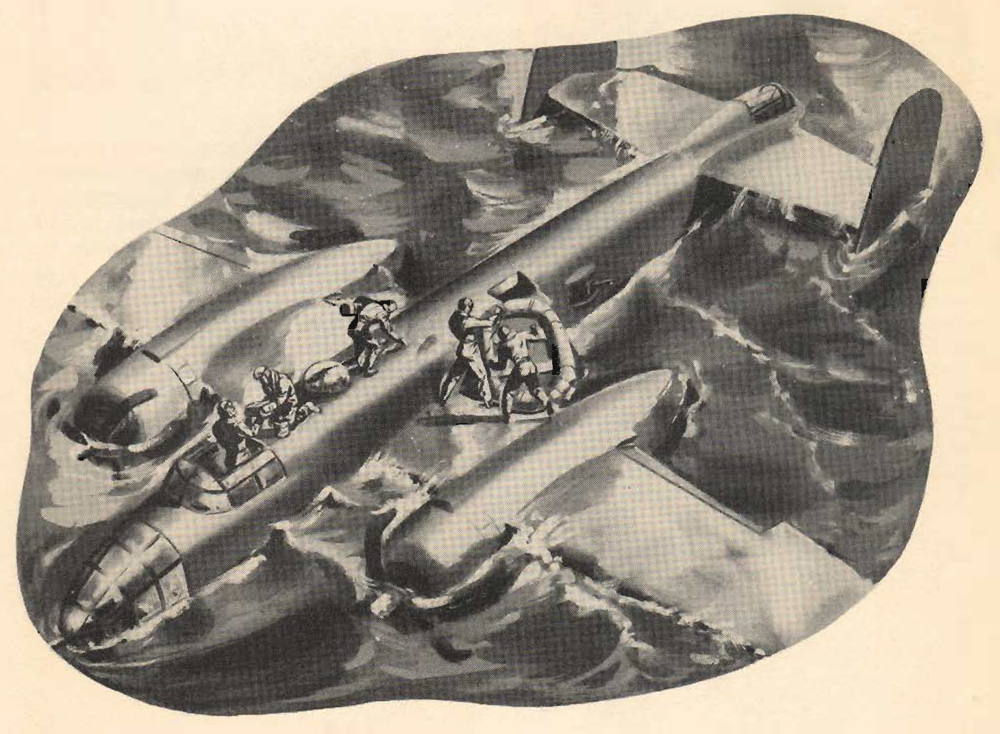

Escape procedure: Front Cockpit
===============================

 {.body .taskbody}
**Front Cockpit**

1.  [Copilot---through top escape hatch. Check, or manually release the
    life raft. Proceed to the rear of the plane to assist men in their
    escape.]{.ph .cmd}
2.  [Pilot---through top escape hatch. Aid the crew members in the front
    cockpit to escape. Take parachute to raft.]{.ph .cmd}
3.  [Engineer---through top escape hatch. Stand by to assist pilot and
    navigator. Carry equipment to the raft.]{.ph .cmd}
4.  [Navigator---through the top escape hatch. Stand by to assist pilot.
    Carry equipment to raft.]{.ph .cmd}

**Rear Compartment**

5.  [Radio operator---through lower right es- cape hatch. Take equipment
    to the raft.]{.ph .cmd}
6.  [Gunner---through lower right escape hatch. Take equipment to the
    raft.]{.ph .cmd}

 {#DitchingEscapeProcedure__result_nhm_q55_3gb .section .section .result}
\
{#DitchingEscapeProcedure__image_p5y_r55_3gb
.image}\

**Parent topic:**
[Ditching](../topics/ditching.md "With the tactical needs of World War II calling for the operation of land planes over vast stretches of water, airmen faced a new hazard: ditching—the forced landing of land planes at sea.")

