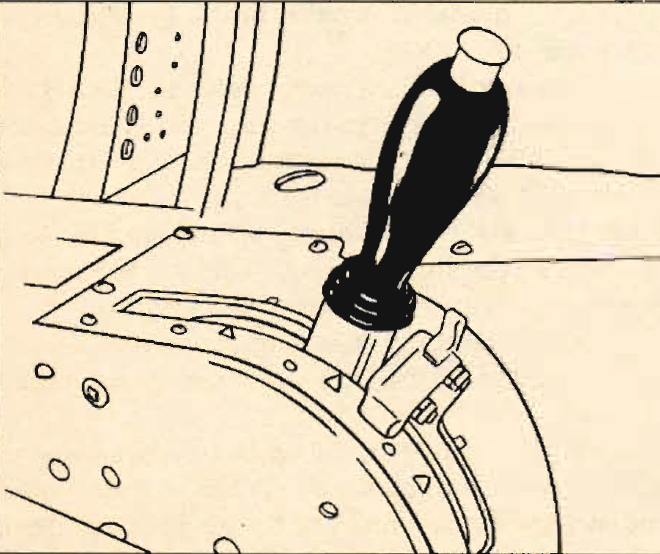

Emergency Salvo Release
=======================

 {.body .taskbody}
When your hydraulic system is in operation you can salvo all of your
bomb load, both internal and external, by moving the bomb control handle
to the \"SALVO\" position.

 {.section .section .context}
\
{.image
width="288"}\

All bombs are dropped safe when salvoed, unless you have an arming
control in use on your plane. In that case you can salvo them either
armed or safe.

Your bomb bay droppable tank is suspended on bomb shackles in the bomb
bay- the pilot and bombardier both have control of these racks and may
salvo both bombs and bomb bay tank.

**To operate:**

1.  [Push the bombardier\'s control handle to \"SALVO.\"]{.ph .cmd}
2.  [Pull The pilot\'s emergency salvo release; this will automatically
    open the bomb bay doors and salvo your load.]{.ph .cmd}

Now to return the system to normal operation.

3.  [If the bombardier\'s control has been used, simply move the control
    handle to \"CLOSED.\"]{.ph .cmd}
4.  [If the pilot\'s emergency release has been used: ]{.ph .cmd}
    a.  [Move the bombardier\'s control handle to \"SALVO\"; this
        recocks pilot\'s emergency release.]{.ph .cmd}
    b.  [Move control to \"CLOSED.\"]{.ph .cmd}

If your plane has an auxiliary control for torpedo work, you may push
down and pull out this control, which is on the right side of the
pilot\'s control pedestal. This enables you to close the doors from the
pilot\'s compartment.

**If you use this control, however, you must reopen the doors with it
before you can regain control with the bombardier\'s control handle.**

To salvo the torpedo you must:

5.  [Open the bomb bay doors with the auxiliary control.]{.ph .cmd}
6.  [Pull the emergency salvo release (this also jettisons the wing
    bombs.)]{.ph .cmd}
     {.itemgroup .info}
     {.note .warning .note_warning}
    [Warning:]{.note__title} On the torpedo only it is necessary to open
    bomb bay doors to use the emergency salvo release.
    

     {.note .note .note_note}
    [Note:]{.note__title} On some [B-25]{.keyword}J and
    [B-25]{.keyword}H airplanes the bombing controls are electrical. In
    the event of electrical failure you cannot salvo the bombs or bomb
    bay tank.
    

    \
    {.image width="288"}\
    

**Parent topic:** [Emergency
Systems](../topics/emergency_systems.md "This section covers all of the emergency systems, including the emergency hydraulic wheel lowering system, wing flap system, hydraulic and air brakes, what to do in the event of a complete failure of the hydraulic systems, and miscellaneous emergency equipment.")

