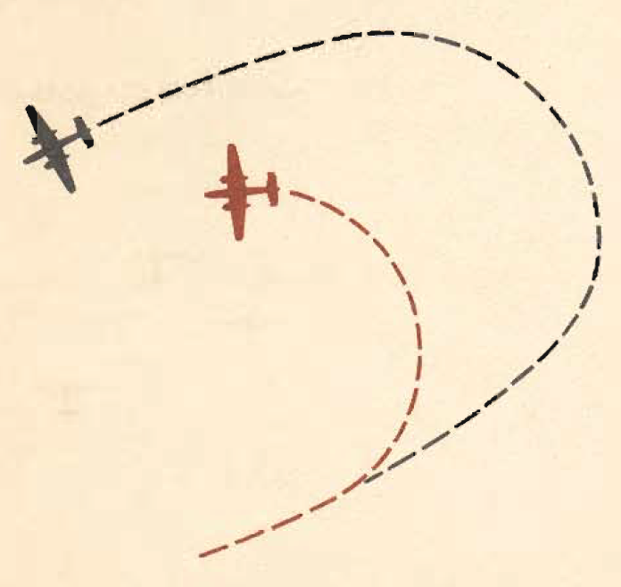

Formation
=========

 {.body .conbody}
\"You just gotta stay in there.\" Thus returning combat pilots pass on
to you the most important thing they learned in the battle zones.

\"You just don\'t come back from a mission if you straggle from a
formation. Even if you are hit and hurt badly, if the plane can stay in
the air, stay in formation.\"

This is not an obsession; it is a lesson so well learned that it is
instinct. Combat pilots know, as no other men on earth can know, that
mutual protection alone makes possible the operations over enemy
territory today.

As a trainee pilot it is a lesson you can learn from the experiences of
other men. Prepare yourself for the job to come by mastering the
elements of formation flying.

 {#formation__sect_WhyFormation .section .section}
Why Fly in Formation? {#why-fly-in-formation .title .sectiontitle}
---------------------

Bombardment units fly in formation for many reasons, and mutual defense
is only one of them. Other reasons are:

-   Concentrate the power of the attack.
-   Concentrate the power of the defense.
-   Maintain the element of surprise in attack.
-   Observation against surprise attack.
-   Unity of command.
-   Maneuverability for attack and defense.
-   Control of navigation.

The basic formation procedures you have learned remain the same. The
difference in tactical training is slight; it is primarily in the
accuracy of your technique, and the limitations of your airplane.

The [B-25]{.keyword} is easy to fly in formation. You need good
instruction and plenty of practice, however to become competent in the
technique.

Your main problem is learning the difference between handling the
[B-25]{.keyword} and a light training plane. Weight and momentum are
your chief concerns.

**The [B-25]{.keyword} does not respond instantly to changes in power
settings.**

You have more than 26,000 lb. to control, and the momentum of thi5
weight must be overcome before the plane responds to changes in power.
When applying power, give the plane a chance to respond. Don\'t be a
throttle juggler---it is not necessary, and you cannot fly good
formation by blasting the power on and then cutting it off. Tease your
plane into its position by small, accurate corrections. You can fly
accurate, well-controlled formation and seldom need a great change in
power setting.

**Learn to anticipate.** This is the hardest part of formation flying in
the [B-25]{.keyword}. The ideal formation is one in which each man so
anticipates his power needs that he never has to make any but the
slightest corrections in his power settings.

Tactical formation places a high premium on a pilot\'s ability to move
accurately from one type of formation to another. You must be able to
move quickly from a relatively loose route formation to a tight
defensive formation. If you are in proper position above and well up on
the lead plane, you can close accurately and quickly by nosing down,
thus converting altitude to the speed required.

You may fly in a formation of hundreds of airplanes, but these huge
formations break down into the familiar 3-plane combinations. Learn
these fundamentals well and you will feel at home and be in position in
any formation.

 {#formation__sect_AirDiscipline .section .section}
Air Discipline {#air-discipline .title .sectiontitle}
--------------

A formation in the air is no place for a difference of opinion. You are
in a formation to enable the formation leader to exercise his right of
command.

He is the boss of the formation as a captain is boss of his ship at sea;
there is no question of his orders and no recourse. Once you have
landed, you--- like a sailor--- can take your complaint to a higher
authority.

**In the air--- Obey.**

 {#formation__sect_FormationTypes .section .section}
Types of Formations {#types-of-formations .title .sectiontitle}
-------------------

There are many types of formations; for simplicity, the three basic
groupings are sufficient to give you the primary elements of all
formations.

These formations are illustrated as squadron formations to allow you to
see their integration into larger groups.

\
{#formation__image_cvw_jt4_ggb
.image}\
\
{#formation__image_swd_lt4_ggb
.image}\

 {#formation__sect_TakeoffLanding .section .section}
Takeoff and Landing {#takeoff-and-landing .title .sectiontitle}
-------------------

Many variations of takeoff and landing procedures are used in the
different Air Forces. The fundamentals are the same wherever you go.

A time interval is set between takeoffs for each plane; on the basis of
this time interval, the formation leader flies straight out from the end
of the runway at a predetermined rate of climb and a set airspeed. When
the time interval shows that his immediate flight is in the air, he
starts a constant- rate turn, allowing the rear planes to turn inside
him and close in to pick up position.

Each plane takes an alternate side of the runway at takeoff to avoid the
prop wash of the preceding plane.

 {.note .warning .note_warning}
[Warning:]{.note__title} Watch wind direction closely to determine where
you will encounter the heaviest prop wash, and try to fly above or below
it at that point.

 {.p}
\
{#formation__image_byt_st4_ggb
.image}\
**Keep your nose inside the nose of the lead plane.** You will delay the
entire joining procedure if you turn with the lead plane instead of
inside him.

To land information you must land accurately at varying distances on the
runway. Land on the side away from the plane ahead of you, and give the
man behind you a little room to get down. Don\'t blast your throttles on
the approach. You only create unnecessary prop wash. Plan your landing
to get in without increasing power.

Don\'t be afraid to go around if you mess up a formation landing.
**Remember, there is a man coming in right behind you.** If you can\'t
land accurately, go around.

**Watch the plane ahead of you.** If you see him make a low, dragging
approach, you will eat a lot of his prop wash as you land. Try to plan
your landing to come in over his prop wash, and let down to the runway
where his power has been cut, thereby missing the worst turbulence.

 {#formation__sect_LeadingFormation .section .section}
Leading a Formation {#leading-a-formation .title .sectiontitle}
-------------------

Leading a formation requires accurate, precise flying and excellent
judgment. It is similar to instrument flying. A definite planned
procedure is the secret of leading a formation properly.

Remember--- your wing men trust you implicitly for leadership and
direction. Neither you, they, nor anyone else will trust a leader who
bounces around like a Yo-Yo. Make each maneuver smooth and slow enough
so that your poorest wingman can follow you without difficulty.

Make your signals distinct, but not violent. Remember that the size of
the formation following you governs the arc of turn. If you pour on the
coal and turn tight you play crack-the- whip with the man on the tail of
the formation. Tomorrow he may be the guy whose gunners could save your
neck if he was in position.

Fly at reduced power. Your wingmen must have a margin of power available
to maintain position.

Follow the instructions given on the ground. Many combat reports show
that formation leaders have caused casualties by ignoring the planned
attack to try a makeshift at the last moment.

Remember the size of your formation. Fly accurately.

Plan your work well in advance.

Fly at reduced power--- compact defensive power is more potent than a
little extra speed.

Use the best judgment you are able to exercise.

 {#formation__sect_WingmanTips .section .section}
Tips for a Wingman {#tips-for-a-wingman .title .sectiontitle}
------------------

**Trust your leader. Stay in formation.**

These two simple things will do more than anything else to bring you
home safely from the toughest missions. If you disagree with the
formation leader, wait until you are on the ground to say so.

Watch the lead plane constantly.

Make power changes smoothly, waiting for the planers reaction.

Keep your head out of the cockpit. Train your copilot or engineer to
make rpm adjustments to compensate for your changing throttle settings.
Don\'t change them constantly, but stay out of the detonation range.

When changing position, keep all other planes in your field of vision.
Coordinate the controls. You don\'t have to kick your plane around; fly
it through the necessary corrections.

Be ready in advance of takeoff time. Don\'t be so late that you have no
time for a good pre-takeoff check of your plane.

 {.note .caution .note_caution}
[CAUTION:]{.note__title} When operating on Grade 91 fuel, for additional
safety, formation leaders should reduce manifold pressure 2\" Hg. and
wingmen should increase rpm settings by 100 rpm.

\
{#formation__image_cys_yt4_ggb
.image}\

**Parent topic:** [Advanced Air
Work](../topics/advanced_air_work.md "Many of the maneuvers described here are prohibited in this airplane. However, knowing the reactions of the airplane to these maneuvers is important.")

 {.linklist .relinfo .relconcepts}
**Related concepts**\

[Taxiing](../topics/taxiing.md "Taxiing the B-25, with its tricycle landing gear, may seem strange after handling the conventional type.")

[Common Taxiing
Errors](../topics/common_taxiing_errors.md "A short list of what not to do when taxiing.")

[Taxiing
Tips](../topics/taxiing_tips.md "A short list of useful tips to know when taxiing.")

[Takeoff](../topics/takeoff.md "Takeoff in the B-25 with its tricycle gear, varies from that with conventional gear only during the initial part of the roll. You will find it much easier.")

[Notes on
Takeoff](../topics/notes_on_takeoff.md "Do not dive the airplane after lifting it at the end of the takeoff run. When you level out to pick up CSE speed after takeoff release the stick pressure as the speed picks up.")

[Common Takeoff
Errors](../topics/common_takeoff_errors.md "A list of common errors that are made during takeoff.")

[Power
Changes](../topics/power_changes.md "What to know about expected engine performance when throttling up.")

[Climb](../topics/climb.md "Making your B-25 climb properly without straining your arms or your airplane.")

[Let-down](../topics/let_down.md "A let-down is a simple procedure either in instrument or contact flight.")

[Landing](../topics/landing.md ""The easiest plane to land I have ever flown."")

[Power-On
Landings](../topics/power_on_landings.md "Before turning onto the base leg, one landing is much like another. The variations in procedure start as you leave the downwind leg.")

[Power-Off
Landing](../topics/power_off_landing.md "The B-25 is too large and heavy to practice the prescribed forced-landing procedures used in lighter planes.")

[Tips On
Landing](../topics/tips_on_landing.md "A list of things to know that will make your landings easier on you and on the B-25.")

[Making a
Go-Around](../topics/making_a_go_around.md "There is a common reluctance among pilots to go around. They feel it implies a lack of ability to meet an unusual situation.")

[Common landing errors](../topics/common_landing_errors.md)

 {.linklist .relinfo .reltasks}
**Related tasks**\

[Run-up](../topics/run_up.md "The process for doing a run-up prior to takeoff.")

[Trimming](../topics/trimming.md "When properly trimmed the B-25 flies with an ease that belies its weight and size.")

[Landing
Checklist](../topics/landing_checklist.md "On any landing, enter traffic as instructed by field regulations or as instructed by the control tower.")

[Post-Landing
Checklist](../topics/post_landing_checklist.md "On the runway, move the prop control to "INC. RPM."")

[No-Flap
Landing](../topics/no_flap_landing.md "Occasionally both in combat and normal operations your plane may be damaged to the extent that flaps cannot be lowered for landing.")

[Go-Around
Procedure](../topics/go_around_procedure.md "Don't hesitate to go around. Any doubt that the plane is under perfect control is sufficient cause to go around. If you have made a poor approach and know that the landing will be too long, or too rough— go around.")

[Parking](../topics/parking.md "When you park your plane after a flight, just remember that the Colonel may make the next flight in that particular airplane.")

 {.linklist .relinfo .relref}
**Related reference**\

[Before Takeoff - C.I.G. F.T.P.R.-Friction
Brake](../topics/before_takeoff_c.i.g.f.t.p.r._friction_brake.md "Checklist to ensure that your Controls move freely, Instruments function, proper Gas settings, then to check Flaps, Trim, Props are set for take-off, and then Run up the engine before removing the friction brake.")

