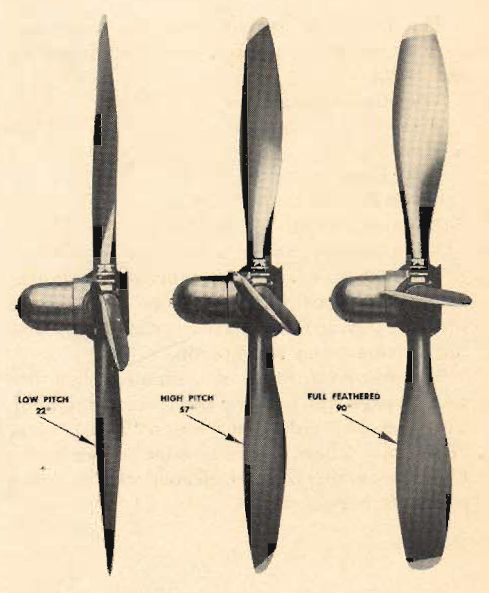

Hamilton Hydromatic Propellers
==============================

 {.body .conbody}
The Hamilton hydromatic propellers of the [B-25]{.keyword} are
hydraulically operated.

{#hamilton_hydromatic_propellers__image_vxf_3jm_cgb
.image}

Their special features are automatic constant-engine-speed operation and
the ability to feather and unfeather quickly in an emergency.

The actuating mechanisms operate in an oil bath, thereby minimizing wear
and the chance of mechanical failure.

Constant-engine-speed control is achieved by an engine-driven governor
metering oil to and from in the actuating dome assembly. Engine oil
under 75-90 lb. sq. in. pressure, plus the centrifugal twisting moment
of the blade, decreases blade angle. Engine oil at a boosted pressure of
180-200 lb. sq. in. pressure increases blade angle.

Feathering and unfeathering is accomplished by an independent auxiliary
oil system controlled from the cockpit.

 {#hamilton_hydromatic_propellers__sect_PrincipleOperation .section .section}
Principle of Operation {#principle-of-operation .title .sectiontitle}
----------------------

Angular blade movement of the propellers is obtained by converting the
straight-line motion of the piston to circular movement by the cams. Oil
pressure drives the piston forward or backward.

 {#hamilton_hydromatic_propellers__sect_ConstantSpeedCtrl .section .section}
Constant-speed Control {#constant-speed-control .title .sectiontitle}
----------------------

\
{#hamilton_hydromatic_propellers__image_er4_kjm_cgb
.image width="576"}\

The propeller governor assembly maintains rpm settings established by
the pilot.

The governor consists of 2 flyweights geared to the operation of the
crankshaft. These fly-weights adjust the load on the engine by raising
or lowering a pilot valve which allows oil under pressure to be metered
to the propeller dome, thereby increasing or decreasing the blade angle.

**On-speed---** An on-speed condition exists when the engine is turning
at the selected rpm. The pilot valve has closed the pressure and drain
ports in the governor, maintaining the blades at a fixed blade angle.

**Overspeed---** An overspeed condition indicates that the engine rpm
has increased beyond the original setting. To counteract this condition,
engine oil flows to the governor. There a booster pump increases
pressure of the oil to 180-200 lb. per sq. in. Entry of this oil to the
inboard side of the propeller dome is permitted when the pilot valve
opens the pressure port, moving the piston forward and thus increasing
blade angle and decreasing engine rpm.

**Underspeed---** An underspeed condition indicates that the engine is
running slower than the selected rpm. To correct this, the pilot valve
is forced downward, opening the drain port. Oil drains from the inboard
side of the piston in the propeller dome. The centrifugal twisting
moment of the blades, plus engine oil pressure on the outboard side of
the piston, moves the blades to a lower angle, thus increasing engine
rpm to the selected setting.

 {#hamilton_hydromatic_propellers__sect_Feathering .section .section}
Feathering {#feathering .title .sectiontitle}
----------

{#hamilton_hydromatic_propellers__image_zcc_mjm_cgb
.image width="288"}

You feather a propeller by actuating the feathering control button on
the pilot\'s pedestal. An electric feathering pump supplies oil at 400
lb. sq. in. through a transfer valve. Through this valve the oil
bypasses the governor to the propeller dome. Pressure is then built up
on the inboard side of the piston, twisting the blades to the
full-feathered position (90°.) When the blades are at this angle,
pressure increases sufficiently to operate a cut-out switch, disengaging
the feathering pump.

 {#hamilton_hydromatic_propellers__sect_Unfeathering .section .section}
Unfeathering {#unfeathering .title .sectiontitle}
------------

To unfeather a propeller hold the control button down. This operates the
feathering pump, applying pressure through the same passages used for
feathering. Since further travel of the piston is no longer possible,
oil pressure at 600 lb. sq. in, shifts a distributor valve to its
outboard limit, which reverses the oil passages to the propeller dome.
The pressure is now applied to the outboard side of the piston and moves
it inboard, decreasing the blade angle. Hold control button down until
the propeller is windmilling at 800 rpm. Then resume control in a normal
manner.

**Parent topic:** [Equipment and
Instruments](../topics/equipment_and_instruments.md "This section provides a survey of the key systems, equipment and instrumentation of the B-25 airplane.")

