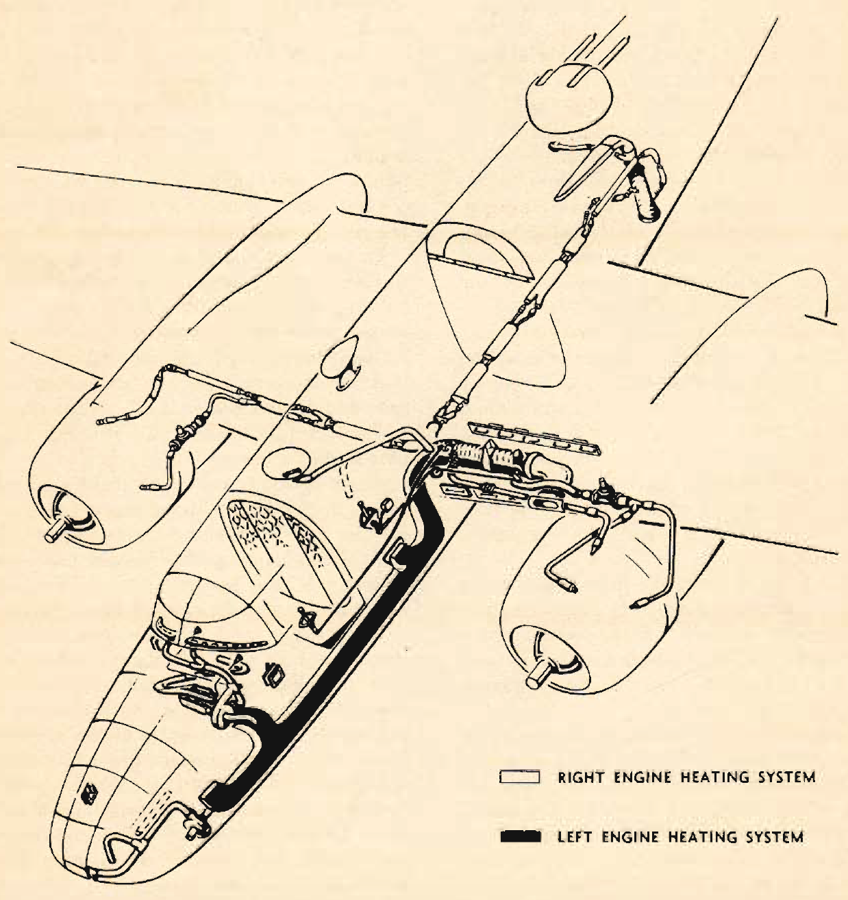

Heating System
==============

 {.body .conbody}
The airplane has two independent heating systems; one for heating the
navigator\'s, pilot\'s, and bombardier\'s compartments, the other for
heating the radio operator\'s compartment and the interior of the
fuselage aft of it.

Each of these two systems has a Stewart-Warner heater burning a mixture
of fuel and air. The forward heating system will operate only when the
left engine is running, and the aft system only when the right engine is
running.

The heater for the forward system is in the left wing center section and
a system of hot air ducts leads forward along the left wall of the
fuselage. The pilot may obtain more air at high altitude and slow
airspeed by operating the air flow control at the left side of his seat.
The air travels from the intake scoop on the leading edge, through the
heaters, to valve equipped outlets in each forward compartment.

Controllable cold air scoops are provided for the pilot, copilot, and
bombardier.

**Do not open any of the three escape hatches during flight to obtain
ventilation.** The drag these open hatches create lowers the efficiency
of the plane and in some flight attitudes will cause unstable flight
characteristics,

A direct control for the aft heater system, mounted on the heater
itself, is just aft of the lower turret on the left wall of the radio
operator\'s compartment.

There is also a master control switch on the pilot\'s switch panel for
emergency use and to aid the pilot in keeping the heater off during
takeoff and landing. The flexible tube leading from the blower and
heater unit heats the interior of either the upper or lower turret.

The heating and ventilating system is designed so that you can always
obtain hot or cold air when either heater is on or off, respectively, by
opening air outlets in the compartment. The temperature of the air is
regulated by the air temperature control in the navigator\'s
compartment, which sets the heater in operation and governs its heat
output. Both the air temperature control and the pilot\'s air flow
control regulate the heating and defrosting air simultaneously.

The first movement of the heater control in the radio operator\'s
compartment actuates a micro-switch turning the heater igniter on and
starting the blower. Additional movement of the control opens the heater
throttle for additional heat output.

The heater in the left wing center section will automatically shut off
its heating chamber if it becomes too hot, and will restart when the
temperature lowers.

If the temperature in the wing compartment that contains the heater
becomes too high, the heater will automatically shut off but will not
restart until it has been serviced.

 {.note .warning .note_warning}
[Warning:]{.note__title} When taking off or landing, in order to have
full power available, heating system must be off.

\
{.image}\

**Parent topic:** [Cold Weather
Operations](../topics/cold_weather_operations.md "Cold weather operations bring visions of long arctic nights, glaciers, Eskimos, and stories you have heard of the Far North.")

 {.linklist .relinfo .relconcepts}
**Related concepts**\

[Weight and
Balance](../topics/WeightAndBalance.md "The day when a pilot flew by guesswork is past. One by one the decisions that were made by intuition, hunches, and guesswork have been taken over by an orderly system based on knowledge and understanding. Invariably this has resulted in greater safety and operating efficiency.")

[Principles of weight and
balance](../topics/PrinciplesOfWeightAndBalance.md "Understanding proper balance and the center of gravity of a B-25, and how to correctly determine the total weight and its distribution on board the aircraft.")

[Fuel](../topics/fuel.md "Information on the fuel required for the B-25, and how to determine the maximum flight range for the aircraft under different conditions.")

[Grade 91
Fuel](../topics/grade_91_fuel.md "With our entry into World War II, and our operations on fighting fronts the length and breadth of the world, it became apparent that we could not produce high-octane fuels quickly enough to meet the demand.")

[Some Typical
Missions](../topics/some_typical_missions.md "The types of practice missions you can expect when learning the B-25.")

[Gunnery
Missions](../topics/gunnery_missions.md "In this and all ensuing gunnery missions when both ground and water targets are used, extreme care must be exercised to see that the field of fire is clear of other planes.")

 {.linklist .relinfo .reltasks}
**Related tasks**\

[Formation
Bombing](../topics/formation_bombing.md "This is a day, 6-ship formation bombing mission.")

[Chemical spray
mission](../topics/ChemicalSprayMission.md "Background and expectations on the chemical spray missions.")

[Day Navigation, Photo-Reconnaissance, and Instrument Let-Down
Mission](../topics/day_navigation_photo_reconnaissance_and_instrument_let_down_mission.md "How this mission works and what's expected of every crew member.")

 {.linklist .relinfo .relref}
**Related reference**\

[Power Control Chart for Grade 91
Fuel](../topics/power_control_chart_for_grade_91_fuel.md "What you can expect when flying the B-25 using Grade 91 fuel.")

[Maximum Range Chart For B-25 C, D, & G
Aircraft](../topics/maximum_range_chart_for_b_25_c_d_and_g_aircraft.md "Information on the maximum range for the C, D, and G models of the B-25.")

[Maximum Range Chart for B-25 H & J
Aircraft](../topics/maximum_range_chart_for_b_25_h_and_j_aircraft.md "Information on the maximum range for the H and J models of the B-25.")

