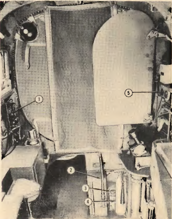

Navigator\'s Compartment-Forward View
=====================================

Controls and guages located in the Navigator\'s compartment facing
forward.

 {#navigators_compartment_forward_view__section_rzr_phm_cgb .section .section}
{#navigators_compartment_forward_view__image_xd2_thm_cgb
.image width="288"}

 {.p}
1.  Radio Compass Control Unit
2.  Main Landing Gear and Nose Gear Emergency Hydroulic Lowering Handle
3.  Emergency Air Brake Pressure Gage
4.  Hand Fire Extinguisher (CO~2~)
5.  Accumulator Hydraulic Pressure Gages

**Parent topic:** [Location of Controls B-25 C and
D](../topics/location_of_controls_b_25_c_and_d.md "An overview of the airplane's key controls and their locations.")

