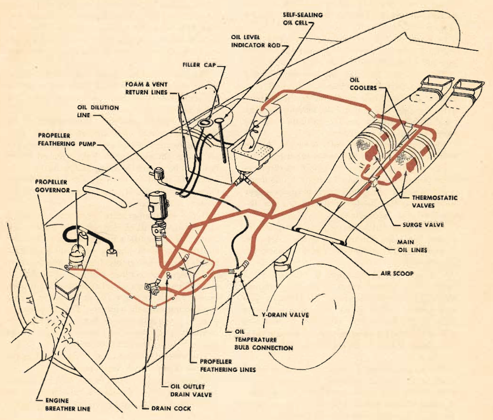

Oil System
==========

 {.body .conbody}
Each engine has an independent oil supply. The self-sealing oil tank
mounted behind the firewall on each nacelle has a capacity of 34
gallons.

It contains a hopper tank to accelerate oil warming and facilitate oil
dilution. A sump and standpipe in the lower part of the tank insure a
supply of 1½ gallons of oil for the propeller feathering system even if
the main oil system is dry.

On early models not equipped with self-sealing tanks, the tank is of the
same outward size but will hold 37½ gallons of oil.

The Y drain for each oil system is in the lowermost part of the system.
This unit contains a bulb which is connected to the oil temperature
gage, and also an inlet leading from the oil dilution valve to insure
gasoline reaching every part of the oil system.

Check this drain frequently for leaks. A leak will cause the loss of the
entire oil supply.

The oil pump is a gear-type, positive displacement pump incorporating 3
pumps in one housing: a pressure pump and 2 return or scavenger pumps---
one for the forward and one for the rear sump of the engine.

A spring-loaded valve adjusts the pressure pump, bypassing the oil side
to the inlet side. Turning the adjustment clockwise increases the
pressure.

The oil pressure system is relieved by a spring-loaded check valve in
the line between the oil pump and the oil cuno. It is set to open at a
pressure of 90 lb. sq. in. Pressure greater than 90 lb. forces this
valve off its seat and allows oil to bypass and return to the main tank.
This keeps the pressure constant within a + or - 1 lb.

The cuno strainer is made up of many metal discs, with a small metal
plate between each pair of discs. It strains out foreign particles. A
small flange operated by oil pressure turns the discs, making the cuno
self-cleaning.

The cuno incorporates an automatic bypass valve. This valve opens and
allows the oil to flow around the strainers if the plates become badly
clogged.

The oil temperature regulators are outboard of the engine nacelle in
each wing, with 2 regulators connected in parallel for each system.

Each regulator consists of a 10-inch-diameter oil cooler controlled by a
thermostatic valve. Each cooler comprises a cooling element, serving as
a core, enclosed by a shell and surrounded by a warming jacket. It is
similar to the radiator of an automobile.

The oil has 2 paths of flow. One is through the warming jacket past a
relief valve and out, thus bypassing the cooling element. The other path
is around the warming jacket to the cooling element inlet, through the
cooling element and out.

The position of the thermostatic valve determines the path to be used.
Regulation of the oil temperature is fully automatic once the valve is
calibrated.

Air for cooling enters the leading edge of the wing. The amount of
cooling effected is in proportion to the mass of air flowing through the
air ducts. On early models the amount of air flow can be manually
controlled from the cockpit by direct linkage with the oil cooler
shutters. On models H and J, the operation of the oil coolers is
automatic.

If the oil temperature rises abnormally, it may be the result of clogged
cooling elements. Rectify this condition by closing the oil cooler
shutters for a maximum of 2 minutes. This builds up an extremely high
oil temperature and cleans the cooling element of sludge or gum. Then
resume normal operation. On models H and J, a surge valve allows the oil
to bypass the cooling element entirely. The oil pressure gage in older
planes is an autosyn-type instrument on one of the engine mounts. In the
newer planes it is a pressure transmitter.

The pressure transmitter is described in the section dealing with
instruments.

The temperature bulb in the Y drain is connected directly to a
bourdon-tube gage on the instrument panel calibrated to read temperature
directly.

The drain plug in the front sump of the engine is magnetic, to aid in
clearing steel particles from the oil. It is also an aid in indicating
internal damage in the engine.

The maximum oil consumption of the engine at cruising throttle setting
is 16 quarts per hour; at takeoff throttle setting it is 28.2 quarts per
hour.

The airplane should have full oil cells (34 gallons each) for takeoff.
However, in an emergency it may be flown with a minimum of 21 gallons in
each cell.

{#oil_system__image_yvl_l3m_cgb
.image}

**Parent topic:** [Equipment and
Instruments](../topics/equipment_and_instruments.md "This section provides a survey of the key systems, equipment and instrumentation of the B-25 airplane.")

