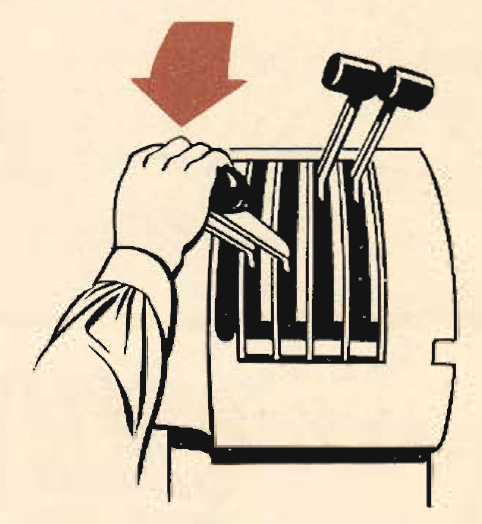
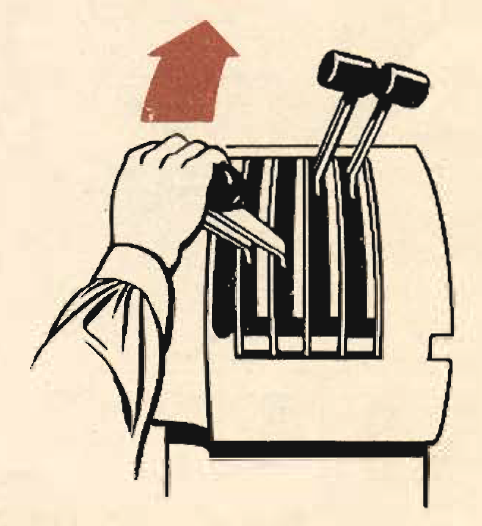

Operating Instructions for the Supercharger
===========================================

 {.body .taskbody}
The supercharger is an integral part of your engine at all altitudes.

 {.section .section .context}
Don\'t fall into the trap of assuming that because you are operating at
medium and low altitudes, your supercharger is not important. Your
supercharger must have proper care all the time, regardless of whether
you intend to use high blower.

**Flight Instructions**

1.  Except where airfields are at extremely high altitudes, always take
    off in \"[LOW]{.keyword .option}\" blower. (There are no fields in
    the continental U.S. where \"[HIGH]{.keyword .option}\" blower
    take-offs are necessary.) While in \"[LOW]{.keyword .option}\"
    blower operate the engine as a single-speed supercharged engine.
2.  Never operate in \"[HIGH]{.keyword .option}\" blower below 9,000
    feet. The power gained by operating in \"[HIGH]{.keyword .option}\"
    blower below this altitude is offset by the power required to
    operate in \"[HIGH]{.keyword .option}\" blower. Make the shift from
    \"[LOW]{.keyword .option}\" to \"[HIGH]{.keyword .option}\" blower
    between 11,000 and 13,000 feet depending on the need for additional
    power.

**Operation**

Shift From Low Blower To High Blower:

1.  [Mixture control \"FULL RICH\"]{.ph .cmd}
2.  [Reduce manifold pressure. (Reduce throttles sufficiently to prevent
    the surge in manifold pressure exceeding the prescribed power
    setting when the shift is made.)]{.ph .cmd}
3.  [Set rpm at 1700.]{.ph .cmd}
4.  [Shift the controls rapidly and evenly from \"[LOW]{.keyword
    .option}\" to \"[HIGH]{.keyword .option},\" and lock. Make this a
    quick, positive action.]{.ph .cmd}
5.  [Reset the desired power setting.]{.ph .cmd}
     {.itemgroup .info}
     {.note .warning .note_warning}
    [Warning:]{.note__title} Never operate in \"[HIGH]{.keyword
    .option}\" blower below 1500 rpm. During prolonged operation in
    \"[HIGH]{.keyword .option}\" blower, change to \"[LOW]{.keyword
    .option}\" blower for 15 minutes every 2 hours, (This removes sludge
    from the clutch.)
    
    

Shift From High Blower To Low Blower.

6.  [Mixture control \"FULL RICH.\"]{.ph .cmd}
7.  [Reduce throttles. (Your manifold pressure must not exceed the
    setting for 1700 rpm.)]{.ph .cmd}
8.  [Set rpm at 1700.]{.ph .cmd}
9.  [Shift the controls from \"[HIGH]{.keyword .option}\" to
    \"[LOW]{.keyword .option}\" in a quick, positive action.]{.ph .cmd}
10. [Reset the desired power setting.]{.ph .cmd}
     {.itemgroup .info}
     {.note .note .note_note}
    [Note:]{.note__title} For maximum performance above 12,000 ft.
    reduce rpm to 2400. This adds 5 to 8 mph. to the maximum speed.
    
    

 {.example}
\
{.image width="288"}\

 {.example}
\
{.image width="288"}\

**Parent topic:** [Equipment and
Instruments](../topics/equipment_and_instruments.md "This section provides a survey of the key systems, equipment and instrumentation of the B-25 airplane.")

