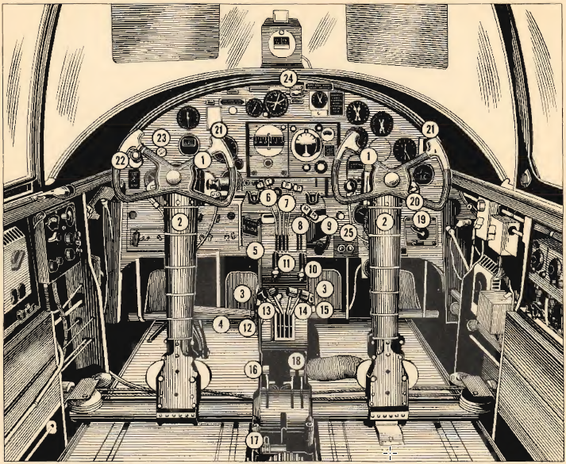

Pilot\'s Compartment-General Forward View
=========================================

Controls and switches that are directly visible to the pilot when
looking to the front of the airplane.

 {.section .section}
{#pilots_compartment_general_forward_view__image_am5_1gm_cgb
.image}

**Parent topic:** [Location of Controls B-25 C and
D](../topics/location_of_controls_b_25_c_and_d.md "An overview of the airplane's key controls and their locations.")

