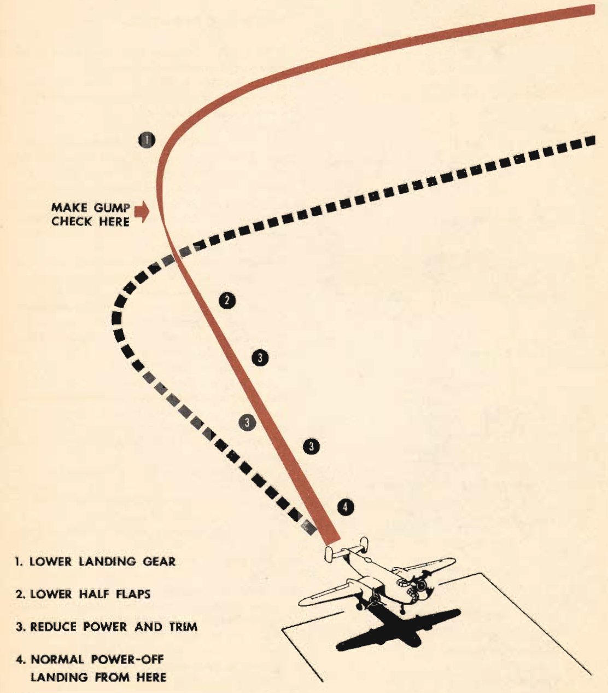

Single Engine Landing
=====================

 {.body .conbody}
Single engine landings should remove any lingering doubts you may have
about the [B-25]{.keyword} and its ability as a single engine performer.

\
{.image}\

You have flown on one engine, turned on one engine. Now you will make
single engine landings. This maneuver is simple, safe, and vital for
your continued safety.

Fly this maneuver with the propeller unfeathered to allow for recovery
from a bad approach. By following this simple procedure you get an exact
simulation of single engine flight:

1.  While practicing single engine flight set the prop at \"DEC. RPM\"
    and feather an engine.
2.  Trim the plane for hands-off flight.
3.  Unfeather the engine, leaving the prop control set at \"DEC. RPM\"
    and apply enough power to the engine you feathered to again have the
    plane trimmed for hands-off flight.

You have, in effect, found out exactly how much the feathered propeller
reduces drag on the airplane. By adding only enough power to return the
plane to a trimmed condition without changing the trim tabs, you have
simply applied power to offset the drag caused by a windmilling
propeller.

This is an exact simulation of single engine operation, including the
landing effect of the feathered prop. With a feathered prop, when the
power is cut on the good engine, drag is induced, making the plane slew
into the good engine during the last stage of landing.

Set the prop at 2400 rpm on the approach so that you have maximum
climbing power available for a go-around if it is needed.

The landing procedure is as follows:

1.  Fly a normal traffic pattern, except that you do not lower landing
    gear until you are on the approach.

    Make
    [GUMPS](../gl_GUMPS.md "GUMPS stands for: G – Gas (Fuel on the proper tank, fuel pump on as required, positive fuel pressure) U – Undercarriage (landing gear down) M – Mixture (fuel mixture set) P – Propeller (prop set) S – Seat belts and Switches (lights, pitot heat, and so on)")
    check here.

2.  On the approach, lower and check the gear, check brake and hydraulic
    pressure, set props at 2400 rpm.
3.  Lower half flaps--- use the rest of the flaps and the power to
    increase the accuracy of the approach.
4.  Never let the airspeed fall below 140 mph on the approach until you
    are positive the landing can be made.
5.  Reduce power and reduce trim. Never allow the power reduction to get
    ahead of the trim. The ideal approach is one where the power is
    reduced. Then the trim, then power, then trim--- and so on
    throughout the approach.
6.  Maintain 140 mph until the landing is in the bag, then lower the
    remaining flaps and reduce power to make an accurate landing.

 {.embed-responsive .embed-responsive-16by9}

[Figure[ 1]{.fig--title-label-number}: ]{.figtitleprefix
.fig--title-label}Landing a [B-25]{.keyword} on one engine

The plane will have a tendency to yaw into the good engine as the power
is cut off completely. This yaw is present when the propeller is
feathered and so should not be changed by cutting power on the engine
you have set up to act as a feathered prop. This yaw is easily
controlled with the rudder; since you expect it, you will have no
trouble.

This technique is sound as it does not make too great a demand on the
pilot\'s judgment. As you approach the ground your ability to properly
gage distance and depth increases, allowing you to make good use of the
remaining power and flaps for an accurate landing. This in turn greatly
reduces the possibility of overshooting or undershooting.

Never try to recover from a bad approach with one engine. Once the power
has been cut and the speed is below 140 mph, go ahead and land.

 {#single_engine_landing__sect_CommonErrors .section .section}
Common Errors {#common-errors .title .sectiontitle}
-------------

-   Overshooting --- a combination of errors. Setting the base leg
    improperly. Airspeed too high on the approach, and taking too much
    time to accomplish procedures on the approach.
-   Forgetting to lower the landing gear. This is usually the result of
    the normal habit of lowering gear on the downwind leg, cutting off
    the warning horn or lights, and not making the landing check
    properly.
-   Failure to retrim the airplane properly.
-   Attempting to make an accuracy landing from the top of the approach.
-   Undershooting and using too much power.

**Parent topic:** [Advanced Air
Work](../topics/advanced_air_work.md "Many of the maneuvers described here are prohibited in this airplane. However, knowing the reactions of the airplane to these maneuvers is important.")

 {.linklist .relinfo .relconcepts}
**Related concepts**\

[Taxiing](../topics/taxiing.md "Taxiing the B-25, with its tricycle landing gear, may seem strange after handling the conventional type.")

[Common Taxiing
Errors](../topics/common_taxiing_errors.md "A short list of what not to do when taxiing.")

[Taxiing
Tips](../topics/taxiing_tips.md "A short list of useful tips to know when taxiing.")

[Takeoff](../topics/takeoff.md "Takeoff in the B-25 with its tricycle gear, varies from that with conventional gear only during the initial part of the roll. You will find it much easier.")

[Notes on
Takeoff](../topics/notes_on_takeoff.md "Do not dive the airplane after lifting it at the end of the takeoff run. When you level out to pick up CSE speed after takeoff release the stick pressure as the speed picks up.")

[Common Takeoff
Errors](../topics/common_takeoff_errors.md "A list of common errors that are made during takeoff.")

[Power
Changes](../topics/power_changes.md "What to know about expected engine performance when throttling up.")

[Climb](../topics/climb.md "Making your B-25 climb properly without straining your arms or your airplane.")

[Let-down](../topics/let_down.md "A let-down is a simple procedure either in instrument or contact flight.")

[Landing](../topics/landing.md ""The easiest plane to land I have ever flown."")

[Power-On
Landings](../topics/power_on_landings.md "Before turning onto the base leg, one landing is much like another. The variations in procedure start as you leave the downwind leg.")

[Power-Off
Landing](../topics/power_off_landing.md "The B-25 is too large and heavy to practice the prescribed forced-landing procedures used in lighter planes.")

[Tips On
Landing](../topics/tips_on_landing.md "A list of things to know that will make your landings easier on you and on the B-25.")

[Making a
Go-Around](../topics/making_a_go_around.md "There is a common reluctance among pilots to go around. They feel it implies a lack of ability to meet an unusual situation.")

[Common landing errors](../topics/common_landing_errors.md)

 {.linklist .relinfo .reltasks}
**Related tasks**\

[Run-up](../topics/run_up.md "The process for doing a run-up prior to takeoff.")

[Trimming](../topics/trimming.md "When properly trimmed the B-25 flies with an ease that belies its weight and size.")

[Landing
Checklist](../topics/landing_checklist.md "On any landing, enter traffic as instructed by field regulations or as instructed by the control tower.")

[Post-Landing
Checklist](../topics/post_landing_checklist.md "On the runway, move the prop control to "INC. RPM."")

[No-Flap
Landing](../topics/no_flap_landing.md "Occasionally both in combat and normal operations your plane may be damaged to the extent that flaps cannot be lowered for landing.")

[Go-Around
Procedure](../topics/go_around_procedure.md "Don't hesitate to go around. Any doubt that the plane is under perfect control is sufficient cause to go around. If you have made a poor approach and know that the landing will be too long, or too rough— go around.")

[Parking](../topics/parking.md "When you park your plane after a flight, just remember that the Colonel may make the next flight in that particular airplane.")

 {.linklist .relinfo .relref}
**Related reference**\

[Before Takeoff - C.I.G. F.T.P.R.-Friction
Brake](../topics/before_takeoff_c.i.g.f.t.p.r._friction_brake.md "Checklist to ensure that your Controls move freely, Instruments function, proper Gas settings, then to check Flaps, Trim, Props are set for take-off, and then Run up the engine before removing the friction brake.")

