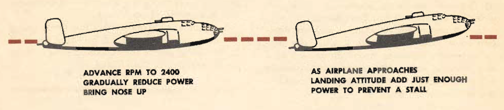
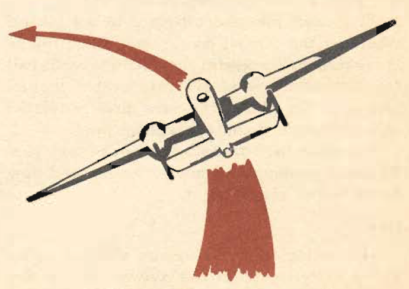

Slow Flying
===========

 {.body .conbody}
Slow flying increases your confidence in the [B-25]{.keyword} as few
other maneuvers will. It demonstrates more effectively than anything
else the effect of applying power.

\
{.image width="576"}\

You can fly the plane at almost a stall attitude and at low airspeed,
and by the manipulation of power, continue to keep the plane in safe
flight.

It teaches lighter control and the necessity for smooth control
movements at low speeds. It teaches stall prevention and recovery by
using throttle and a minimum change of attitude. It is one of the most
helpful exercises to teach you to fly by feel alone, and in the last
phases of every landing, you must fly by feel alone as you do not have
time to watch your instruments.

Slow flying is good training for all types of short-field landings and
takeoffs.

The technique is as follows: Gain sufficient altitude to allow for safe
recovery from an unexpected stall. At cruising setting, advance the rpm
to 2400 rpm, gradually reduce the power and at The same time bring the
nose up and allow the airspeed to drop. As the airplane comes to a
landing attitude and approaches the stalling point, add just enough
power to prevent a stall. Approximately ⅔ power is the maximum to be
used in the [B-25]{.keyword} in this type of maneuver. Do not get into
an exaggerated attitude, as the airplane is heavy and slow to respond.

Hold the airplane in this attitude, increasing power when needed to
prevent a stall and decreasing power when the airspeed becomes too
great. Smooth coordination of stick and throttle is needed to hold the
airplane in this landing attitude just above the stalling speed.

**During a maneuver of this type, the engines have a tendency to
overheat; watch the cylinder-head temperature carefully, and do not
allow it to rise dangerously.**

\
{.image
width="288"}\

Practice this maneuver, checking the airspeed indicator only
occasionally. Learn to fly through it by feel alone. Practice it with
the flaps up and down. Practice it in turns, noting that to hold
airspeed and altitude you must increase power. Normally, in an actual
short-field landing, the gear is extended and the flaps down; after
determining the characteristics with the flaps and wheels up, practice
the maneuver with the wheels and full flaps down.

**In this maneuver, smoothness and coordination come first.** When used,
it will be a precision maneuver; make it one. Practice it at a safe
altitude and perfect your technique. Do not attempt to use it in
turbulent air unless it is an emergency landing.

 {#slow_flying__sect_CommonErrors .section .section}
Common Errors {#common-errors .title .sectiontitle}
-------------

1.  A reluctance to keep a low airspeed.
2.  A tendency to drop the nose or apply more power than is necessary.
    Practice will overcome this and give you confidence.
3.  A tendency to prevent stalling by dropping the nose alone, rather
    than breaking the stall by the use of power and relaxed pressure.
    Here again, practice is the answer.

**Parent topic:** [Advanced Air
Work](../topics/advanced_air_work.md "Many of the maneuvers described here are prohibited in this airplane. However, knowing the reactions of the airplane to these maneuvers is important.")

 {.linklist .relinfo .relconcepts}
**Related concepts**\

[Taxiing](../topics/taxiing.md "Taxiing the B-25, with its tricycle landing gear, may seem strange after handling the conventional type.")

[Common Taxiing
Errors](../topics/common_taxiing_errors.md "A short list of what not to do when taxiing.")

[Taxiing
Tips](../topics/taxiing_tips.md "A short list of useful tips to know when taxiing.")

[Takeoff](../topics/takeoff.md "Takeoff in the B-25 with its tricycle gear, varies from that with conventional gear only during the initial part of the roll. You will find it much easier.")

[Notes on
Takeoff](../topics/notes_on_takeoff.md "Do not dive the airplane after lifting it at the end of the takeoff run. When you level out to pick up CSE speed after takeoff release the stick pressure as the speed picks up.")

[Common Takeoff
Errors](../topics/common_takeoff_errors.md "A list of common errors that are made during takeoff.")

[Power
Changes](../topics/power_changes.md "What to know about expected engine performance when throttling up.")

[Climb](../topics/climb.md "Making your B-25 climb properly without straining your arms or your airplane.")

[Let-down](../topics/let_down.md "A let-down is a simple procedure either in instrument or contact flight.")

[Landing](../topics/landing.md ""The easiest plane to land I have ever flown."")

[Power-On
Landings](../topics/power_on_landings.md "Before turning onto the base leg, one landing is much like another. The variations in procedure start as you leave the downwind leg.")

[Power-Off
Landing](../topics/power_off_landing.md "The B-25 is too large and heavy to practice the prescribed forced-landing procedures used in lighter planes.")

[Tips On
Landing](../topics/tips_on_landing.md "A list of things to know that will make your landings easier on you and on the B-25.")

[Making a
Go-Around](../topics/making_a_go_around.md "There is a common reluctance among pilots to go around. They feel it implies a lack of ability to meet an unusual situation.")

[Common landing errors](../topics/common_landing_errors.md)

 {.linklist .relinfo .reltasks}
**Related tasks**\

[Run-up](../topics/run_up.md "The process for doing a run-up prior to takeoff.")

[Trimming](../topics/trimming.md "When properly trimmed the B-25 flies with an ease that belies its weight and size.")

[Landing
Checklist](../topics/landing_checklist.md "On any landing, enter traffic as instructed by field regulations or as instructed by the control tower.")

[Post-Landing
Checklist](../topics/post_landing_checklist.md "On the runway, move the prop control to "INC. RPM."")

[No-Flap
Landing](../topics/no_flap_landing.md "Occasionally both in combat and normal operations your plane may be damaged to the extent that flaps cannot be lowered for landing.")

[Go-Around
Procedure](../topics/go_around_procedure.md "Don't hesitate to go around. Any doubt that the plane is under perfect control is sufficient cause to go around. If you have made a poor approach and know that the landing will be too long, or too rough— go around.")

[Parking](../topics/parking.md "When you park your plane after a flight, just remember that the Colonel may make the next flight in that particular airplane.")

 {.linklist .relinfo .relref}
**Related reference**\

[Before Takeoff - C.I.G. F.T.P.R.-Friction
Brake](../topics/before_takeoff_c.i.g.f.t.p.r._friction_brake.md "Checklist to ensure that your Controls move freely, Instruments function, proper Gas settings, then to check Flaps, Trim, Props are set for take-off, and then Run up the engine before removing the friction brake.")

